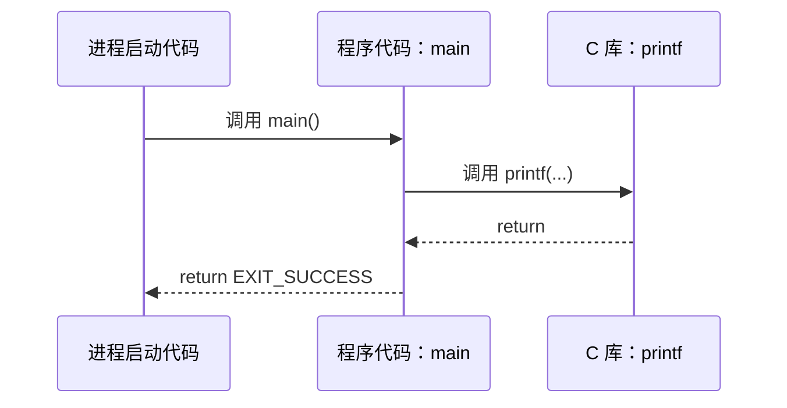

# 2. 程序的基本结构

[[toc]]

本章涵盖：

- C 文法
- 声明标识符
- 定义对象
- 用语句向编译器下达指令

与上一章的小示例相比，真正的程序会更复杂，也会包含更多元素；不过，它们的结构仍会非常相似。清单 1.1 已经具备 C 程序的大部分结构元素。

阅读和分析 C 程序时，需要考虑两个层面：句法层面（怎样编写程序，编译器才能读懂？）和语义层面（怎样说明，程序才能完成我们期望的工作？）。下面几节将介绍句法方面（文法）以及三个不同的语义方面：声明部分（事物是什么）、对象定义（事物在哪里）和语句（事物应当做什么）。

## 2.1 文法

从总体结构来看，C 程序由不同种类的文本元素组成，这些元素依照某种文法组装在一起。它们包括以下几类。

**关键字和预处理指令。** 清单 1.1 使用了下面这些特殊单词：[^8]

```text
#include int maybe_unused char void double for return
```

在本书的程序文本中，大多数这样的单词会以黑色粗体印出。它们表示 C 语言规定、不可更改的概念与功能。

**标点符号。** C 使用多种标点符号来组织程序文本。

- 共有六种括号：`{ ... }`、`( ... )`、`[ ... ]`、`[[ ... ]]`、`/* ... */` 和 `< ... >`。它们把程序的特定部分组合在一起，并且应当总是成对出现。所幸，`< ... >` 在 C 中并不常见，而且只会像示例那样用于同一逻辑文本行。其余五种不受单行限制，内容可以跨越多行，就像前面使用 `printf` 时那样。
- 有两种不同的分隔符或终止符：逗号和分号。使用 `printf` 时，逗号分隔了该函数的四个实参。在第 12 行中还可以看到，逗号也可以跟在元素列表的最后一个元素后面：

```c
[3] = .00007,
```

初学 C 的难点之一，是同一个标点字符会用来表达不同概念。例如，在清单 1.1 中，`{}` 和 `[]` 各有三种不同用途。[^ex9]

::: tip 要点 2.1 #1
同一个标点字符可以用于多种不同目的。
:::

**注释。** 前面见过的 `/* ... */` 构造告诉编译器，其中的一切都是注释。例如第 5 行：

```c
/* The main thing that this program does. */
```

编译器会忽略注释，因此注释最适合用来解释代码并为代码编写文档。这种就地文档能够（而且应当）显著改善代码的可读性与可理解性。另一种注释形式是第 15 行那样的所谓 C++ 风格注释，以 `//` 为标记。C++ 风格注释从 `//` 一直延伸到该行末尾。（译者注：单行注释 `//` 起源于 C++，自 C99 标准起，已被正式纳入 C 语言标准。）

**字面量。** 程序包含若干指代固定值的项目，这些值是程序的一部分：`0`、`1`、`3`、`4`、`5`、`9.0`、`2.9`、`3.E+25`、`.00007`，以及：

```text
"element %zu is %g, \tits square is %g\n"
```

它们称为字面量。

**标识符。** 标识符是我们（或 C 标准）赋予程序中某些实体的“名称”。这里有 `A`、`i`、`main`、`printf`、`size_t` 和 `EXIT_SUCCESS`。标识符可以在程序中扮演不同角色。它们可以指代的事物包括：

- **数据对象**，例如 `A` 和 `i`。它们也常称为**可变对象**。
- **类型**别名，例如 `size_t`，它说明新对象（这里是 `i`）的“种类”。请注意名称末尾的 `_t`。C 标准采用这种命名约定，提醒你该标识符指代一种类型。（译者注：“type”）
- 函数，例如 `main` 和 `printf`。
- 常量，例如 `EXIT_SUCCESS`。

**函数。** 有两个标识符指代函数：`main` 和 `printf`。如前所述，程序使用 `printf` 产生输出。另一方面，`main` 函数得到了**定义**：也就是说，它的**声明** `int main (void)` 后面跟着**函数体**（由复合语句的 `{ ... }` 标明），用于描述该函数应当做什么。在示例中，这个**函数定义**从第 6 行延伸到第 24 行。后面会看到，`main` 在 C 程序中扮演特殊角色：它必须始终存在，因为它是程序开始执行的位置。

**运算符。** C 有大量运算符，但程序只使用了少数几个：

- `=` 用于**初始化**和**赋值**
- `<` 用于比较
- `++` 用于递增对象（把它的值增加 `1`）
- `*` 用于把两个值相乘

**属性。** `[[maybe_unused]]` 这样的属性放在双层方括号中，如示例所示，用来为程序的基本结构提供补充信息。[^c23]

与自然语言一样，前面看到的 C 程序词法元素和文法，必须同这些构造所传达的实际含义区分开来。不同于自然语言，这种含义有严格规定，通常不留歧义。接下来几节会深入介绍 C 所区分的三种主要语义类别：声明、定义和语句。

## 2.2 声明

在程序中使用某个标识符之前，必须先向编译器提供一个**声明**，说明该标识符应当表示什么。标识符因此有别于关键字：关键字由语言预先定义，不得声明或重新定义。

::: tip 要点 2.2 #1
程序中的所有标识符都必须声明。
:::

程序实际声明了我们使用的若干标识符：`main`、`argc`、`argv`、`A` 和 `i`。稍后会看到其余标识符（`printf`、`size_t` 和 `EXIT_SUCCESS`）来自何处。前面已经提到 `main` 函数的声明。如果把这五个声明单独抽出来，仅保留为“纯声明”，它们如下：

```c
int main (int, char*[]);
int argc;
[[maybe_unused]] char* argv[];
double A[5];
size_t i;
```

这五个声明遵循同一种模式。每个声明都有一个标识符（`main`、`argc`、`argv`、`A` 或 `i`），还说明了与该标识符关联的若干性质：

- `i` 的**类型**是 `size_t`。
- `argc` 的类型是 `int`。
- `main` 后面还跟有圆括号 `( ... )`，因而声明了一个类型为 `int` 的函数。
- `A` 后面跟有方括号 `[ ... ]`，因而声明了一个**数组**。数组是若干同类型项目组成的聚合；这里，它由 5 个 `double` 类型的项目构成。这 5 个项目有确定顺序，可以用称为**索引**的数字 `0` 到 `4` 指代。
- `argv` 后面也跟有方括号，因此同样具有数组的性质。属性 `[[maybe_unused]]` 表明它可能不会使用；事实上，这段程序代码的其他地方确实没有出现 `argv`。它含有 `argc+1` 个元素，元素类型由 `char*` 表示。

每个声明都以**类型**开头（这里是 `int`、`char*`、`double` 和 `size_t`）。稍后会看到类型表示什么。目前只需知道，它说明四个标识符（`main`、`argc`、`A` 和 `i`）在语句的上下文中使用时，会提供某种数字。

对于另一个标识符 `argv`，`char*` 末尾的 `*` 表明它是**指针**。指针虽然是 C 语言的一项主要功能，却要到本书相当靠后的位置才会出现。

`argc`、`i` 和 `A` 的声明声明了**可变对象**，也就是允许我们**存储值**的具名项目。最好把它们想象成某种盒子，盒子里可以装着特定类型的“某样东西”：

| 标识符 | 类型     | 值   |
| ------ | -------- | ---- |
| `argc` | `int`    | `??` |
| `i`    | `size_t` | `??` |

`A` 则是由多个盒子组成的数组：

| 标识符 |  索引 | 类型     | 值   |
| ------ | ----: | -------- | ---- |
| `A`    | `[0]` | `double` | `??` |
| `A`    | `[1]` | `double` | `??` |
| `A`    | `[2]` | `double` | `??` |
| `A`    | `[3]` | `double` | `??` |
| `A`    | `[4]` | `double` | `??` |

从概念上说，务必区分盒子本身（对象）、盒子的规格（类型）、盒中内容（值），以及写在盒子上的名称或标签（标识符）。在这类图示中，如果不知道某个项目的实际值，就用 `??` 表示。

至于另外三个标识符 `printf`、`size_t` 和 `EXIT_SUCCESS`，程序中没有出现它们的声明。事实上，它们是预声明标识符。不过，正如尝试编译清单 1.2 时所见，这些标识符的信息不会凭空出现。我们必须告诉编译器从哪里取得相关信息。这件事就在程序开头的第 2 行和第 3 行完成：`printf` 由 `<stdio.h>` 提供，`size_t` 和 `EXIT_SUCCESS` 则来自 `<stdlib.h>`。这些标识符的真正声明，写在计算机上某处相应名称的 `.h` 文件中。它们可能类似于：

```c
int printf (char const format[static 1], ...);
typedef unsigned long size_t;
#define EXIT_SUCCESS 0
```

由于这些预声明功能的具体细节并不重要，相关信息通常隐藏在**包含文件**或**头文件**中。如果需要了解其语义，直接查看相应文件通常并非好主意，因为这些文件往往几乎无法阅读。应当改为查阅平台随附的文档。对于勇敢的读者，我一向建议看看当前的 C 标准，因为这一切都源自那里。对于胆量稍小的读者，下面这些命令也许有帮助：

```console
> apropos printf
> man printf
> man 3 printf
```

声明只描述一项功能，并不创建它，所以重复声明通常不会造成太大伤害，只会增加冗余。

::: tip 要点 2.2 #2
一个标识符可以有多个相互一致的声明。
:::

显然，如果程序同一部分中存在同一标识符的多个相互矛盾的声明，无论我们还是编译器都会陷入混乱，因此一般不允许这样做。C 对“程序同一部分”的含义作了相当具体的规定：**作用域**是程序中某个标识符**可见**的部分。

::: tip 要点 2.2 #3
声明仅在其出现的作用域内有效。
:::

标识符的作用域由文法毫无歧义地描述。清单 1.1 中的声明分处不同作用域：

- `A` 在 `main` 函数定义内部可见，从第 8 行的声明开始，一直到包含该声明的最内层 `{ ... }` 复合语句在第 24 行以 `}` 结束。
- `i` 的可见范围更窄。它绑定于声明自己的 `for` 构造；从第 16 行的声明开始，一直到与 `for` 关联的 `{ ... }` 复合语句在第 21 行结束。
- `main` 没有包含在其他复合语句中，因此从自身声明开始一直到文件末尾都可见。
- `argc` 和 `argv` 并不包含在 `{ ... }` 内，却位于把 `main` 标记为函数的 `( ... )` 之中。它们是函数的**形参**；各自的作用域从相应声明开始，随后覆盖所属函数（这里是 `main`）的整个 `{ ... }` 函数体。

上述第一、第二以及最后一类作用域都属于为**块作用域（block scope）**；**块（block）**是文法中封装这类声明的结构。像 `main` 这样的函数连同形参列表（括在 `()` 中）和整个函数体（括在 `{}` 中），共同形成一个独立的块。`for` 构造形成一个**外层块（primary block）**，循环体（通常也以 `{ ... }` 包围）则形成一个**内层块（secondary block）**。可以看到，块会**嵌套**：`main` 的块包含 `for` 循环的外层块，而后者又包含它的内层块。

第三类作用域用于 `main` 本身的名称；该名称不处在任何 `( ... )` 或 `{ ... }` 对中。这种作用域称为**文件作用域**。文件作用域中的标识符常称为**全局标识符**。

因此，这个看似简单的程序其实拥有四层嵌套作用域：文件作用域和三个嵌套的块。

## 2.3 定义

一般来说，声明只说明标识符所指代的对象种类，并不说明标识符的具体值是什么，也不说明去哪里寻找它所指代的对象。这项重要职责由**定义**承担。

::: tip 要点 2.3 #1
声明说明标识符，定义说明对象。
:::

后面会看到，现实情况稍微复杂一些；但现在可以作出简化，假定我们总会初始化所有对象。初始化是一种扩充声明并为对象提供初始值的文法构造。例如：

```c
size_t i = 0;
```

这是 `i` 的声明，并让其初始值为 `0`。

在 C 中，带有初始化器的这种声明同时定义了相应名称的对象：也就是说，它指示编译器提供存储，以便存放对象的值。

::: tip 要点 2.3 #2
对象在初始化的同时得到定义。
:::

现在可以为盒子图补上一个值，在这个示例中是 `0`：

| 标识符 | 类型     |   值 |
| ------ | -------- | ---: |
| `i`    | `size_t` |  `0` |

`A` 稍微复杂一些，因为它有多个组成部分：

```c
double A[5] = {
  [0] = 9.0,
  [1] = 2.9,
  [4] = 3.E+25,
  [3] = .00007,
};
```

这会依次把 `A` 中的 5 个项目初始化为值 `9.0`、`2.9`、`0.0`、`0.000’07` 和 `3.0E+25`：

| 标识符 |  索引 | 类型     |         值 |
| ------ | ----: | -------- | ---------: |
| `A`    | `[0]` | `double` |      `9.0` |
| `A`    | `[1]` | `double` |      `2.9` |
| `A`    | `[2]` | `double` |      `0.0` |
| `A`    | `[3]` | `double` | `0.000’07` |
| `A`    | `[4]` | `double` |  `3.0E+25` |

这里看到的初始化器形式称为**指定初始化**：一对方括号和其中的整数指代要以相应值初始化的数组项目。例如，`[4] = 3.E+25` 把数组 `A` 的最后一个项目设为值 `3.E+25`。还有一条特殊规则：初始化器中未列出的任何位置都会设为 `0`。在示例中，缺少的 `[2]` 会用 `0.0` 填充。[^11]

::: tip 要点 2.3 #3
初始化器中缺少的元素默认为 `0`。（译者注：此处的“0”应当理解为与该元素类型相对应的“零值（Zero Value）”。整数为 `0`，浮点数为 `0.0`，指针为 NULL，等等。）
:::

你可能已经注意到，数组位置——**索引**——第一个元素从 `0` 开始，而不是从 `1` 开始。可以把数组位置理解为相应数组元素到数组起点的距离。

::: tip 要点 2.3 #4
对于含有 n 个元素的数组，第一个元素的索引是 0，最后一个元素的索引是 n-1。
:::

对于函数，如果其声明后面跟有包含函数代码的花括号 `{ ... }`，那么它就有一个定义，而不只是声明：

```c
int main (int argc, [[maybe_unused]] char* argv[argc+1]) {
  ...
}
```

截至目前，示例中出现的名称指代两类不同功能：**对象**（`i` 和 `A`）以及**函数**（`main` 和 `printf`）。同一个标识符可以有多个对象声明或函数声明，而对象定义或函数定义必须唯一。也就是说，要让 C 程序能够工作，任何使用到的对象或函数都必须有定义（否则执行时就不知道去哪里寻找它们），并且不得有一个以上的定义（否则执行可能变得不一致）。

::: tip 要点 2.3 #5
每个对象或函数都必须恰好有一个定义。
:::

## 2.4 语句

`main` 函数的第二部分主要由语句组成。语句是一些指令，告诉编译器如何处理此前已经声明的标识符。程序中有：

```c
for (size_t i = 0; i < 5; ++i) {
  printf("element %zu is %g, \tits square is %g\n",
         i,
         A[i],
         A[i]*A[i]);
}

return EXIT_SUCCESS;
```

我们已经讨论了调用 `printf` 的那些代码行。此外还有其他种类的语句：`for`、`return`，以及由**运算符** `++` 表示的递增操作。下面几节会稍微深入三类语句的细节：迭代（多次做某件事）、函数调用（把执行委派到其他地方）以及函数返回（从调用函数的位置恢复执行）。

### 2.4.1 迭代

`for` 语句告诉编译器，程序应当多次执行 `printf` 那一行。这是 C 所提供的最简单的**范围迭代**形式。它包含四个不同部分。跟在 `for ( ... )` 之后的内层块（这里是由 `{ ... }` 标明的复合语句）是需要重复的代码，也称为**循环体**。另外三个部分位于 `( ... )` 内部，由分号分隔：

1. **循环对象** `i` 的声明、定义和初始化，前面已经讨论过它。在整个 `for` 语句的其余任何部分执行之前，这项初始化只执行一次。
2. **循环条件** `i < 5` 说明 `for` 迭代应当持续多久。它告诉编译器：只要 `i` 严格小于 `5`，就继续迭代。每次执行循环体之前，都会检查循环条件。
3. 另一个语句 `++i` 在每次迭代之后执行。在这里，它每次都把 `i` 的值增加 `1`。

把这些部分合在一起，就是要求程序执行内层块中的代码五次，并在各次迭代中依次把 `i` 的值设为 `0`、`1`、`2`、`3` 和 `4`。每次迭代都可以用 `i` 的一个特定值来标识，这使它成为对**范围** `0, ..., 4` 的迭代。在 C 中不止一种办法可以做到这一点，但 `for` 是完成这项任务最简单、最整洁也最合适的工具。

::: tip 要点 2.4.1 #1
范围迭代应当用 `for` 语句编写。
:::

`for` 语句还可以写成其他几种形式。人们经常把循环对象的定义放在 `for` 之前的某处，甚至在多个循环中重复使用同一个对象。不要这样做：为了帮助偶然阅读代码的人和编译器理解代码，务必让人知道该对象具有特定含义——它是给定 `for` 循环的迭代计数器。

::: tip 要点 2.4.1 #2
循环对象应当定义在 `for` 的起始部分中。
:::

### 2.4.2 函数调用

函数调用是一种特殊语句，会暂停当前函数（开始时通常是 `main`）的执行，然后把控制交给对应的函数。在示例中：

```c
printf("element %zu is %g, \tits square is %g\n",
       i,
       A[i],
       A[i]*A[i]);
```

被调用的函数是 `printf`。函数调用通常不只提供函数名称，还会提供实参。这里的实参是那串很长的字符、`i`、`A[i]` 以及 `A[i]*A[i]`。这些实参的值会传递给函数。在这个示例中，它们就是 `printf` 所打印的信息。这里要强调的是“值”：虽然 `i` 是一个实参，但 `printf` 永远无法改变 `i` 本身。这种机制称为按值调用。其他编程语言还提供按引用调用，被调用函数可以借此改变某个对象的值。C 不实现按引用传递；它使用另一种机制把对象的控制权传给其他函数：取得地址并传送指针。很多章以后才会看到这种机制。（译者注：C 语言的实参全都是按值传递。）

### 2.4.3 函数返回

`main` 中的最后一个语句是 `return`。它告诉 `main` 函数，在完成工作之后返回到调用自己的语句。这里，因为 `main` 的声明中有 `int`，`return` 就必须向调用语句送回一个 `int` 类型的值。在这个示例中，该值是 `EXIT_SUCCESS`。

虽然看不到 `printf` 的定义，但 `printf` 函数中一定包含相似的 `return` 语句。在第 17 行调用该函数时，`main` 中各语句的执行暂时挂起。程序继续执行 `printf` 函数，直到遇到 `return`。从 `printf` 返回之后，`main` 中各语句的执行会从暂停的位置继续。



**图 2.1　一个小程序的执行过程**

图 2.1 大致展示了这个小程序的执行过程，也就是它的控制流。首先，平台提供的进程启动代码（左侧）调用用户提供的函数 `main`（中间）。`main` 又调用 `printf`，后者是 **C 库**的一部分（右侧）。`printf` 遇到 `return` 后，控制返回 `main`；到达 `main` 中的 `return` 时，控制又交还给启动代码。从程序员的角度来看，后一次控制转移就是程序执行的终点。

## 小结

- C 区分程序的词法结构（标点符号、标识符和数字）、文法结构（句法）与语义（含义）。
- 所有标识符（名称）都必须声明，这样我们才知道它们所表示概念的性质。
- 所有对象（我们处理的事物）和函数（我们用来处理事物的方法）都必须定义；也就是说，我们必须说明它们如何产生以及在哪里产生。
- 语句指出事情将如何完成：迭代（`for`）反复执行任务的不同变化形式，函数调用（`printf(...)`）把任务委派给函数，函数返回（`return something;`）则回到来时的位置。

[^8]: 用 C 行话说，它们分别属于**指令**、**关键字**、**属性**和**保留标识符**。

[^ex9]: **练习 9**　找出这两组括号各自的不同用途。

[^c23]: **C23**　这是 C23 新增的功能，因此你的编译器可能尚未实现。

[^11]: 后面会看到，这些带小数点（`.`）和指数（`E+25`）的数字字面量如何工作。
