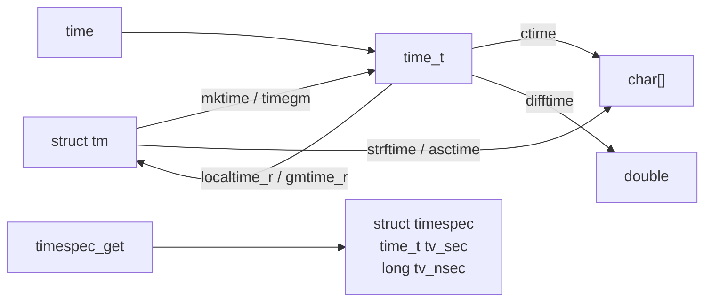

# 8 C 库函数

[[toc]]

::: info 本章内容

- 数学运算、文件处理与字符串处理
- 时间操作
- 运行时环境管理
- 程序终止

:::

C 标准提供的功能分为两大部分：一部分是 C 语言本身，另一部分是 C 库。我们已经见过几个 C 库函数，包括 `printf`、`puts` 和 `strtod`，所以你应当能大致猜出 C 库的内容：日常编程所需的基本工具，以及为确保可移植性而必须具备明确接口和语义的功能。

在许多平台上，通过应用程序编程接口（application programming interface，API）作出清晰规定，还能把编译器实现与库实现分离。例如，在 Linux 系统上，我们可以选择不同的编译器，最常见的是 `gcc` 和 `clang`；也可以选择不同的 C 库实现，例如 GNU C 库（glibc）、dietlibc 和 musl。原则上，这些选项可以任意搭配，用来生成可执行文件。

我们先讨论 C 库及其接口的一般性质与工具，再介绍若干函数组：数学（数值）函数、输入／输出函数、字符串处理、时间处理、运行时环境访问，以及程序终止。

## 8.1 C 库及其函数的一般性质

大体而言，库函数服务于以下一种或两种用途。

**平台抽象层。** 这类函数将平台特定的属性和需求抽象出来。输入/输出等基本操作的实现依赖于平台；如果不了解平台的底层细节，程序员是无法自行实现的。例如，`puts` 函数必须知道“终端输出”的含义以及如何与终端交互。实现这些功能通常需要运用操作系统甚至处理器特有的技巧，这超出了绝大多数 C 程序员的知识储备。有人已经替你完成了这些底层工作，这确实值得庆幸。

**基本工具。** 这类函数实现 C 编程中经常出现的任务（例如 `strtod`），其接口必须固定。由于使用频繁，它们的实现应当相当高效；又因为我们要放心地依赖它们，所以还应经过充分测试且没有缺陷。原则上，任何称职的 C 程序员都应当能够实现这样的函数。[练习 61]

`printf` 这样的函数可以看作兼有两种用途：它实际上可以分成格式化阶段和输出阶段，前者提供基本工具，后者依赖具体平台。函数 `snprintf`（到 14.1 节才会说明）提供与 `printf` 相同的格式化功能，但把结果存入字符串。之后可用 `puts` 打印这个字符串，从而得到与整个 `printf` 相同的输出。

下文将依次讨论：声明 C 库接口的各个头文件（8.1.1 节）、C 库提供的不同接口形式（8.1.2 节）、C 库采用的各种错误处理策略（8.1.3 节）、一组旨在提高应用程序安全性的可选接口（8.1.4 节），以及可以在编译时断言平台特有性质的工具（8.1.5 节）。

::: details 练习 61
编写函数 `my_strtod`，为十进制浮点常量实现 `strtod` 的功能。
:::

### 8.1.1 头文件

C 库的函数很多，远超本书能够全部处理的范围。一个**头文件**（header）把若干功能的接口描述汇集在一起，其中大部分是函数。这里讨论的头文件提供 C 库功能；以后我们也可以创建自己的接口，并把它们汇集到头文件中（第 10 章）。

在当前层次，我们将讨论使用此前介绍的语言元素进行基本编程时不可或缺的 C 库函数。进入更高层次后，还会继续补充。表 8.1 概览了各个标准头文件。

**表 8.1　C 库头文件**

| 名称              | 说明               |   章节 |
| ----------------- | ------------------ | -----: |
| `<assert.h>`      | 断言运行时条件     |    8.8 |
| `<complex.h>`     | 复数               |  5.7.8 |
| `<ctype.h>`       | 字符分类与转换     |    8.5 |
| `<errno.h>`       | 错误码             |  8.1.3 |
| `<fenv.h>`        | 浮点环境           | 15.1.4 |
| `<float.h>`       | 浮点类型的性质     |    5.7 |
| `<inttypes.h>`    | 整数类型的格式转换 |  5.7.6 |
| `<iso646.h>`      | 运算符的替代拼写   | 18.1.2 |
| `<limits.h>`      | 整数类型的性质     |  5.1.3 |
| `<locale.h>`      | 国际化             |    8.7 |
| `<math.h>`        | 类型特有的数值函数 |    8.3 |
| `<setjmp.h>`      | 非局部跳转         |   19.5 |
| `<signal.h>`      | 信号处理函数       |   19.6 |
| `<stdalign.h>`    | 对象对齐           |   12.7 |
| `<stdarg.h>`      | 实参数量可变的函数 | 17.4.2 |
| `<stdatomic.h>`   | 原子操作           |   19.6 |
| `<stdbit.h>`      | 位操作             |  5.7.2 |
| `<stdbool.h>`     | 布尔类型           |    3.1 |
| `<stdckdint.h>`   | 经检查的整数算术   |    8.2 |
| `<stddef.h>`      | 基本类型与宏       |    5.2 |
| `<stdint.h>`      | 精确宽度整数类型   |  5.7.6 |
| `<stdio.h>`       | 输入与输出         |    8.4 |
| `<stdlib.h>`      | 基本函数           |      2 |
| `<stdnoreturn.h>` | 不返回的函数       |      7 |
| `<string.h>`      | 字符串处理         |    8.5 |
| `<tgmath.h>`      | 类型泛化数值函数   |    8.3 |
| `<threads.h>`     | 线程与控制结构     |     20 |
| `<time.h>`        | 时间处理           |    8.6 |
| `<uchar.h>`       | Unicode 字符       |   14.3 |
| `<wchar.h>`       | 宽字符串           |   14.3 |
| `<wctype.h>`      | 宽字符分类与转换   |   14.3 |

### 8.1.2 接口

C 库中的大多数接口规定为函数，但在适合时，实现可以自由选择把它们实现为宏。与 5.6.3 节见过的宏相比，这里使用的是第二种宏形式；它们在语法上类似函数，称为**类函数宏**（function-like macro）：

```c
#define putchar(A) putc(A, stdout)
```

与此前一样，这只进行文本替换；由于替换文本可能多次包含宏实参，绝不能向这类宏或函数传入含有副作用的表达式。希望此前关于副作用的讨论（要点 4.3 #2）已经让你确信不该这样做。

接下来要看的某些接口，其实参或返回值是指针。我们还无法完整讨论这些情况，但在多数场合，指针实参只需传入已知指针或 `nullptr` 即可。指针作为返回值，只会出现在可将其解释为错误状况的情形中。

### 8.1.3 错误检查

C 库函数通常用特殊返回值表示失败。究竟哪个值代表失败并不统一，取决于函数本身。一般来说，必须查阅该函数的手册页，确认它采用的具体约定。表 8.2 粗略概括了各种可能。它们分为三类：以某个特殊值表示错误；以某个特殊值表示成功；成功时返回某种正计数，失败时返回负值。

**表 8.2　C 库函数的错误返回策略**（某些函数还会通过宏 `errno` 的值指出具体错误状况。）

| 失败返回   | 检验            | 典型情形           | 示例                                          |
| ---------- | --------------- | ------------------ | --------------------------------------------- |
| 空指针     | `!value`        | 其他值均有效       | `fopen`                                       |
| 特殊错误码 | `value == code` | 其他值均有效       | `puts`、`clock`、`mktime`、`strtod`、`fclose` |
| 非零值     | `value`         | 除此之外不需要该值 | `fgetpos`、`fsetpos`                          |
| 特殊成功码 | `value != code` | 按失败状况分类     | `thrd_create`                                 |
| 负值       | `value < 0`     | 正值是计数         | `printf`                                      |

典型的错误检查代码如下：

```c
if (puts("hello world") == EOF) {
    perror("can't output to terminal:");
    exit(EXIT_FAILURE);
}
```

这里可以看到，`puts` 属于出错时返回特殊值 `EOF`（end-of-file，文件结束）的函数。随后使用 `<stdio.h>` 中的 `perror` 函数，根据具体错误给出附加诊断；`exit` 终止程序执行。不要把失败掩盖起来。

::: tip 要点 8.1.3 #1
失败永远是一种可能。
:::

::: tip 要点 8.1.3 #2
检查库函数的返回值是否表示错误。
:::

让程序立即失败，往往最有利于在开发早期发现并修复缺陷。

::: tip 要点 8.1.3 #3
快速失败，尽早失败，经常失败。
:::

C 有一个记录 C 库函数错误的主要状态对象：一头名叫 `errno` 的恐龙。`perror` 函数在内部使用该状态来生成诊断。如果函数以一种允许恢复的方式失败，我们还必须保证错误状态得到重置；否则，库函数或错误检查可能产生混乱：

```c
void puts_safe(char const s[static 1]) {
    static bool failed = false;
    if (!failed && puts(s) == EOF) {
        perror("can't output to terminal:");
        failed = true;
        errno = 0;
    }
}
```

### 8.1.4 边界检查接口

C 库中许多函数在接收到不一致的形参时，容易发生**缓冲区溢出**。这已经导致（并仍在导致）大量安全缺陷和漏洞利用，通常必须极其谨慎地处理。

C11 通过两种方式应对这类问题：弃用或从标准中删除若干函数；增加一组可选的新接口，在运行时检查各形参是否一致。这就是 C 标准附录 K 中的边界检查接口。与大多数其他特性不同，它没有自己的头文件，而是向其他头文件添加接口。两个宏控制对这些接口的访问：`__STDC_LIB_EXT1__` 表示是否支持这组可选接口，`__STDC_WANT_LIB_EXT1__` 则将其启用。后一个宏必须在包含任何头文件**之前**设置：

```c
#if !__STDC_LIB_EXT1__
#  error "This code needs bounds checking interface Annex K"
#endif
#define __STDC_WANT_LIB_EXT1__ 1
#include <stdio.h>
/* 从这里开始使用 printf_s。 */
```

这一机制一直备受争议，因此附录 K 是可选特性。许多现代平台经过慎重考虑，决定不支持它。O'Donell 和 Sebor（2015）甚至开展过一项广泛研究，结论是引入这些接口造成的问题远多于解决的问题。

下文用“附录 K”容器标出此类可选特性。

::: info 附录 K（可选）
边界检查函数通常在所替代库函数的名称后加后缀 `_s`，例如以 `printf_s` 代替 `printf`。因此，你自己的代码不应使用这个后缀。
:::

::: tip 要点 8.1.4 #1
以下划线后接 `s`（`_s`）结尾的标识符名称是保留的。
:::

如果这类函数遇到不一致，也就是发生**运行时约束违反**，通常应在打印诊断后终止程序执行。

### 8.1.5 平台前置条件

使用 C 这样的标准化语言编程，一项重要目标就是可移植性。我们应尽量少对执行平台作出假设，让 C 编译器和库来填补空缺。遗憾的是，有时无法做到这一点；此时就应清楚标明代码的前置条件。

::: tip 要点 8.1.5 #1
如果执行平台不满足前置条件，必须中止编译。
:::

实现这一目标的经典工具是我们此前见过的**预处理条件指令**：

```c
#if !__STDC_LIB_EXT1__
#  error "This code needs bounds checking interface Annex K"
#endif
```

可以看到，这种条件指令以某行中的记号序列 `#if` 开始，以另一行中的 `#endif` 结束。只有条件（这里是 `!__STDC_LIB_EXT1__`）为真时，才执行中间的 `#error` 指令。它以一条错误消息中止编译过程；类似的 `#warning` 指令允许编译继续，但保证给出警告消息。可用于这种构造的条件有所限制。[练习 62]

::: tip 要点 8.1.5 #2
在预处理条件指令中，只求取宏和整数字面量。
:::

这类条件还有一项额外特性：未知标识符求值为 `0`。因此在前一个示例中，即使此时并不知道 `__STDC_LIB_EXT1__`，表达式仍然有效。

::: tip 要点 8.1.5 #3
在预处理条件指令中，未知标识符求值为 `0`。
:::

预处理条件指令中有一些特殊运算符，可以查询编译器的特殊能力以及特定资源是否可用。

**表 8.3　预处理条件检验**（如果支持作为实参给出的相应特性，结果为真；否则为假。）

| 运算符              | 实参         |
| ------------------- | ------------ |
| `defined`           | 宏名         |
| `__has_include`     | 头文件名     |
| `__has_embed`       | 二进制文件名 |
| `__has_c_attribute` | 属性名       |

`defined` 检验还有直接融入 `#` 语法的简写形式。

**表 8.4　预处理条件指令的简写**

| 简写           | 含义                | 可用性 |
| -------------- | ------------------- | ------ |
| `#ifdef(X)`    | `#if defined(X)`    |        |
| `#ifndef(X)`   | `#if !defined(X)`   |        |
| `#elifdef(X)`  | `#elif defined(X)`  | C23 起 |
| `#elifndef(X)` | `#elif !defined(X)` | C23 起 |

如果要检验预处理器无法得知、只有后续编译阶段才能得知的复杂条件，可以使用 `static_assert`。这里可以保证条件始终在预处理之后、编译期间求值：

```c
static_assert(sizeof(double) == sizeof(long double),
              "Extra precision needed for convergence.");
```

C23 以前，该关键字写作 `_Static_assert`；`<assert.h>` 还以宏的形式提供 `static_assert`。

::: details 练习 62
编写一个预处理条件，检验 `int` 是否采用二进制补码符号表示。
:::

## 8.2 整数算术

整数算术的大部分功能已经由运算符定义。对于没有紧凑记法可用，或者某些特定实参值必须特别处理的情形，C 库又补充了一些功能。其中大多数函数都是 C23 新增的。表 8.5 给出概览。

**表 8.5　整数算术函数**（其中大多数是类型泛化宏，但有些也为特定类型提供函数接口。$x$ 和 $y$ 表示实参，$\bar{x}$ 表示按位取反，$w$ 表示宽度，$m$ 表示该类型的最大值。）

| 函数                       | 说明                              | 备注                         |
| -------------------------- | --------------------------------- | ---------------------------- |
| `abs`、`labs`、`llabs`     | $\lvert x\rvert$                  | 与类型无关                   |
| `div`、`ldiv`、`lldiv`     | $x/y$ 和 $x\%y$                   | 与类型无关                   |
| `ckd_add`                  | $x+y$（低位比特）及溢出标志       | 取决于目标类型               |
| `ckd_mul`                  | $x\times y$（低位比特）及溢出标志 | 取决于目标类型               |
| `ckd_sub`                  | $x-y$（低位比特）及溢出标志       | 取决于目标类型               |
| `stdc_bit_ceil`            | $2^{\lceil\log_2x\rceil}$         | $x=0$ 时为 1；$x>m/2$ 时为 0 |
| `stdc_bit_floor`           | $2^{\lfloor\log_2x\rfloor}$       | $x=0$ 时为 0                 |
| `stdc_bit_width`           | $1+\lfloor\log_2x\rfloor$         | $x=0$ 时为 0                 |
| `stdc_count_ones`          | $x$ 中值为 1 的比特数             | 与类型无关                   |
| `stdc_count_zeros`         | $x$ 中值为 0 的比特数             | 取决于类型                   |
| `stdc_has_single_bit`      | 存在 $n$ 使 $x=2^n$               | 与类型无关                   |
| `stdc_first_leading_one`   | 从高位端起第一个 1 的位置         | $x=0$ 时为 0                 |
| `stdc_first_leading_zero`  | 从高位端起第一个 0 的位置         | $x$ 的所有比特均置位时为 0   |
| `stdc_leading_ones`        | 高位端连续 1 的数量               | $x$ 的所有比特均置位时为 $w$ |
| `stdc_leading_zeros`       | 高位端连续 0 的数量               | $x=0$ 时为 $w$               |
| `stdc_first_trailing_one`  | 从低位端起第一个 1 的位置加一     | $x=0$ 时为 0                 |
| `stdc_first_trailing_zero` | 从低位端起第一个 0 的位置加一     | $x$ 的所有比特均置位时为 0   |
| `stdc_trailing_ones`       | 低位端连续 1 的数量               | $x$ 的所有比特均置位时为 $w$ |
| `stdc_trailing_zeros`      | 低位端连续 0 的数量               | $x=0$ 时为 $w$               |

有几组函数提供常见的整数算术运算。前两个函数族 `abs` 和 `div` 来自头文件 `<stdlib.h>`；前缀 `l` 表示 `long` 实参，`ll` 表示 `long long` 实参。`abs` 函数是为方便使用而提供的接口，因为 C 没有表示有符号整数绝对值的紧凑记法。即便写成表达式：

```c
(x < 0) ? -x : x
```

也会对 `x` 求值两次。

`div` 函数更重要一些，因为它们同时给出两项运算的结果：商和余数。

```c
auto res = div(x, y);
printf("%d/%d is %d, remainder %d\n", x, y, res.quot, res.rem);
```

这些函数的返回类型是结构体，不过不必太在意这些结构体的名称。C23 允许像上面那样用 `auto` 推断类型，从而更容易接住返回值。对三个 `div` 函数，都可以通过成员 `quot` 和 `rem` 访问具体结果。如今，优化编译器通常很擅长把商和余数运算合并成一条指令，因此这些接口的用处已不大。

除以 `0` 以及涉及 `INT_MIN` 等值的某些组合除外，商和余数运算对大多数值都有良好定义。遗憾的是，另外三种常见算术运算——加、减、乘——存在更多特殊情形。编写正确的 C 代码，预先判断运算结果是否越界，相当困难。因此，C23 通过新头文件 `<stdckdint.h>` 引入了表中的三个类型泛化函数。它们通过第一个实参（一个指针）提供运算结果，并返回布尔值；发生溢出时，该布尔值为真。无论如何，运算本身都无条件有效；结果值保存正确结果的最低有效比特：

```c
unsigned result = 0;
bool overflow = ckd_add(&result, UINT_MAX, UINT_MAX);
printf("Overflow flag %s, result %x\n",
       (overflow ? "true" : "false"),
       result);
```

这里所有类型都是 `unsigned`，所以和无符号值的通常算术一样，结果只需按模缩减。在这个示例中，结果为 `UINT_MAX-1`。此外，调用返回 `true`，表明任意精度下的结果为 $2\times\texttt{UINT_MAX}$，无法装入 `unsigned`。

现在把示例改为使用有符号类型和最小值：

```c
signed result = 0;
bool overflow = ckd_add(&result, -INT_MAX, -INT_MAX);
printf("Overflow flag %s, result %x\n",
       (overflow ? "true" : "false"),
       result);
```

运算 `-INT_MAX + -INT_MAX` 会溢出，直接求取这样的表达式会使程序失败。这里的数学结果是 $2\times\texttt{INT_MIN}+2$，同样无法装入 `signed`。但上面的调用仍有良好定义：`result` 除位置 1 的比特外全部为 0，返回值为 `true`。所以，尽管数学结果为负，`ckd_add` 调用得到的结果却是正值 2。

其余函数涉及位操作。它们同样由 C23 通过新头文件 `<stdbit.h>` 引入，接收任意标准或扩展无符号整数类型的值作为实参。其返回值如表 8.5 所示：第二列给出一般公式，第三列给出一般公式不适用时的结果。请注意：

- 所有函数对所有实参值都有定义好的结果。即使编译器可以对大多数值使用某条硬件指令来实现函数，特殊情形也应交给编译器处理，而不是由你来操心。
- 这一组的第一批函数具有描述性名称，直接取自相应数值性质的直观定义。优先使用它们，可以提高代码可读性。
- 第二批函数都是处理实参或其补数大小的变体。只有确实关心表中给出的例外结果时才使用它们。如果必须自行处理例外情形，请使用 `stdc_bit_width`；编译器比你更清楚如何优化这类条件表达式。
- 以下函数的结果与实参类型无关：

  ```text
  stdc_bit_floor          stdc_bit_width
  stdc_count_ones         stdc_has_single_bit
  stdc_first_trailing_one stdc_first_trailing_zero
  ```

  尤其是最后两个函数，与具有类似功能的其他变体相比，能让你和代码的其他读者轻松不少。对这六个函数，应尽可能优先使用类型泛化版本的接口。

- 以下函数的结果取决于实参类型的宽度：

  ```text
  stdc_bit_ceil           stdc_count_zeros
  stdc_first_leading_one  stdc_first_leading_zero
  stdc_leading_ones       stdc_leading_zeros
  stdc_trailing_ones      stdc_trailing_zeros
  ```

  读者理解这些函数会稍微困难一些。能不用就不用。

## 8.3 数值计算

数值函数由头文件 `<math.h>` 提供，但使用 `<tgmath.h>` 中的类型泛化宏要简单得多。基本上，每个函数都有一个宏，它会检查实参 `x` 的类型，把 `sin(x)` 或 `pow(x, n)` 这样的调用分派给相应函数；该函数的返回值与 `x` 具有相同类型。

定义的类型泛化宏太多，无法在此逐一详述。表 8.6 概览了所提供的函数。

**表 8.6　用于浮点类型的数值函数**（名称后带 `[f|l]` 的条目表示三个函数，分别接收 `double`、`float` 和 `long double` 实参；其余条目是类型泛化宏，会适应实参的具体类型。）

| 函数                                | 说明                                                                          |
| ----------------------------------- | ----------------------------------------------------------------------------- |
| `acosh`                             | 双曲反余弦                                                                    |
| `acos`、`acospi`                    | 反余弦（后者除以 $\pi$；C23）                                                 |
| `asinh`                             | 双曲反正弦                                                                    |
| `asin`、`asinpi`                    | 反正弦（后者除以 $\pi$；C23）                                                 |
| `atan2`、`atan2pi`                  | 双实参反正切（后者除以 $\pi$；C23）                                           |
| `atanh`                             | 双曲反正切                                                                    |
| `atan`、`atanpi`                    | 反正切（后者除以 $\pi$；C23）                                                 |
| `canonicalize[f                     | l]`                                                                           | 将浮点值规范化                          |
| `cbrt`                              | $\sqrt[3]{x}$                                                                 |
| `ceil`                              | $\lceil x\rceil$                                                              |
| `compoundn`                         | $(1+x)^n$（C23）                                                              |
| `copysign`                          | 把 $y$ 的符号复制给 $x$                                                       |
| `cosh`                              | 双曲余弦                                                                      |
| `cos`、`cospi`                      | $\cos x$（后者为 $\cos \pi x$；C23）                                          |
| `erfc`                              | 互补误差函数 $1-\frac{2}{\sqrt\pi}\int_0^x e^{-t^2}\,dt$                      |
| `erf`                               | 误差函数 $\frac{2}{\sqrt\pi}\int_0^x e^{-t^2}\,dt$                            |
| `exp2`                              | $2^x$                                                                         |
| `expm1`                             | $e^x-1$                                                                       |
| `exp`                               | $e^x$                                                                         |
| `fabs`                              | 浮点数的 $\lvert x\rvert$                                                     |
| `fadd`、`dadd`                      | 把加法结果舍入至 `float` 或 `double`（C23）                                   |
| `fdim`                              | 正差值                                                                        |
| `fdiv`、`ddiv`                      | 把除法结果舍入至 `float` 或 `double`（C23）                                   |
| `floor`                             | $\lfloor x\rfloor$                                                            |
| `fmaximum_mag[_num]`                | 幅值最大的浮点值（C23）                                                       |
| `fmax`、`fmaximum[_num]`            | 浮点最大值（C23）                                                             |
| `fma`                               | $x\cdot y+z$                                                                  |
| `fminimum_mag[_num]`                | 幅值最小的浮点值（C23）                                                       |
| `fmin`、`fminimum[_num]`            | 浮点最小值（C23）                                                             |
| `fmod`                              | 浮点除法的余数                                                                |
| `fmul`、`dmul`                      | 把乘法结果舍入至 `float` 或 `double`（C23）                                   |
| `fpclassify`                        | 对浮点值分类                                                                  |
| `frexp`                             | 有效数与指数                                                                  |
| `fromfp[f                           | l]`                                                                           | 舍入至具有指定宽度的有符号整数值（C23） |
| `fsub`、`dsub`                      | 把减法结果舍入至 `float` 或 `double`（C23）                                   |
| `hypot`                             | $\sqrt{x^2+y^2}$                                                              |
| `ilogb`                             | 以整数给出 $\lfloor\log_{\texttt{FLT_RADIX}}x\rfloor$                         |
| `isfinite`                          | 检查是否有限                                                                  |
| `isinf`                             | 检查是否为无穷大                                                              |
| `isnan`                             | 检查是否为 NaN                                                                |
| `isnormal`                          | 检查表示是否正规                                                              |
| `ldexp`                             | $x\cdot2^y$                                                                   |
| `lgamma`                            | $\log_e\Gamma(x)$                                                             |
| `log10`                             | $\log_{10}x$                                                                  |
| `log1p`                             | $\log_e(1+x)$                                                                 |
| `log2`                              | $\log_2x$                                                                     |
| `logb`                              | 以浮点数给出 $\log_{\texttt{FLT_RADIX}}x$                                     |
| `log`                               | $\log_ex$                                                                     |
| `modf[f                             | l]`                                                                           | 整数部分和小数部分                      |
| `nan[f                              | l]`                                                                           | 相应类型的非数（NaN）                   |
| `nearbyint`                         | 按当前舍入模式取最近整数                                                      |
| `nextafter`、`nexttoward`、`nextup` | 下一个可表示浮点值                                                            |
| `pow`                               | $x^y$                                                                         |
| `pown`                              | $x^n$，其中 $n$ 为整数（C23）                                                 |
| `powr`                              | $x^y$，按 $e^{y\log_ex}$ 计算（C23）                                          |
| `remainder`                         | 除法的有符号余数                                                              |
| `remquo`                            | 有符号余数以及商的末尾若干比特                                                |
| `rint`、`lrint`、`llrint`           | 按当前舍入模式取最近整数                                                      |
| `rootn`                             | $\sqrt[n]{x}$（C23）                                                          |
| `round`、`lround`、`llround`        | $\operatorname{sign}(x)\lfloor\lvert x\rvert+0.5\rfloor$，结果为整数          |
| `roundeven`                         | $\operatorname{sign}(x)\lfloor\lvert x\rvert+0.5\rfloor$，结果为浮点数（C23） |
| `scalbn`、`scalbln`                 | $x\cdot\texttt{FLT_RADIX}^y$                                                  |
| `signbit`                           | 检查是否为负                                                                  |
| `sinh`                              | 双曲正弦                                                                      |
| `sin`、`sinpi`                      | $\sin x$（后者为 $\sin\pi x$；C23）                                           |
| `sqrt`                              | $\sqrt{x}$                                                                    |
| `tanh`                              | 双曲正切                                                                      |
| `tan`、`tanpi`                      | $\tan x$（后者为 $\tan\pi x$；C23）                                           |
| `tgamma`                            | 伽马函数 $\Gamma(x)$                                                          |
| `trunc`                             | $\operatorname{sign}(x)\lfloor\lvert x\rvert\rfloor$                          |
| `ufromfp[f                          | l]`                                                                           | 舍入至具有指定宽度的无符号整数值（C23） |

如今，数值函数的实现通常质量优良、效率很高，并且对数值精度有严格控制。具备足够数值知识的程序员固然可以实现其中任何函数，但你不应试图替换或绕开它们。其中许多不只是 C 函数，还可以使用处理器特有指令。例如，处理器可能提供 `sqrt` 和 `sin` 的快速近似，或者以底层指令实现浮点乘加 `fma`。尤其是，检查或修改浮点内部表示的所有函数都很可能使用这类底层指令，例如 `carg`、`creal`、`fabs`、`frexp`、`ldexp`、`llround`、`lround`、`nearbyint`、`rint`、`round`、`scalbn` 和 `trunc`。因此，替换或手写重新实现它们通常都不是好主意。

## 8.4 输入、输出与文件操作

我们已经见过头文件 `<stdio.h>` 提供的一些输入／输出（IO）函数：`puts` 和 `printf`。后者允许方便地格式化输出，前者则更基础：它只输出作为实参的字符串，再输出一个行结束字符。

### 8.4.1 无格式文本输出

还有一个比 `puts` 更基础的函数：`putchar`，它只输出一个字符。这两个函数的接口如下：

```c
int putchar(int c);
int puts(char const s[static 1]);
```

`putchar` 的形参采用 `int` 类型，是一个不会给你造成太多麻烦的历史偶然。相比之下，返回类型必须是 `int`，这样函数才能向调用方返回错误。具体而言，成功时它返回实参 `c`；失败时则返回特殊负值 `EOF`（end-of-file，文件结束），该值保证不与任何字符对应。

借助这个函数，我们实际上可以自行重新实现 `puts`：

```c
int puts_manually(char const s[static 1]) {
    for (size_t i = 0; s[i]; ++i) {
        if (putchar(s[i]) == EOF) return EOF;
    }
    if (putchar('\n') == EOF) return EOF;
    return 0;
}
```

这只是一个示例；它的效率大概不如平台提供的 `puts`。

到目前为止，我们只见过如何向终端输出。你常常还想把结果写入永久存储，流所用的 `FILE*` 类型为此提供了抽象。函数 `fputs` 和 `fputc` 把无格式输出推广到了流：

```c
int fputc(int c, FILE *stream);
int fputs(char const s[static 1], FILE *stream);
```

`FILE*` 类型中的 `*` 再次表明它是指针类型，我们暂不深究细节。目前只需知道，可以检验一个指针是否为空（要点 6.2 #4），所以我们能够检验流是否有效。

标识符 `FILE` 表示一种**不透明类型**；除本节将要介绍的函数接口所提供的信息外，我们对它一无所知。它被实现为宏，而且用“FILE”这个名字表示流也名不副实；这些都提醒我们，它是早于标准化时代的历史接口。

::: tip 要点 8.4.1 #1
不透明类型通过函数接口来规定。
:::

::: tip 要点 8.4.1 #2
不要依赖不透明类型的实现细节。
:::

如果不作特殊处理，有两个流可用于输出：`stdout` 和 `stderr`。我们此前已经隐式使用过 `stdout`：`putchar` 和 `puts` 在内部使用它，而该流通常连接终端。`stderr` 与之类似，默认也连接终端，不过性质可能略有不同。无论如何，二者联系紧密。之所以提供两个流，是为了区分“通常”输出（`stdout`）与“紧急”输出（`stderr`）。

可以用这些更一般的函数重写前面的函数：

```c
int putchar_manually(int c) {
    return fputc(c, stdout);
}

int puts_manually(char const s[static 1]) {
    if (fputs(s, stdout) == EOF) return EOF;
    if (fputc('\n', stdout) == EOF) return EOF;
    return 0;
}
```

请注意，`fputs` 与 `puts` 不同，它不会在字符串后追加行结束字符。

::: tip 要点 8.4.1 #3
`puts` 与 `fputs` 对行结束的处理不同。
:::

### 8.4.2 文件与流

如果要把输出写入真正的文件，就必须借助 `fopen` 函数将文件关联到程序：

```c
FILE *fopen(char const path[static 1], char const mode[static 1]);
FILE *freopen(char const path[static 1], char const mode[static 1],
              FILE *stream);
```

它的用法可以像下面这样简单：

```c
int main(int argc, char *argv[argc + 1]) {
    FILE *logfile = fopen("mylog.txt", "a");
    if (!logfile) {
        perror("fopen failed");
        return EXIT_FAILURE;
    }
    fputs("feeling fine today\n", logfile);
    return EXIT_SUCCESS;
}
```

这段代码打开文件系统中名为 `"mylog.txt"` 的**文件**，并通过对象 `logfile` 提供对它的访问。模式实参 `"a"` 以追加方式打开文件：如果文件已经存在，就保留其内容，并从文件当前末尾开始写入。

打开文件可能因多种原因失败，例如文件系统已满，或者进程没有在指定位置写入的权限。我们检查这种错误状况（要点 8.1.3 #2），并在必要时退出程序。

如前所述，`perror` 函数用于给出已经发生的错误的诊断。它大致等价于：

```c
fputs("fopen failed: some-diagnostic\n", stderr);
```

这里的 `some-diagnostic` 可能（但不一定）包含更多信息，帮助程序用户处理该错误。

**表 8.7　`fopen` 与 `freopen` 的模式和修饰符**（模式字符串必须以前三项之一开头，之后可以跟另外三项中的零项或多项。所有有效组合见表 8.8。）

| 模式  | 助记                | `fopen` 后的文件状态 |
| ----- | ------------------- | -------------------- |
| `'a'` | 追加（append），`w` | 文件不变；位置在末尾 |
| `'w'` | 写入（write），`w`  | 清除文件已有内容     |
| `'r'` | 读取（read），`r`   | 文件不变；位置在开头 |

| 修饰符 | 助记                 | 附加性质                         |
| ------ | -------------------- | -------------------------------- |
| `'+'`  | 更新（update），`rw` | 打开文件以便读写                 |
| `'b'`  | 二进制（binary）     | 视为二进制文件；否则视为文本文件 |
| `'x'`  | 独占（exclusive）    | 仅当文件尚不存在时才创建并写入   |

::: info 附录 K（可选）
还有边界检查替代函数 `fopen_s` 和 `freopen_s`，它们保证传入的实参都是有效指针。这里的 `errno_t` 类型来自 `<stdlib.h>`，用于编码错误返回。新出现的关键字 `restrict` 只适用于指针类型，目前超出我们的讨论范围：

```c
errno_t fopen_s(FILE *restrict streamptr[restrict],
                char const filename[restrict],
                char const mode[restrict]);
errno_t freopen_s(FILE *restrict newstreamptr[restrict],
                  char const filename[restrict],
                  char const mode[restrict],
                  FILE *restrict stream);
```
:::

打开文件的模式不止一种，`"a"` 只是若干可能之一。表 8.7 概览了模式字符串中可以出现的字符。三个基本模式决定对已有文件如何处理以及流的初始位置；此外，还可以在其后附加三个修饰符。表 8.8 完整列出了各种可能组合。

这些表说明，流不仅可以为写入而打开，也可以为读取而打开；我们很快会看到该怎么做。要判断哪个基本模式用于读取或写入，只需运用常识。对 `'a'` 和 `'w'` 而言，文件位置在末尾，那里没有内容可读，所以它们用于写入。对 `'r'` 而言，文件内容得到保留，位置又在开头，不应意外覆盖，因此它用于读取。

日常编码中较少使用修饰符。带 `'+'` 的“更新”模式应谨慎使用；同时读写并不简单，需要特殊处理。至于 `'b'`，14.6 节将更详细地讨论文本流与二进制流的区别。

**表 8.8　`fopen` 与 `freopen` 的模式字符串**（这些是表 8.7 中各字符的有效组合。）

| 模式字符串                                                                   | 含义                                         |
| ---------------------------------------------------------------------------- | -------------------------------------------- |
| `"a"`                                                                        | 必要时创建空文本文件；在文件末尾打开以便写入 |
| `"w"`                                                                        | 创建空文本文件或清除已有内容；打开以便写入   |
| `"r"`                                                                        | 打开已有文本文件以便读取                     |
| `"a+"`                                                                       | 必要时创建空文本文件；在文件末尾打开以便读写 |
| `"w+"`                                                                       | 创建空文本文件或清除已有内容；打开以便读写   |
| `"r+"`                                                                       | 在文件开头打开已有文本文件以便读写           |
| `"ab"`、`"rb"`、`"wb"`、`"a+b"`、`"ab+"`、`"r+b"`、`"rb+"`、`"w+b"`、`"wb+"` | 含义同上，但处理二进制文件而不是文本文件     |
| `"wx"`、`"w+x"`、`"wbx"`、`"w+bx"`、`"wb+x"`                                 | 含义同上，但调用前文件已存在时出错           |

还有三个处理流的主要接口：`freopen`、`fclose` 和 `fflush`：

```c
FILE *freopen(const char *pathname, const char *mode, FILE *stream);
int fclose(FILE *fp);
int fflush(FILE *stream);
```

`freopen` 和 `fclose` 的主要用途直截了当。`freopen` 可以把给定流关联到另一个文件，并可改变模式。它对于把标准流关联到文件尤其有用。例如，刚才的小程序可以改写为：

```c
int main(int argc, char *argv[argc + 1]) {
    if (!freopen("mylog.txt", "a", stdout)) {
        perror("freopen failed");
        return EXIT_FAILURE;
    }
    puts("feeling fine today");
    return EXIT_SUCCESS;
}
```

### 8.4.3 文本 IO

向文本流输出通常会经过**缓冲**：为了更有效地利用资源，IO 系统可以推迟对流的物理写入。如果用 `fclose` 关闭流，就能保证所有缓冲区都被**冲刷**到应去的位置。在希望立即从终端看到输出，或者暂时不想关闭文件、却想保证已写入内容全都正确到达目的地时，就需要 `fflush`。清单 8.1 展示了一个示例：它向 `stdout` 写入 10 个点，每次写入之间大约延迟一秒。[练习 63]

文本文件最常见的 IO 缓冲形式是**行缓冲**。在这种模式下，只有遇到文本行末尾，输出才会实际写出。因此，用 `puts` 写出的文本通常立即出现在终端上；`fputs` 则会等到输出中遇见 `'\n'`。文本流和文件还有一项有趣性质：程序中写出的字符，与最终落在控制台设备或文件中的字节，并非一一对应。

::: tip 要点 8.4.3 #1
文本输入和输出会转换数据。
:::

::: details 练习 63
分别用零个、一个和两个命令行实参运行程序，观察其行为。
:::

**清单 8.1　冲刷缓冲输出**

```c:line-numbers [flush.c]
#include <stdio.h>

/* 用一段粗糙代码延迟执行；掌握 thrd_sleep 后应改用它。 */
void delay(double secs) {
    double const magic = 4E8; // 只在我的机器上有效
    unsigned long long const nano = secs * magic;
    for (unsigned long volatile count = 0;
         count < nano;
         ++count) {
        /* 此处什么也不做 */
    }
}

int main(int argc, [[maybe_unused]] char *argv[argc + 1]) {
    fputs("waiting 10 seconds for you to stop me", stdout);
    if (argc < 3) fflush(stdout);
    for (unsigned i = 0; i < 10; ++i) {
        fputc('.', stdout);
        if (argc < 2) fflush(stdout);
        delay(1.0);
    }
    fputs("\n", stdout);
    fputs("You did ignore me, so bye bye\n", stdout);
}
```

文本输入和输出之所以转换数据，是因为文本字符的内部表示与外部表示未必相同。遗憾的是，至今仍有许多不同的字符编码；只要能力所及，C 库负责正确完成转换。其中最声名狼藉的一点，是文件中的行结束编码取决于平台。

::: tip 要点 8.4.3 #2
常用的行结束编码转换共有三种。
:::

无论平台如何，C 都使用 `'\n'`，为此提供了非常合适的抽象。进行文本 IO 时还应注意另一项修改：行末之前的空白可能被抑制。因此，不能依赖空格或制表符等**行尾空白**的存在，应当避免写出它们。

::: tip 要点 8.4.3 #3
文本行不应包含行尾空白。
:::

C 库还为文件系统中的文件操作提供了非常有限的支持：

```c
int remove(char const pathname[static 1]);
int rename(char const oldpath[static 1], char const newpath[static 1]);
```

它们的功能基本正如其名。

### 8.4.4 格式化输出

我们已经介绍过如何使用 `printf` 进行格式化输出。函数 `fprintf` 与它非常相似，不过多了一个形参，用来指定输出写入哪个流：

```c
int printf(char const format[static 1], ...);
int fprintf(FILE *stream, char const format[static 1], ...);
```

三个点 `...` 表明这些函数可以接收任意数量的待打印项目，称为**尾随实参**。有一项重要约束：尾随实参数量必须与 `'%'` 说明符严格对应，否则程序会失败。

::: tip 要点 8.4.4 #1
`printf` 调用中的尾随实参必须与格式说明符严格对应。
:::

采用语法 `%[FF][WW][.PP][LL]SS` 时，一条完整格式说明由五部分组成：标志、宽度、精度、修饰符和说明符，详见表 8.9。说明符不可省略，它选择要进行的输出转换类型，概览见表 8.10。

**表 8.9　`printf` 及类似函数的格式说明**（一般语法为 `%[FF][WW][.PP][LL]SS`，字段外的 `[]` 表明该字段可选。）

| 字段 | 名称     | 作用           |
| ---- | -------- | -------------- |
| `FF` | 标志     | 转换的特殊形式 |
| `WW` | 字段宽度 | 最小宽度       |
| `PP` | 精度     | 精度控制       |
| `LL` | 修饰符   | 选择类型宽度   |
| `SS` | 说明符   | 选择转换       |

**表 8.10　`printf` 及类似函数的格式说明符**

| 说明符         | 输出形式                        | 实参类型     |
| -------------- | ------------------------------- | ------------ |
| `'d'` 或 `'i'` | 十进制                          | 有符号整数   |
| `'u'`          | 十进制                          | 无符号整数   |
| `'b'`          | 二进制                          | 无符号整数   |
| `'o'`          | 八进制                          | 无符号整数   |
| `'x'` 或 `'X'` | 十六进制                        | 无符号整数   |
| `'e'` 或 `'E'` | `[-]d.ddd e+/-dd`，“科学记数法” | 浮点数       |
| `'f'` 或 `'F'` | `[-]d.ddd`                      | 浮点数       |
| `'g'` 或 `'G'` | 通用的 `e` 或 `f`               | 浮点数       |
| `'a'` 或 `'A'` | `[-]0xh.hhhh p+/-d`，十六进制   | 浮点数       |
| `'%'`          | 字符 `'%'`                      | 不转换实参   |
| `'c'`          | 字符                            | 整数         |
| `'s'`          | 字符序列                        | 字符串       |
| `'p'`          | 地址                            | `void*` 指针 |

可以看到，多数值类型都有多种格式可选。应根据输出值要传达的**含义**，选用最合适的格式。对所有数值，通常都应使用十进制格式。

::: tip 要点 8.4.4 #2
使用 `"%d"` 和 `"%u"` 格式打印整数值。
:::

另一方面，如果关心的是位模式，就应使用二进制格式（小型位集合）或十六进制格式（大型位集合），而不是八进制格式。它们更契合字符类型为 8 位的现代体系结构。

::: tip 要点 8.4.4 #3
使用 `"%b"` 或 `"%x"` 格式打印位模式。
:::

还要注意，这些格式接收无符号值；这又为“位集合只使用无符号类型”增添了一条理由。集合变大后，十六进制表示比二进制表示更合适，但看到十六进制值并联想到对应位模式，需要练习。表 8.11 概览了各个数字、数值及其表示的位模式。

**表 8.11　十六进制值与位模式**

| 数字 |   值 | 模式   | 数字 |   值 | 模式   |
| ---- | ---: | ------ | ---- | ---: | ------ |
| `0`  |    0 | `0000` | `8`  |    8 | `1000` |
| `1`  |    1 | `0001` | `9`  |    9 | `1001` |
| `2`  |    2 | `0010` | `A`  |   10 | `1010` |
| `3`  |    3 | `0011` | `B`  |   11 | `1011` |
| `4`  |    4 | `0100` | `C`  |   12 | `1100` |
| `5`  |    5 | `0101` | `D`  |   13 | `1101` |
| `6`  |    6 | `0110` | `E`  |   14 | `1110` |
| `7`  |    7 | `0111` | `F`  |   15 | `1111` |

浮点格式的选择更多。如果没有特殊需求，通用格式最便于输出十进制形式。

::: tip 要点 8.4.4 #4
使用 `"%g"` 格式打印浮点值。
:::

修饰符部分对于指定相应实参的确切类型非常重要。表 8.12 给出了各标准类型所用的代码。这个修饰符尤其重要，因为用错误的修饰符解释值可能造成严重损害。`printf` 函数只能通过格式说明符了解实参，所以给函数错误的大小，可能导致它读取比实参实际提供的更多或更少的字节，或者解释错误的硬件寄存器。

::: tip 要点 8.4.4 #5
使用不恰当的格式说明符或修饰符，会使行为未定义。
:::

优秀的编译器应当对错误格式发出警告；请认真对待这样的警告。还应注意，语义类型有专用修饰符。特别是，组合 `"%zu"` 很方便，因为我们无须知道 `size_t` 对应哪一种基础类型。

**表 8.12　`printf` 及类似函数的格式修饰符**（`float` 实参会先转换为 `double`。）

| 字符    | 类型                                                                                    | 转换   |
| ------- | --------------------------------------------------------------------------------------- | ------ |
| `"hh"`  | 字符类型                                                                                | 整数   |
| `"h"`   | `short` 类型                                                                            | 整数   |
| `""`    | `signed`、`unsigned`                                                                    | 整数   |
| `"l"`   | `long` 整数类型                                                                         | 整数   |
| `"ll"`  | `long long` 整数类型                                                                    | 整数   |
| `"j"`   | `intmax_t`、`uintmax_t`                                                                 | 整数   |
| `"z"`   | `size_t`                                                                                | 整数   |
| `"t"`   | `ptrdiff_t`                                                                             | 整数   |
| `"wN"`  | `uintN_t`、`intN_t`、`uint_leastN_t` 或 `int_leastN_t`；`N` 通常为 8、16、32、64 或 128 | 整数   |
| `"wfN"` | `uint_fastN_t` 或 `int_fastN_t`                                                         | 整数   |
| `"L"`   | `long double`                                                                           | 浮点数 |

宽度（`WW`）和精度（`.PP`）可以控制打印值的总体外观。例如，对通用浮点格式 `"%g"`，精度控制有效数字的位数。格式 `"%20.10g"` 规定一个 20 字符宽、至多包含 10 位有效数字的输出字段。不同格式说明符对它们的解释各不相同。

标志可以改变输出形式，例如为结果添加符号（`"%+d"`），为十六进制转换添加 `0x`（`"%#X"`），为八进制添加 `0`（`"%#o"`）；以 `0` 填充；或者让输出在字段中左对齐而不是右对齐。见表 8.13。请记住，整数前导零通常被解释为引出八进制数，而不是十进制数。因此，把零填充与左对齐组合成 `"%-0"` 并不好，因为这会让读者误判数的进制。

**表 8.13　`printf` 及类似函数的格式标志**

| 字符  | 含义                           | 适用转换        |
| ----- | ------------------------------ | --------------- |
| `"#"` | 替代形式，例如前缀 `0x`        | `"aAeEfFgGoxX"` |
| `"0"` | 以零填充                       | 数值            |
| `"-"` | 左对齐                         | 任意            |
| `" "` | 正值前加空格，负值前加 `'-'`   | 有符号          |
| `"+"` | 正值前加 `'+'`，负值前加 `'-'` | 有符号          |

如果知道写出的数稍后还会从文件中读回，那么有符号类型使用 `"%+d"`、无符号类型使用 `"%#X"`、浮点数使用 `"%a"` 最为合适。它们能保证字符串到数值的转换检测出正确形式，也保证存入文件时不丢失信息。

::: tip 要点 8.4.4 #6
对稍后还要读回的转换，使用 `"%+d"`、`"%#X"` 和 `"%a"`。
:::

::: info 附录 K（可选）
可选接口 `printf_s` 和 `fprintf_s` 会检查流、格式以及所有字符串实参是不是有效指针，但不会检查列表中的表达式是否与正确的格式说明符对应：

```c
int printf_s(char const format[restrict], ...);
int fprintf_s(FILE *restrict stream,
              char const format[restrict], ...);
```

下面是重新打开 `stdout` 的修改版示例：

```c
int main(int argc, char *argv[argc + 1]) {
    int ret = EXIT_FAILURE;
    fprintf_s(stderr, "freopen of %s:", argv[1]);
    if (freopen(argv[1], "a", stdout)) {
        ret = EXIT_SUCCESS;
        puts("feeling fine today");
    }
    perror(0);
    return ret;
}
```

这段代码把文件名加入输出字符串，从而改善了诊断输出。使用 `fprintf_s` 可以检查流、格式和实参字符串的有效性。如果两个流都连接到同一个终端，这个函数可能使二者的输出混合在一起。
:::

### 8.4.5 无格式文本输入

无格式输入最好使用 `fgetc` 读取单个字符，使用 `fgets` 读取字符串。标准流 `stdin` 始终有定义，通常连接终端输入：

```c
int fgetc(FILE *stream);
char *fgets(char s[restrict], int n, FILE *restrict stream);
int getchar(void);
```

::: info 附录 K（可选）
`getchar` 和 `gets_s` 也从 `stdin` 读取，但与前面更一般的接口相比，并没有增添多少功能：

```c
char *gets_s(char s[static 1], rsize_t n);
```
:::

历史上，本着 `puts` 特化 `fputs` 的同一思路，先前版本的 C 标准曾提供 `gets` 接口。它在设计上就无法防范缓冲区溢出，因此已经从 C 标准中删除。

::: warning 要点 8.4.5 #1
不要使用 `gets`。
:::

下面的清单给出一个功能与 `fgets` 等价的函数。

**清单 8.2　用 `fgetc` 实现 `fgets`**

```c:line-numbers
char *fgets_manually(char s[restrict], int n,
                     FILE *restrict stream) {
    if (!stream) return nullptr;
    if (!n) return s;
    /* 至多读取 n-1 个字符。 */
    for (size_t i = 0; i < n - 1; ++i) {
        int val = fgetc(stream);
        switch (val) {
            /* EOF 表示文件结束或错误。 */
            case EOF:
                if (feof(stream)) {
                    s[i] = 0;
                    /* 这是一次有效调用。 */
                    return s;
                } else {
                    /* 错误 */
                    return nullptr;
                }
            /* 在行结束处停止。 */
            case '\n':
                s[i] = val; s[i + 1] = 0; return s;
            /* 否则只需赋值并继续。 */
            default:
                s[i] = val;
        }
    }
    s[n - 1] = 0;
    return s;
}
```

同样，这类示例代码并非用于替代该函数，而是用于说明所讨论函数的性质；这里展示的是错误处理策略。

::: tip 要点 8.4.5 #2
`fgetc` 返回 `int`，是为了在所有有效字符之外还能编码特殊错误状态 `EOF`。
:::

仅仅检测到返回 `EOF`，还不足以断定已经到达流末尾。必须调用 `feof`，检验流的位置是否已经到达文件结束标记。

::: tip 要点 8.4.5 #3
只有读取失败后才能检测到文件结束。
:::

清单 8.3 给出了一个同时使用输入函数和输出函数的示例。

**清单 8.3　把多个文本文件转储至 `stdout` 的程序**

```c:line-numbers
#include <stdlib.h>
#include <stdio.h>
#include <errno.h>

enum { buf_max = 32, };

int main(int argc, char *argv[argc + 1]) {
    int ret = EXIT_FAILURE;
    char buffer[buf_max] = { };
    for (int i = 1; i < argc; ++i) {       // 把实参
        FILE *instream = fopen(argv[i], "r"); // 作为文件名处理
        if (instream) {
            while (fgets(buffer, buf_max, instream)) {
                fputs(buffer, stdout);
            }
            fclose(instream);
            ret = EXIT_SUCCESS;
        } else {
            /* 提供错误诊断。 */
            fprintf(stderr, "Could not open %s: ", argv[i]);
            perror(0);
            errno = 0;                     // 重置错误码
        }
    }
    return ret;
}
```

这是一个简易的 `cat` 实现：它读取命令行给出的若干文件，并把内容转储至 `stdout`。[练习 64][练习 65][练习 66][练习 67]

::: details 练习 64
在什么情形下，这个程序会以成功返回码或失败返回码结束？
:::

::: details 练习 65
令人意外的是，这个程序甚至能处理行长超过 31 个字符的文件。为什么？
:::

::: details 练习 66
让程序在没有命令行实参时从 `stdin` 读取。
:::

::: details 练习 67
如果第一个命令行实参是 `"-n"`，让程序在每个输出行前加上行号。
:::

## 8.5 字符串处理与转换

C 中的字符串处理必须面对这样一个事实：源环境与执行环境可以使用不同编码。因此，提供不依赖具体编码的接口至关重要。最重要的工具由语言本身提供：`'a'` 和 `'\n'` 这样的整数字符常量，以及 `"hello:\tx"` 这样的字符串字面量，在你的平台上应当始终产生正确效果。你也许还记得，宽度小于 `int` 的类型不一定有相应字面量。作为历史遗留，`'a'` 这样的整数字符字面量具有 `int` 类型，而不是你可能以为的 `char`。[^68] 处理字符类别时，这类字面量可能会变得很麻烦。

因此，C 库通过头文件 `<ctype.h>` 提供了处理最常用字符类别的函数和宏。其中有以下分类函数：

```text
isalnum  isalpha  isblank  iscntrl  isdigit  isgraph
islower  isprint  ispunct  isspace  isupper  isxdigit
```

以及转换函数 `toupper` 和 `tolower`。同样出于历史原因，它们全都接收 `int` 实参，也返回 `int`。各分类函数概览见表 8.14。`toupper` 和 `tolower` 把字母字符转换为相应大小写，其他字符则保持不变。

**表 8.14　字符分类函数**（第三列指出 C 实现是否可以用平台特有字符扩展相应类别，例如把 `'ä'` 作为小写字母，或把 `'C'` 作为标点。）

| 名称       | 含义（`"C"` 区域设置）                                          | 可扩展 |
| ---------- | --------------------------------------------------------------- | ------ |
| `islower`  | 小写字母 `'a'` 到 `'z'`                                         | 是     |
| `isupper`  | 大写字母 `'A'` 到 `'Z'`                                         | 是     |
| `isblank`  | 空白 `' '`、`'\t'`                                              | 是     |
| `isspace`  | 空白字符 `' '`、`'\f'`、`'\n'`、`'\r'`、`'\t'`、`'\v'`          | 是     |
| `isdigit`  | 十进制数字 `'0'` 到 `'9'`                                       | 否     |
| `isxdigit` | 十六进制数字 `'0'` 到 `'9'`、`'a'` 到 `'f'`、`'A'` 到 `'F'`     | 否     |
| `iscntrl`  | 控制字符 `'\a'`、`'\b'`、`'\f'`、`'\n'`、`'\r'`、`'\t'`、`'\v'` | 是     |
| `isalnum`  | 字母数字，`isalpha(x) \|\| isdigit(x)`                          | 是     |
| `isalpha`  | 字母，`islower(x) \|\| isupper(x)`                              | 是     |
| `isgraph`  | 图形字符，`(!iscntrl(x)) && (x != ' ')`                         | 是     |
| `isprint`  | 可打印字符，`!iscntrl(x)`                                       | 是     |
| `ispunct`  | 标点，`isprint(x) && !(isalnum(x) \|\| isspace(x))`             | 是     |

表中包含一些特殊字符，例如此前已经遇到的换行字符 `'\n'`。所有特殊编码及其含义列于表 8.15。

**表 8.15　字符字面量与字符串字面量中的特殊字符**

| 字符   | 含义   | 字符   | 含义     |
| ------ | ------ | ------ | -------- |
| `'\''` | 单引号 | `'\a'` | 警报     |
| `'\"'` | 双引号 | `'\b'` | 退格     |
| `'\?'` | 问号   | `'\f'` | 换页     |
| `'\\'` | 反斜杠 | `'\n'` | 换行     |
|        |        | `'\r'` | 回车     |
|        |        | `'\t'` | 水平制表 |
|        |        | `'\v'` | 垂直制表 |

[^68]: 此外还有字符字面量 `u8'a'`、`u'a'` 和 `U'a'`，它们通常分别具有 `uint8_t`、`uint16_t` 和 `uint32_t` 类型。后文讨论中会看到其用途。

整数字符字面量还可以用数值编码：八进制形式如 `'\037'`，十六进制形式如 `'\xFFFF'`。第一种形式用至多三个八进制数字表示编码。第二种形式会把 `x` 后所有能解释为十六进制数字的连续字符都纳入编码。在字符串中使用它们时，必须特别注意标明该字符的结束位置：`"\xdeBruyn"` 与 `"\xde" "Bruyn"` 不同，[^69] 它对应的是 `"\xdeB" "ruyn"`，即编码为 3563 的字符，后接 `'r'`、`'u'`、`'y'` 和 `'n'` 四个字符。

这一特性所谓的可移植，仅仅是说：只要存在编码为 3563 的字符，它就能在所有平台上通过编译。该字符是否存在、实际是什么，都取决于平台和程序执行的具体设置。

::: tip 要点 8.5 #1
数值编码字符的解释取决于执行字符集。
:::

因此，它们并非完全可移植，应当避免使用。

下面的函数 `hexatridecimal` 使用其中一些函数，为所有字母数字字符提供一个三十六进制数值。这与十六进制字面量类似，只不过其他所有字母在三十六进制中也都有对应值。请注意，小写和大写字母产生相同的值；尤其是字符 `'a'` 和 `'A'` 都映射到值 10。[练习 70][练习 71][练习 72]

```c:line-numbers=8 [strtoul.c]
/* 假定小写字符连续排列。 */
static_assert('z' - 'a' == 25,
              "alphabetic characters not contiguous");
#include <ctype.h>
/* 把一个字母数字转换为 unsigned： */
/* '0' ... '9' => 0 .. 9u */
/* 'A' ... 'Z' => 10 .. 35u */
/* 'a' ... 'z' => 10 .. 35u */
/* 其他值 => 更大的值 */
unsigned hexatridecimal(int a) {
    if (isdigit(a)) {
        /* 这保证有效：十进制数字连续排列，
           而且 isdigit 不依赖区域设置。 */
        return a - '0';
    } else {
        /* 如果 a 不是小写字母，就保持不变。 */
        a = toupper(a);
        /* 如果不是拉丁大写字母，返回大于或等于 36 的值。 */
        return (isupper(a)) ? 10 + (a - 'A') : -1;
    }
}
```

[^69]: 不过请记住，相邻的字符串字面量会连接起来（要点 5.3 #1）。

::: details 练习 70
`hexatridecimal` 的第二条 `return` 对 `a` 与 `'A'` 的关系作了什么假设？
:::

::: details 练习 71
描述一种不满足该假设的错误情形。
:::

::: details 练习 72
修复这个缺陷：重写代码，使其不对 `a` 与 `'A'` 的关系作任何假设。
:::

除 `strtod` 外，C 库还提供以下函数，把字符串转换为数值：

```text
strtoul   strtol    strtoumax  strtoimax
strtoull  strtoll   strtold    strtof
```

名称末尾的字符对应类型：`u` 表示 `unsigned`，`l`（小写字母 L）表示 `long`，`d` 表示 `double`，`f` 表示 `float`，`[i|u]max` 表示 `intmax_t` 和 `uintmax_t`。

返回整数类型的接口全都有三个形参，例如 `strtoul`：

```c
unsigned long int strtoul(char const nptr[restrict],
                          char **restrict endptr,
                          int base);
```

它把字符串 `nptr` 解释为以 `base` 为基数的数。`base` 值 0、2、8、10 和 16 很有用。后四个值分别对应二进制、八进制、十进制和十六进制编码。第一个值 0 综合了这四种情形，此时会按通常的文本数值解释规则选择基数：`"7"` 是十进制，`"0b10"` 是二进制，`"007"` 是八进制，`"0x7"` 是十六进制。更精确地说，字符串被解释为可能由四部分组成：空白、符号、数值以及剩余数据。

第二个形参可用于取得剩余数据的位置，不过这对我们来说仍然太复杂。目前只需给该形参传入 `0`，就能保证一切正常。常用而方便的一组实参是 `strtoul(S, 0, 0)`，它会尝试把 `S` 解释为数值，而不考虑输入格式。三个返回浮点值的函数工作方式类似，只是函数形参数量限为两个。

下面演示如何用更基础的原语实现这类函数。先看 `Strtoul_inner`。它是 `strtoul` 实现的核心，在循环中使用 `hexatridecimal`，从字符串计算出大整数：

```c:line-numbers=31 [strtoul.c]
unsigned long Strtoul_inner(char const s[static 1],
                            size_t i,
                            unsigned base) {
    unsigned long ret = 0;
    while (s[i]) {
        unsigned c = hexatridecimal(s[i]);
        if (c >= base) break;
        /* 对 64 位而言，可表示的最大值在三十六进制中是
           3w5e11264sgsf。 */
        if (ULONG_MAX / base < ret) {
            ret = ULONG_MAX;
            errno = ERANGE;
            break;
        }
        ret *= base;
        ret += c;
        ++i;
    }
    return ret;
}
```

如果字符串表示的数太大，无法装入 `unsigned long`，该函数会返回 `ULONG_MAX`，并把 `errno` 设为 `ERANGE`。如果字符串根本不含数字，该函数只返回 0；仅凭这个返回值无法检测这种错误。若我们对指针的掌握已经足够，倒是可以用 `strtoul` 的 `endptr` 形参完成检测。

现在，`Strtoul` 在不借助指针所能做到的范围内，给出了 `strtoul` 的函数实现：

```c:line-numbers=60 [strtoul.c]
unsigned long Strtoul(char const s[static 1], unsigned base) {
    if (base > 36u) {                  /* 检验 base。 */
        errno = EINVAL;                /* 扩展了规范。 */
        return ULONG_MAX;
    }
    size_t i = strspn(s, " \f\n\r\t\v"); /* 跳过空白。 */
    bool switchsign = false;           /* 查找符号。 */
    switch (s[i]) {
        case '-':
            switchsign = true;
            [[fallthrough]];
        case '+':
            ++i;
    }
    /* 检验字符串中是否还剩内容。 */
    if (!s[i]) return 0;
    if (!base || base == 16 || base == 2) { /* 使用前缀。 */
        size_t adj = find_prefix(s, i, "0x");
        switch (adj) {
            case 2:                    // 存在 0x 或 0X 前缀
                if (!base || base == 16) base = 16;
                // 如果要求其他基数，x 就是结束位置
                else return 0;
                break;
            case 1:                    // 存在 0 前缀
                adj = find_prefix(s, i, "0b");
                switch (adj) {
                    case 1:            // 只有 0 前缀
                        if (!base) base = 8;
                        break;
                    default:           // 存在 0b 或 0B 前缀
                        if (!base || base == 2) base = 2;
                        // 如果要求其他基数，b 就是结束位置
                        else return 0;
                        break;
                }
                break;
            default:
                if (!base) base = 10;
                break;
        }
        i += adj;
    }
    /* 再次检验：也许前缀 0 就是唯一的数字。 */
    if (!s[i]) return 0;
    /* 现在开始真正的转换。 */
    unsigned long ret = Strtoul_inner(s, i, base);
    return (switchsign) ? -ret : ret;
}
```

它包装 `Strtoul_inner`，并完成所需的前置调整：跳过空白，寻找可选符号，在形参 `base` 为 0 时调整基数，并跳过可能存在的 `0`、`0b` 或 `0x` 前缀。还要注意，如果提供了负号，它会按照 `unsigned long` 算术正确地对结果取负。[练习 73] 处理正负号字符的代码还使用了属性 `[[fallthrough]]`，表明从 `-` 的 `case` 贯穿进入 `+` 的 `case` 是有意为之，因而不应发出警告。

为了跳过空白，`Strtoul` 使用 `<string.h>` 提供的字符串搜索函数之一 `strspn`。该函数返回第一个形参中由第二个形参所含字符构成的最长前缀的长度。函数 `strcspn`（`c` 代表 complement，即补集）的工作方式类似，不过它寻找的是一段不含第二个实参中任何字符的起始序列。

这个头文件还提供更多内存和字符串搜索函数：`memchr`、`strchr`、`strpbrk`、`strrchr`、`strstr` 和 `strtok`。但使用它们需要指针，所以目前还无法处理。

::: details 练习 73
按 `Strtoul` 的需要实现函数 `find_prefix`。
:::

### 8.5.1 字符串处理的可移植性

遗憾的是，把字符串转换为数值的函数在不同版本的 C 标准之间改变过语义，而且与这些数值自身的字符串字面量并不完全一致。这也会影响 14.2 节将要介绍的格式化输入函数，因为它们依赖这些字符串函数。

第一个问题是，这些函数接受的格式改变过两次，分别发生在 C99 和 C23。以下面这个看似无害的调用为例：

```c
double x = strtod("0x1.0P0", nullptr);
```

它应当一直处理到字符串字面量末尾，并返回值 `1.0`。但由于十六进制浮点字面量直到 C99 才引入，更早的库会在字符 `x` 处停止，并返回值 `0.0`。

类似地，C23 为整数字面量引入前缀 `0b`，这会使

```c
unsigned long res = strtoul("0b1", nullptr, 2);
```

在 C17 中得到 0，在 C23 中得到 1；因为前者会在 `b` 之前停止解释。对于基数 0 和 2，`strtol` 及类似函数都受到这一语义变更的影响。

::: tip 要点 8.5.1 #1
不要用字符串转换函数确定数值的边界。
:::

第二，C23 引入的新数字分隔符 `'` 在字符串处理函数中没有可移植的对应形式。下面这个刻意构造的示例展示了问题：

```c
#include <stdio.h>
#include <stdlib.h>
#include <limits.h>

#define STRINGIFY_(X) #X
#define STRINGIFY(X) STRINGIFY_(X)

char const elements[] = STRINGIFY(ULLONG_MAX);

int main(int argc, char *argv[argc + 1]) {
    char const *p = (argc > 1) ? argv[1] : elements;
    if (strtoull(p, nullptr, 0) <= 65535) {
        printf("unusual platform with %s max\n", p);
    }
}
```

这里，`elements` 的初始化式（使用 `ULLONG_MAX`）通常会展开成如下字符串之一：

```c
"0xffffffffffffffffLL"
"18446744073709551615"
```

它们会被正确识别为数值，因而跳过对 `printf` 的调用。在 C23 中，如果实现选择改用数字分隔符（例如为了提高可读性），展开结果可能变成：

```c
"0xffff'ffff'ffff'ffffLL"
"18'446'744'073'709'551'615"
```

于是 `strtoull` 调用只能看见开头的 `0xffff` 或 `18`，并进入包含 `printf` 调用的分支。

::: tip 要点 8.5.1 #2
不要用字符串转换函数扫描源自数值字面量的数。
:::

## 8.6 时间

第一类“时间”可以归为**日历时间**：其粒度和范围通常会出现在人类日历的约会、生日等记录中。下面是处理时间的一部分函数接口，全都由头文件 `<time.h>` 提供：

```c
time_t time(time_t *t);
double difftime(time_t time1, time_t time0);
time_t mktime(struct tm tm[1]);
size_t strftime(char s[static 1], size_t max,
                char const format[static 1],
                struct tm const tm[static 1]);
int timespec_get(struct timespec ts[static 1], int base);
int timespec_getres(struct timespec ts[static 1], int base);
```

第一个函数直接为我们提供当前时间的 `time_t` 类型时间戳。最简单的形式是使用 `time(0)` 的返回值。如前所述，在程序执行的不同时刻取得两个这样的时间后，可以借助 `difftime` 表示时间差。

让我们从人类角度看看这一切在做什么。正如我们所知，`struct tm` 主要按照直觉中的方式组织日历时间。它有分层的日期成员，如表示年份的 `tm_year`、表示月份的 `tm_mon`，依此类推，粒度一直细化到秒。不过它有一个陷阱：成员的计数方式。除一个成员外，其余成员都从 0 开始。例如，`tm_mon` 为 0 表示一月，`tm_wday` 为 0 表示星期日。

遗憾的是，以下成员例外：

- `tm_mday` 从 1 开始计算一个月中的日期。
- `tm_year` 必须加上 1900 才是公历年份。按这种方式表示的年份应当介于公历 0 年和 9999 年之间。
- `tm_sec` 的范围为 0 到 60（含两端）。最后一个值用于偶尔出现的闰秒。

三个补充日期成员用于向 `struct tm` 中的时间值提供附加信息：

- `tm_wday` 表示星期几。
- `tm_yday` 表示一年中的第几天。
- `tm_isdst` 是一个标志，表明某日期在本地时区中是否视为采用夏令时。

函数 `mktime` 可以强制保证所有这些成员的一致性。它分三步工作：

1. 把分层日期成员规范化到各自的范围内。
2. 把 `tm_wday` 和 `tm_yday` 设为对应值。
3. 如果 `tm_isdst` 为负值，则当该日期在本地平台上处于夏令时期间时，把它改为 1；否则改为 0。

`mktime` 还有额外用途：它以 `time_t` 形式返回时间。`time_t` 与 `struct tm` 表示相同的日历时间，但它被定义为算术类型，更适合进行计算；它采用线性时间尺度。在 C 的术语中，`time_t` 时间起点处的值 0 称为**纪元**（epoch），通常对应 1970 年 1 月 1 日开始的时刻。

`time_t` 的粒度通常为秒，但标准不作保证。有时处理器硬件会为时钟提供专用寄存器，其粒度可能不同。`difftime` 把两个 `time_t` 值之差转换为以 `double` 表示的秒数。

C 中其他传统时间操作函数有些危险，因为它们操作全局状态：

```c
[[deprecated]] char *asctime(const struct tm *timeptr);
[[deprecated]] char *ctime(const time_t *timer);
struct tm *gmtime(const time_t *timer);
struct tm *localtime(const time_t *timer);
```

我们不再讨论它们，因为 C23 已加入这些接口的更安全变体：

```c
time_t timegm(struct tm *timeptr);
struct tm *gmtime_r(const time_t *timer, struct tm *buf);
struct tm *localtime_r(const time_t *timer, struct tm *buf);
```

图 8.1 展示了这些函数如何相互配合。



_图 8.1：时间转换函数_

这里出现了两个从 `time_t` 反向转换为 `struct tm` 的函数：

- `localtime_r` 存储分解后的本地时间。
- `gmtime_r` 存储以协调世界时 UTC 表示的分解时间。

如上所示，它们在转换时采用的时区不同。正常情况下，`localtime_r` 与 `mktime` 互为逆操作，`gmtime_r` 与 `timegm` 互为逆操作。

日历时间也有文本表示。属性 `[[deprecated]]` 表明 `asctime` 已弃用，不应在新代码中使用。它以固定格式存储日期，不受任何区域设置、语言（它使用英文缩写）或平台差异影响。格式如下：

```text
"Www Mmm DD HH:MM:SS YYYY\n"
```

这个函数之所以弃用，是因为它使用静态缓冲区返回结果。因此，后续调用或并行调用都会覆盖已存储的字符串。

`strftime` 更灵活，它允许使用格式说明符组合出时间的文本表示。只要需要以文本呈现时间，都应优先选用这个接口。

**表 8.16　`strftime` 格式说明符**（“区域设置”列带勾的项目会随运行时区域设置动态变化，见 8.7 节；“ISO 8601”列带勾的项目由该标准规定。）

| 说明符 | 含义                                                          | 区域设置 | ISO 8601 |
| ------ | ------------------------------------------------------------- | :------: | :------: |
| `"%S"` | 秒（`"00"` 到 `"60"`）                                        |          |          |
| `"%M"` | 分（`"00"` 到 `"59"`）                                        |          |          |
| `"%H"` | 时（`"00"` 到 `"23"`）                                        |          |          |
| `"%I"` | 时（`"01"` 到 `"12"`）                                        |          |          |
| `"%e"` | 月内日期（`" 1"` 到 `"31"`）                                  |          |          |
| `"%d"` | 月内日期（`"01"` 到 `"31"`）                                  |          |          |
| `"%m"` | 月（`"01"` 到 `"12"`）                                        |          |          |
| `"%B"` | 完整月份名                                                    |    ✓     |          |
| `"%b"` | 月份名缩写                                                    |    ✓     |          |
| `"%h"` | 等价于 `"%b"`                                                 |    ✓     |          |
| `"%Y"` | 年                                                            |          |          |
| `"%y"` | 年（`"00"` 到 `"99"`）                                        |          |          |
| `"%C"` | 世纪数（年／100）                                             |          |          |
| `"%G"` | 基于周的年份；除 ISO 周数属于另一年份的情形外，与 `"%Y"` 相同 |          |    ✓     |
| `"%g"` | 类似 `"%G"`，范围为 `"00"` 到 `"99"`                          |          |    ✓     |
| `"%u"` | 星期几（`"1"` 到 `"7"`），星期一为 `"1"`                      |          |          |
| `"%w"` | 星期几（`"0"` 到 `"6"`），星期日为 `"0"`                      |          |          |
| `"%A"` | 完整星期名                                                    |    ✓     |          |
| `"%a"` | 星期名缩写                                                    |    ✓     |          |
| `"%j"` | 年内日期（`"001"` 到 `"366"`）                                |          |          |
| `"%U"` | 年内周数（`"00"` 到 `"53"`），从星期日开始                    |          |          |
| `"%W"` | 年内周数（`"00"` 到 `"53"`），从星期一开始                    |          |          |
| `"%V"` | 年内周数（`"01"` 到 `"53"`），以新一年最初四天所在周为第一周  |          |    ✓     |
| `"%Z"` | 时区名称                                                      |    ✓     |          |
| `"%z"` | `"+hhmm"` 或 `"-hhmm"`，相对于 UTC 的时、分偏移               |          |          |
| `"%n"` | 换行                                                          |          |          |
| `"%t"` | 水平制表                                                      |          |          |
| `"%%"` | 字面字符 `"%"`                                                |          |          |
| `"%x"` | 日期                                                          |    ✓     |          |
| `"%D"` | 等价于 `"%m/%d/%y"`                                           |          |          |
| `"%F"` | 等价于 `"%Y-%m-%d"`                                           |          |    ✓     |
| `"%X"` | 时间                                                          |    ✓     |          |
| `"%p"` | `"AM"` 或 `"PM"`；正午为 `"PM"`，午夜为 `"AM"`                |    ✓     |          |
| `"%r"` | 等价于 `"%I:%M:%S %p"`                                        |    ✓     |          |
| `"%R"` | 等价于 `"%H:%M"`                                              |          |          |
| `"%T"` | 等价于 `"%H:%M:%S"`                                           |          |    ✓     |
| `"%c"` | 首选的日期和时间表示                                          |    ✓     |          |

它的工作方式与 `printf` 函数族类似，但使用日期和时间专用的 `%` 代码，见表 8.16。这里，“区域设置”列表示首选语言或时区等不同环境设置可能影响输出。8.7 节将说明如何访问并最终设置这些内容。`strftime` 接收三个数组：一个 `char[max]` 数组，用于填入结果字符串；另一个字符串保存格式；一个 `struct tm const[1]` 保存要表示的时间。为何要为时间传入数组，只有在进一步了解指针后才会清楚。

不透明类型 `time_t`（以及由此决定的 `time`）只有秒级粒度。

如果需要更高精度，可以使用 `struct timespec` 和 `timespec_get` 函数。这样就多了成员 `tv_nsec`，提供纳秒精度。第二个实参 `base` 只有一个 C 标准强制要求的值：`TIME_UTC`。以该值调用 `timespec_get`，结果应与 `time` 调用一致；从 C23 起，还可用 `timespec_getres` 查询该时钟的分辨率。它们都以地球的参考时间为准。其他时钟的参考系可能是你的计算机系统所处的行星系统或其他物理系统。[^74] 尤其是，C 标准库还提供另一个接口，用于收集归属于当前执行的处理时间：

```c
clock_t clock(void);
```

出于历史原因，这又引入了一个类型 `clock_t`。它是算术类型，以每秒 `CLOCKS_PER_SEC` 个单位给出处理器时间。

同时存在 `time`、`timespec_get` 和 `clock` 三种不同接口，多少有些遗憾。为了更容易处理这种状况，C23 新增了可选宏：

- `TIME_ACTIVE`：力求与 `clock` 相容的时间基准；
- `TIME_THREAD_ACTIVE`：只测量当前线程的处理时间；
- `TIME_MONOTONIC`：不受时间调整影响的时间基准。

具体平台还可以为其他时间基准提供更多宏，其名称都以 `TIME_` 开头。

[^74]: 请注意，相对于地球高速运动的对象（如卫星和航天器），与 UTC 相比可能会感受到相对论性时间偏移。

::: warning 挑战 10：排序算法的性能比较
你能否用相差若干数量级的数据规模，比较各个排序程序（挑战 1）的时间效率？

请注意检查数据生成过程具有一定随机性，并确保数据规模不超过计算机的可用内存。

对于两种算法，你都应大致观察到与 $N\log N$ 成正比的行为，其中 $N$ 是参与排序的元素数。
:::

## 8.7 运行时环境设置

C 程序可以访问**环境列表**：这是一组由字符串构成的名称—值对（通常称为**环境项**），用于从运行时环境传递特定信息。有一个历史函数 `getenv` 可访问该列表：

```c
char *getenv(char const name[static 1]);
```

以我们当前的知识，只能借助这个函数检验某个名称是否出现在环境列表中：

```c
bool havenv(char const name[static 1]) {
    return getenv(name);
}
```

我们改用安全函数 `getenv_s`：

::: info 附录 K（可选）
```c
errno_t getenv_s(size_t *restrict len,
                 char value[restrict],
                 rsize_t maxsize,
                 char const name[restrict]);
```
:::

只要能够装下，该函数就会把环境中与 `name` 对应的值复制到 `value`，后者是一个 `char[maxsize]`。可以像这样打印该值：

```c
void printenv(char const name[static 1]) {
    if (getenv(name)) {
        char value[256] = { };
        if (getenv_s(nullptr, value, sizeof value, name)) {
            fprintf(stderr,
                    "%s: value is longer than %zu\n",
                    name, sizeof value);
        } else {
            printf("%s=%s\n", name, value);
        }
    } else {
        fprintf(stderr, "%s not in environment\n", name);
    }
}
```

可以看到，检测环境项是否存在之后，可以安全地调用 `getenv_s`，并把第一个实参设为 `nullptr`。此外，只有预期结果能够装入目标缓冲区 `value` 时，才保证写入该缓冲区。形参 `len` 可以用于检测实际所需长度，再以动态缓冲区分配打印很大的值。我们到更高层次再看这类用法。

程序可以使用哪些环境项，很大程度上取决于操作系统。常见项目包括：`"HOME"`，表示用户主目录；`"PATH"`，表示可执行文件标准路径的集合；`"LANG"` 或 `"LC_ALL"`，表示语言设置。

**语言或区域设置**（locale）是程序执行所继承的执行环境的另一重要部分。启动时，C 强制把区域设置设为一个规范化值，称为 `"C"` 区域设置。它对数值、时间和日期基本采用美国英语约定。

可以用 `<locale.h>` 中的 `setlocale` 函数设置或检查当前值：

```c
char *setlocale(int category, char const locale[static 1]);
```

除 `"C"` 外，C 标准还规定区域设置必须存在另一个有效值：空字符串 `""`。可以用它把有效区域设置设为系统默认值。实参 `category` 可以指定整个语言环境，也可以只指定其中一部分。表 8.17 概览了各个可能值以及它们影响的 C 库部分。平台还可以提供更多类别。

**表 8.17　`setlocale` 函数的类别**

| 类别          | 影响                                       |
| ------------- | ------------------------------------------ |
| `LC_COLLATE`  | 通过 `strcoll` 和 `strxfrm` 进行字符串比较 |
| `LC_CTYPE`    | 字符分类与处理函数，见 8.5 节              |
| `LC_MONETARY` | 货币格式信息，`localeconv`                 |
| `LC_NUMERIC`  | 格式化 IO 的小数点字符，`localeconv`       |
| `LC_TIME`     | `strftime`，见 8.6 节                      |
| `LC_ALL`      | 以上全部                                   |

## 8.8 程序终止与断言

我们已经见过终止程序的最简单方式：从 `main` 正常返回。

::: tip 要点 8.8 #1
正常终止程序应当从 `main` 返回。
:::

在 `main` 内调用 `exit` 没有什么意义，因为使用 `return` 同样容易。

::: tip 要点 8.8 #2
在可能终止正常控制流的函数中使用 `exit`。
:::

C 库还有另外三个终止程序执行的函数，按严重程度依次如下：

```c
[[noreturn]] void quick_exit(int status);
[[noreturn]] void _Exit(int status);
[[noreturn]] void abort(void);
```

从 `main` 返回（或调用 `exit`）已经可以表明程序执行是否成功。请使用返回值表达这一点；只要没有其他需求，或者没有完全理解另外几个函数的作用，就不要使用它们。真的，不要。

::: warning 要点 8.8 #3
除非必须阻止库清理工作执行，否则不要使用 `exit` 以外的函数终止程序。
:::

程序终止时的清理非常重要。运行时系统可以冲刷并关闭已写入的文件，或者释放程序占用的其他资源。这是一项有益特性，极少应该绕开。

甚至还有一种机制，可以安装在程序终止时执行的自定义**处理函数**。可使用以下两个函数：

```c
int atexit(void func(void));
int at_quick_exit(void func(void));
```

这里出现了此前没见过的语法：**函数形参**。例如，第一个声明读作：“函数 `atexit` 返回 `int`，并接收函数 `func` 作为形参”。[^75]

这里不作深入讨论，一个示例足以说明其用法：

```c
void sayGoodBye(void) {
    if (errno) perror("terminating with error condition");
    fputs("Good Bye\n", stderr);
}

int main(int argc, char *argv[argc + 1]) {
    atexit(sayGoodBye);
    // ...
}
```

这段代码使用 `atexit` 函数建立退出处理函数 `sayGoodBye`。程序代码正常终止后，就会执行这个函数，并报告执行状态。如果你正需要赢得同事的一点敬意，这或许是一种给他们留下深刻印象的好办法。更严肃地说，这里最适合放置各种清理代码，例如释放内存，或把终止时间戳写入日志文件。

请注意，调用语法是 `atexit(sayGoodBye)`，`sayGoodBye` 自身后面没有 `()`：此处并不调用 `sayGoodBye`，只是把对该函数的引用传给 `atexit`。

在极少数情况下，你可能想绕开这些已经建立的 `atexit` 处理函数。还有第二对函数 `quick_exit` 和 `at_quick_exit`，可以建立另一份终止处理函数列表。如果正常执行处理函数太耗时，或者需要从信号处理函数中用 `quick_exit` 终止执行，这份替代列表可能有用；19.6 节将介绍后一种情形。请谨慎使用。

下一个函数 `_Exit` 更加严厉：它阻止两类应用程序特有处理函数执行，只进行关闭文件等平台特有的清理。使用时更要谨慎。

最后一个函数 `abort` 侵入性更强。它不仅不调用应用程序处理函数，还会阻止某些系统清理执行。使用时务必慎之又慎。

[^75]: 事实上，在 C 中，把函数 `func` 作为函数 `atexit` 的形参，等价于传递**函数指针**。对此类函数的描述通常采用指针形式。对我们而言，这一区别目前还无关紧要；把它理解为按引用传递函数更简单。

本章开头讨论了 `static_assert`，它应当用来作编译时断言，可以检验任何形式的编译时布尔表达式。`<assert.h>` 还提供另外两个可用于运行时断言的标识符：`assert` 和 `NDEBUG`。前者用于检验某个时刻必须成立的表达式。它可以包含任何布尔表达式，也可以是动态的。如果编译期间没有定义宏 `NDEBUG`，每当执行经过该宏调用时，就会求取表达式。7.3 节的函数 `gcd` 和 `gcd2` 展示了 `assert` 的典型用法：检查一个理应在每次执行中都成立的条件。

如果条件不成立，就会打印诊断消息并调用 `abort`。这一切都不应进入生产可执行文件。根据此前的讨论，我们知道一般来说使用 `abort` 有害；而像下面这样的错误消息，对客户也没有多大帮助：

```text [终端]
0 assertion failed in file euclid.h, function gcd2(), line 6
```

但在调试阶段，它很有帮助，可以把你带到对对象的值作了错误假设的位置。

::: tip 要点 8.8 #4
尽可能多用断言确认运行时性质。
:::

如上所述，`NDEBUG` 会阻止求取表达式，也会阻止调用 `abort`。通常只有当整个程序或库被认为已经可以投入生产时，才会为整个编译设置 `NDEBUG`；因为一旦设置，即使出现错误值，`assert` 也不会触发。由于它针对整个项目的编译，通常应在编译器命令行上设置，而不是使用 `#define` 指令。

::: tip 要点 8.8 #5
在生产编译中，使用 `NDEBUG` 关闭所有断言。
:::

::: warning 挑战 11：图像分割
除 C 标准库外，还有许多支持库提供形形色色的功能，其中不少用于某种图像处理。请寻找一个合适的图像处理库：它用 C 编写或提供 C 接口，并允许你把灰度图像当作基础类型为 `unsigned char` 的二维矩阵处理。

本挑战的目标是分割这样的图像：把像素（矩阵中的 `unsigned char` 元素）分成若干连通区域，使同一区域中的像素在某种意义上“相似”。这种分割构成像素集合的一个划分，与挑战 4 所见相同。因此，你应使用并查集结构表示区域，开始时每个像素各成一区。

你能否实现一个统计函数，计算所有区域的统计量？结果应放在另一个数组中（这是本题中的第三个数组）：对每个根保存像素数和所有像素值之和。

你能否为区域实现合并判据？检验两个区域的平均值是否相差不远，例如不超过五个灰度值。

你能否实现逐行合并策略？对图像每一行中的每个像素，检验其区域是否应与左侧和／或上方区域合并。

你能否逐行反复迭代，直至不再发生变化，使最终得到的每个区域／集合与其所有相邻区域之间的合并检验均为否？

现在你已经有了完整的图像分割函数，请在主题和大小各异的图像上尝试它。改变合并判据，把平均值距离从五改为其他值。
:::

## 小结

- C 库通过一组头文件提供接口。
- 数学函数最好通过 `<tgmath.h>` 中的类型泛化宏使用。
- 输入与输出（IO）通过 `<stdio.h>` 提供接口。既有把 IO 作为文本处理的函数，也有把它作为原始字节处理的函数；文本 IO 可以直接进行，也可以按格式组织。
- 字符串处理使用 `<ctype.h>` 中的字符分类函数、`<stdlib.h>` 中的数值转换函数，以及 `<string.h>` 中的字符串操作函数。
- `<time.h>` 中的时间处理分为两类：便于人类解释、具有结构的日历时间，以及以秒和纳秒组织的物理时间。
- 标准 C 只有一些很初步的接口，用来描述正在运行的程序所处的执行环境；`getenv` 提供对环境项的访问，`<locale.h>` 则规定人类语言相关接口。
