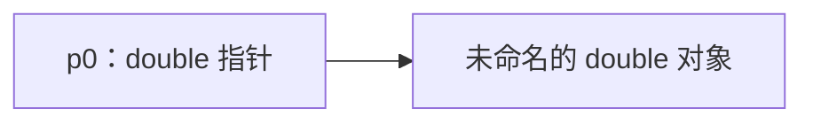
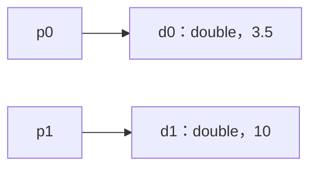
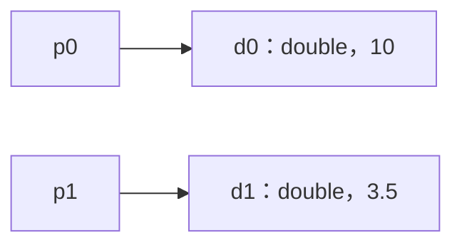

# 第 11 章：指针

本章介绍：

- 指针操作；
- 指针与结构体、数组和函数的配合使用。

[[toc]]

指针是深入理解 C 语言的第一道真正难关。当我们需要从代码的不同位置访问对象，或者需要在运行过程中动态组织数据时，就会用到指针。

初学者把指针和数组混为一谈是出了名的，所以请注意：准确掌握相关术语可能要费些功夫。另一方面，指针又是 C 最重要的特性之一。它们帮助我们屏蔽平台细节，建立抽象并编写可移植代码。因此，学习本章时请保持耐心，因为它对理解本书后续大部分内容至关重要。

**指针**（pointer）是一种特殊的派生类型构造，它“指向”或“引用”某项事物。我们已经见过这种构造的语法：在一个类型（称为**所引用类型**）后加上字符 `*`。例如，`p0` 是指向 `double` 的指针：

```c
double* p0;
```

其基本思想是：一个对象（指针）指向另一对象所在的内存。



本章始终需要严格区分指针本身（箭头左侧）与指针所指向的未命名对象（箭头右侧）。

指针的第一项用途，是打破函数调用方代码与函数内部代码之间的屏障，使我们能够编写非纯函数。以下函数原型就是一例：

```c
void double_swap(double* p0, double* p1);
```

这里有两个函数形参，它们分别“指向”一个 `double` 类型对象。`double_swap` 应当交换这两个对象的内容。例如，调用函数时，`p0` 和 `p1` 可以分别指向调用方定义的两个 `double` 对象 `d0` 和 `d1`：



函数得到这两个对象的信息后，可以有效交换它们的内容，而无须改变指针本身：



借助指针，该函数能直接修改调用函数中的对象；不使用指针或数组的纯函数无法做到这一点。

本章将详细讨论各种指针操作（第 11.1 节），以及几种使指针具有特殊性质的类型：结构体（第 11.2 节）、数组（第 11.3 节）和函数（第 11.4 节）。

## 11.1 指针操作

指针是一项重要概念，因此 C 专门为它提供了多种语言操作和特性。最重要的是，有一些专用运算符可以处理指针与其所指对象之间的“指向”关系（第 11.1.1 节）。指针也被视为**标量**：它支持加偏移量（第 11.1.2 节）和减偏移量（第 11.1.3 节）等算术操作。指针拥有状态（第 11.1.4 节），其中还有专门的“空”状态（第 11.1.5 节）。

### 11.1.1 取地址运算符与间接运算符

若需要完成纯函数无法表达的任务，事情就会复杂起来。我们必须触及并非函数自身局部对象的其他对象，而指针正是完成这项工作的适当抽象。

继续使用前面的 `double_swap`，交换两个 `double` 对象 `d0` 和 `d1` 的内容。调用时使用一元**取地址运算符** `&`，它允许我们通过对象的**地址**引用该对象：

```c
double_swap(&d0, &d1);
```

取地址运算符产生**指针类型**，可以用已经见过的 `*` 记法表示。函数可以实现为：

```c
void double_swap(double* p0, double* p1) {
    auto tmp = *p0;
    *p0 = *p1;
    *p1 = tmp;
}
```

函数内部的指针 `p0` 和 `p1` 保存函数应当操作的对象地址；在本例中，就是 `d0` 和 `d1` 的地址。但函数完全不知道这两个对象的名称，只知道 `p0` 和 `p1`。

访问对象需要使用取地址运算符的逆操作，也就是一元**间接运算符** `*`。`*p0` 表示第一个实参所对应的对象；对前面的调用而言，它就是 `d0`。同理，`*p1` 就是 `d1`。

请注意，字符 `*` 在 `double_swap` 的定义中扮演两种不同角色：在声明中，它构成新的指针类型；在表达式中，它**解引用**指针所引用的对象。为了帮助区分同一符号的两种用途，本书通常在它修饰类型时紧靠左侧，不留空格：

```c
double* p0;
```

而在表达式中解引用指针时，则让它靠近右侧：

```c
*p0 = *p1;
```

::: details 练习 14
编写一个函数，使其接收三个对象的指针，并循环移位这三个对象中的值。
:::

回想第 6.2 节：指针除了保存有效地址，还可能为空或无效。

::: tip 要点 11.1.1-1
若程序执行把 `*` 用于无效指针或空指针，则执行失败。
:::

实践中，这两种情况通常表现不同。无效指针可能访问并修改内存中的随机对象，往往会形成极难追踪的缺陷，因为它会闯入本不应触及的对象。空指针则通常会在开发早期暴露出来，让程序干脆利落地崩溃——请把这当作一项优点。

### 11.1.2 指针加法

我们已经看到，有效指针保存其所引用类型对象的地址；但 C 实际上作出了更强的假定。

::: tip 要点 11.1.2-1
有效指针引用一个由所引用类型构成的数组的首元素。
:::

换言之，指针不仅可以引用所引用类型的单个实例，也可以引用一个长度未知的数组。

指针与数组概念之间的纠缠，在语法中又向前迈出了一大步。定义 `double_swap` 时甚至不必使用指针记法；按照此前使用的记法，也可以写成：

```c
void double_swap(double p0[static 1], double p1[static 1]) {
    auto tmp = p0[0];
    p0[0] = p1[0];
    p1[0] = tmp;
}
```

接口中的数组记法，以及用 `[0]` 访问首元素的写法，都是 C 语言内建的简单改写操作。后文还会看到更多此类规则。

简单的加法运算使我们能够访问数组的后续元素。以下函数对数组的所有元素求和：

```c
double sum0(size_t len, double const* a) {
    double ret = 0.0;
    for (size_t i = 0; i < len; ++i) {
        ret += *(a + i);
    }
    return ret;
}
```

表达式 `a + i` 是指向数组第 `i` 个元素的指针。指针加法有多种写法，所以下列函数会按照完全相同的顺序对数组求和：

```c
double sum1(size_t len, double const* a) {
    double ret = 0.0;
    for (double const* p = a; p < a + len; ++p) {
        ret += *p;
    }
    return ret;
}

double sum2(size_t len, double const* a) {
    double ret = 0.0;
    for (double const* const a_stop = a + len; a < a_stop; ++a) {
        ret += *a;
    }
    return ret;
}
```

在 `sum1` 的第 `i` 次迭代中，指针 `p` 逐个走过数组元素，直到它大于或等于 `a + len`；后者是第一个越过数组末尾的指针值。

在 `sum2` 中，`a` 引用数组第 `i` 个元素。函数内部不会再引用第 `0` 个元素，但数组末尾的信息由对象 `a_stop` 保存。

这些函数可以这样调用：

```c
double s0_7 = sum0(7, &A[0]); // 整个数组
double s1_6 = sum0(6, &A[1]); // 最后 6 个元素
double s2_3 = sum0(3, &A[2]); // 中间 3 个元素
```

遗憾的是，我们无法得知隐藏在指针之后的数组长度，所以必须把长度作为形参传入函数。第 6.1.3 节介绍的 `sizeof` 技巧在这里不起作用。

::: tip 要点 11.1.2-2
无法从指针还原数组对象的长度。
:::

这正是指针与数组之间第一项重要差异。

::: tip 要点 11.1.2-3
指针不是数组。
:::

如果通过指针把数组传入函数，务必保留数组的真实长度。因此，本书始终偏爱在指针接口中采用数组记法：

```c
double sum0(size_t len, double const a[len]);
double sum1(size_t len, double const a[len]);
double sum2(size_t len, double const a[len]);
```

它们与前面的接口完全相同，但能让随手阅读代码的人清楚看到：`a` 应当拥有 `len` 个元素。

### 11.1.3 指针减法与指针差

此前讨论的指针算术，是把整数与指针相加。还有一项逆操作，可以从指针中减去整数。若想逆序访问数组元素，可以这样写：

```c
double sum3(size_t len, double const* a) {
    double ret = 0.0;
    double const* p = a + len - 1;
    do {
        ret += *p;
        --p;
    } while (p > a);
    return ret;
}
```

`p` 最初等于 `a + (len - 1)`。请注意，这个函数颠倒了求和顺序。[^rounding-order]

另一项操作称为**指针差**：它接收两个指针，计算二者之间以元素个数计量的距离。为展示这项操作，可以把 `sum3` 扩展为新版本，并检查一种错误情形：数组中有元素为无穷大。遇到这种情况时，函数要打印完整错误消息，并把肇事元素返回给调用方：[^isinf]

```c
double sum4(size_t len, double const* a) {
    double ret = 0.0;
    double const* p = a + len - 1;
    do {
        if (isinf(*p)) {
            fprintf(stderr,
                    "element %tu of array at %p is infinite\n",
                    p - a,     // 指针差！
                    (void*)a); // 打印指针值
            return *p;
        }
        ret += *p;
        --p;
    } while (p > a);
    return ret;
}
```

表达式 `p - a` 计算当前元素在数组中的位置。只有当两个指针引用同一数组对象的元素时，这项操作才有定义。否则程序就是错误的，并可能发生严重后果。

::: tip 要点 11.1.3-1
只能对指向同一数组对象元素的指针作减法。
:::

指针差的值，就是相应数组元素索引之差：

```c
double A[4] = {0.0, 1.0, 2.0, -3.0};
[[maybe_unused]] double* p = &A[1];
[[maybe_unused]] double* q = &A[3];
assert(p - q == -2);
```

我们已经强调过，表示对象大小的正确类型是 `size_t`。它是无符号类型，而且在许多平台上与 `unsigned` 不同。指针差也有与之对应的类型：一般不能假定简单的 `int` 足以容纳所有可能值。因此，标准头文件 `<stddef.h>` 提供了另一种类型。在大多数体系结构上，它就是与 `size_t` 对应的有符号整数类型，但我们无须依赖这一点。

::: tip 要点 11.1.3-2
所有指针差都具有 `ptrdiff_t` 类型。
:::

::: tip 要点 11.1.3-3
使用 `ptrdiff_t` 编码位置差或大小差的有符号值。
:::

`sum4` 还展示了一种为调试而打印指针值的方法：使用格式说明 `%p`，并通过 `(void*)a` 把指针实参强制转换为晦涩的 `void*` 类型。暂且把这项配方当作既定做法；我们尚未具备完整理解它所需的全部知识，第 12.4 节会给出更多细节。

::: tip 要点 11.1.3-4
打印指针值时，把它强制转换为 `void*`，并使用格式说明 `%p`。
:::

[^rounding-order]: 由于舍入差异，其结果可能与这一系列的前三个函数略有不同。
[^isinf]: `isinf` 来自头文件 `<math.h>`。

### 11.1.4 指针的有效性

前面已经看到，必须谨慎对待指针包含或未包含的地址。指针拥有一个值，也就是它包含的地址；这个值可以改变。

如果指针没有有效地址，把它设为空极为重要，绝不能遗忘。这有助于检查并追踪指针是否已经设置。

::: tip 要点 11.1.4-1
指针具有真值。
:::

为了避免笨拙的比较，C 程序中经常能看到这样的代码：

```c
char const* name = nullptr;
// 完成一些最终会设置 name 的工作
if (name) {
    printf("today's name is %s\n", name);
} else {
    printf("today we are anonymous\n");
}
```

因此，控制所有指针对象的状态十分重要。必须保证指针对象要么为空，要么指向我们确实想操作的有效对象。

::: tip 要点 11.1.4-2
尽早把指针对象设为空。
:::

大多数情况下，保证这一点最简单的办法是显式初始化指针对象（要点 6.2-6）。

我们之前已经见过不同类型的多种**表示**，也就是平台将特定类型的值存储在对象中的具体方式。对于一种类型（例如 `size_t`）来说有效的表示，在另一种类型（例如 `double`）看来可能毫无意义。只要我们直接访问对象，C 语言的类型系统就能保护我们，避免混淆这些不同的表示：`size_t` 类型的对象始终会被当作 `size_t` 来访问，绝对不会被错误地解释为没有意义的 `double` 值。

若使用不慎，指针会打破这道屏障，使代码试图把 `size_t` 的表示解释成 `double`。更一般地说，C 还专门命名了这样一种位模式：若按特定类型解释，它没有任何意义；对该类型而言，这称为**非值表示**。[^trap-representation]

::: tip 要点 11.1.4-3
如果程序执行访问了一个对象，而该对象具有其类型的非值表示，则执行失败。
:::

这样做会引发非常糟糕的后果，请不要尝试。因此，指针不仅必须指向某个对象（或为空），该对象还必须具有正确类型。

::: tip 要点 11.1.4-4
解引用时，指针所指对象必须具有指针指定的类型。
:::

一个直接推论是：指向数组边界之外的指针不得解引用。

```c
double A[2] = {0.0, 1.0};
double* p = &A[0];
printf("element %g\n", *p); // 引用对象
++p;                        // 有效指针
printf("element %g\n", *p); // 引用对象
++p;                        // 有效指针，但没有对象
printf("element %g\n", *p); // 引用非对象：程序执行失败
```

最后一行中，`p` 的值越过了数组边界。即使那里恰好是某个有效对象的地址，我们也对该对象一无所知。因此，即使 `p` 此时仍是有效指针，把那里存放的内容当作 `double` 访问也没有意义，C 通常禁止这种访问。

在前面的示例中，只要不执行最后一行的对象访问，指针加法本身就是正确的。指针的有效值包括所有数组元素的地址，以及刚好越过数组末尾的地址；否则，前面用指针加法编写的 `for` 循环便无法可靠工作。

::: tip 要点 11.1.4-5
指针必须指向有效对象、刚好越过该对象一个位置，或者为空。
:::

因此，前例一直到最后一行之前都能成立，是因为最后一次 `++p` 只让指针到达数组之后一个元素的位置。下面的版本仍然遵循相似模式：

```c
double A[2] = {0.0, 1.0};
double* p = &A[0];
printf("element %g\n", *p); // 引用对象
p += 2;                      // 有效指针，但没有对象
printf("element %g\n", *p); // 引用非对象：程序执行失败
```

但下面这个示例可能在加法操作处就崩溃：

```c
double A[2] = {0.0, 1.0};
double* p = &A[0];
printf("element %g\n", *p); // 引用对象
p += 3;                      // 无效的指针加法：程序执行失败
```

::: tip 要点 11.1.4-6
如果程序执行计算出的指针值超出数组对象边界（也不是刚好越过一个元素），则执行失败。
:::

[^trap-representation]: C23 以前使用的术语是**陷阱表示**（trap representation）。

### 11.1.5 空指针

你可能已经疑惑：关于指针讨论了这么多，为什么始终没有使用宏 `NULL`？原因是，C23 以前把空指针常量定义成“值为 0 的泛型指针”，但最初的这套观念并不成功。

C 有**空指针**概念，对应任何指针类型的空值。[^null-case]

```c
double const* const nix = nullptr;
double const* const nax = nix;
```

`nix` 和 `nax` 都是值为空的指针对象。但遗憾的是，**空指针常量**并不像名称看起来那样简单。

首先，这里的“常量”指编译时常量，而不是受 `const` 限定的对象。因此，上述两个指针对象都不是空指针常量。

其次，C23 以前允许这种常量采用的类型十分奇特：它可以是值为 `0` 的任意整数类型常量表达式，也可以具有 `void*` 类型。其他指针类型均不允许；第 12.4 节会介绍这种“类型”的指针。

C 标准对宏 `NULL` 可能展开成什么规定得相当宽松，只要求它是空指针常量。因此，C23 以前的编译器可以选择以下任一种展开：

| 展开 | 类型 |
| --- | --- |
| `0U` | `unsigned` |
| `0` | `signed` |
| `'\0'` | 值为 `0` 的枚举常量 |
| `0UL` | `unsigned long` |
| `0L` | `signed long` |
| `0ULL` | `unsigned long long` |
| `0LL` | `signed long long` |
| `(void*)0` | `void*` |

常见值为 `0`、`0L` 和 `(void*)0`。[^more-null]

务必注意，C 标准没有规定 `NULL` 背后的具体类型。人们经常用它强调自己正在谈论一个指针常量，而在许多平台上，它根本不是指针类型。在没有完全掌握的语境中使用 `NULL` 甚至很危险，尤其是第 17.4.2 节将讨论的可变实参数量函数。眼下采用最简单的方案即可。

::: tip 要点 11.1.5-1
使用 `nullptr`，不要使用 `NULL`。
:::

`NULL` 隐藏的信息多于它澄清的信息；而 C 编译器总在努力保持向后兼容，所以永远无法确信自己得到的究竟是哪一种形式。

[^null-case]: 注意普通词语“空”（null）与宏 `NULL` 的大小写不同。
[^more-null]: 理论上，`NULL` 还有更多可能的展开形式，例如 `((char)+0)` 和 `((short)-0)`。

## 11.2 指针与结构体

指向结构体类型的指针对绝大多数 C 代码都至关重要，因此语言制定了一些特殊规则和工具，以简化这种典型用法。例如，考虑把此前见过的 `struct timespec` 规范化。以下函数使用指针形参，直接操作相应对象：

::: details `timespec.c`：计算时间差
以下实现使用 `double` 计算时间。如果希望在不进一步损失精度的情况下追踪时间，并假定 `double` 具有 52 位尾数，那么可表示的最大时间差约为 `4.5E6` 秒，即 52 天。

```c
double timespec_diff(struct timespec const* later,
                     struct timespec const* sooner) {
    /* 小心：tv_sec 可能是无符号类型。 */
    if (later->tv_sec < sooner->tv_sec) {
        return -timespec_diff(sooner, later);
    } else {
        return (later->tv_sec - sooner->tv_sec)
               /* 已知 tv_nsec 是有符号类型。 */
               + (later->tv_nsec - sooner->tv_nsec) * 1E-9;
    }
}
```
:::

为了方便，这里使用新的 `->` 运算符。它形似箭头：左操作数是指针，“指向”右操作数所表示的底层结构体成员。它等价于 `*` 和 `.` 的组合。若想获得同样效果，需要写成带括号的 `(*a).tv_sec`，而不能写 `a->tv_sec`。这种写法很快会变得笨拙，所以所有人都使用 `->` 运算符。

请注意，`a->tv_nsec` 这样的构造并不是指针，而是 `long` 类型的对象，也就是数本身。

再看第 10.2.2 节引入的有理数类型 `rat`。清单 10.1 中操作该类型指针的函数可以写成：

```c
void rat_destroy(rat* rp) [[__unsequenced__]] {
    if (rp) {
        *rp = (rat){};
    }
}

rat* rat_init(rat* rp,
              signed sign,
              size_t num,
              size_t denom) [[__unsequenced__]] {
    if (rp) {
        *rp = rat_get(sign, num, denom);
    }
    return rp;
}

rat* rat_normalize(rat* rp) [[__unsequenced__]] {
    if (rp) {
        *rp = rat_get_normal(*rp);
    }
    return rp;
}

rat* rat_extend(rat* rp, size_t f) [[__unsequenced__]] {
    if (rp) {
        *rp = rat_get_extended(*rp, f);
    }
    return rp;
}
```

`rat_destroy` 保证清除对象中可能存在的全部数据，并把所有位设为 `0`。其余三个函数是对已知纯函数的简单包装器。它们先用指针的真值检验有效性，再在指针有效时引用相应对象。因此，即使指针实参为空，也能安全使用这些函数。

::: details 练习 21
按照清单 10.1 的声明实现 `rat_print`。该函数应使用 `->` 访问其 `rat*` 实参的成员，输出形式应为 `±nom/denum`。
:::

::: details 练习 22
组合 `rat_normalize` 与 `rat_print`，实现 `rat_print_normalized`。
:::

四个函数都会检查并返回其指针实参。这是一种便于组合函数的策略，下面两个算术函数的定义展示了这种做法：

```c
rat* rat_rma(rat* rp, rat x, rat y) [[__unsequenced__]] {
    return rat_sumup(rp, rat_get_prod(x, y));
}
```

`rat_rma`（rational multiply add，有理数乘加）完整体现了自身用途：把另外两个函数实参的乘积，加到 `rp` 所引用的对象中。它通过以下函数完成加法：

```c
rat* rat_sumup(rat* rp, rat y) [[__unsequenced__]] {
    size_t c = gcd(rp->denom, y.denom);
    size_t ax = y.denom / c;
    size_t bx = rp->denom / c;
    rat_extend(rp, ax);
    y = rat_get_extended(y, bx);
    assert(rp->denom == y.denom);

    if (rp->sign == y.sign) {
        rp->num += y.num;
    } else if (rp->num > y.num) {
        rp->num -= y.num;
    } else {
        rp->num = y.num - rp->num;
        rp->sign = !rp->sign;
    }
    return rat_normalize(rp);
}
```

`rat_sumup` 是一个更加复杂的例子，其中对指针实参应用了两个维护函数。

::: details 练习 23
实现清单 10.1 中的 `rat_dotproduct`，使其计算 $\sum_{i=0}^{n-1} A[i] \times B[i]$，并把结果存入 `*rp` 后返回。
:::

结构体类型指针还适用另一项特殊规则：即使结构体类型本身未知，也可以使用其指针。这种**不透明结构体**经常用于严格分离库的接口与实现。例如，可以在包含文件中这样公开一个虚构类型 `toto`：

```c
/* struct toto 的前向声明。 */
struct toto;
struct toto* toto_get(void);
void toto_destroy(struct toto*);
void toto_doit(struct toto*, unsigned);
```

无论程序员还是编译器，都不需要更多信息便能使用 `struct toto`。`toto_get` 可以取得 `struct toto` 类型对象的指针，而无须知道定义这些函数的翻译单元究竟怎样定义了该结构体。编译器也能处理这种情况，因为它知道所有结构体指针都具有相同表示，不受底层具体类型定义影响。

这类接口经常利用空指针的特殊性。在前例中，`toto_doit(nullptr, 42)` 可能就是有效用法。因此，许多 C 程序员不喜欢把指针隐藏在 `typedef` 中：

```c
/* 前向声明 struct toto_s，并用类型 toto 隐藏指针。 */
typedef struct toto_s* toto;
toto toto_get(void);
void toto_destroy(toto);
void toto_doit(toto, unsigned);
```

这是有效的 C，却隐藏了 `nullptr` 是 `toto_doit` 可能接收的特殊值这一事实。

::: tip 要点 11.2-1
不要在 `typedef` 中隐藏指针类型。
:::

这与仅为结构体引入 `typedef` 名称不同，后者正是此前采用的做法：

```c
/* struct toto 的前向声明及 typedef 名称 toto。 */
typedef struct toto toto;
toto* toto_get(void);
void toto_destroy(toto*);
void toto_doit(toto*, unsigned);
```

这里，接口接收指针这一事实依然清晰可见。

::: details 挑战 12：文本处理器
能否使用双向链表为文本处理器存储文本？基本思路是用结构体表示一“块”文本，其中包含一个字符串（文本本身），以及分别指向前一块和后一块的指针。

- 能否编写一个函数，在指定位置把一块文本拆成两块？
- 能否编写一个函数，合并相邻的两块文本？
- 能否遍历整篇文本，把它整理成每行一块？
- 能否编写一个函数，打印整篇文本，或者在文本因屏幕大小而被截断前停止打印？
:::

## 11.3 指针与数组

现在可以攻克理解数组与指针关系时的主要障碍了：C 使用同一套语法访问指针和数组元素，而且会把函数的数组形参改写成指针。对经验丰富的 C 程序员而言，这两项特性都提供了方便的快捷方式；但初学者需要花些功夫才能消化。

### 11.3.1 数组访问与指针访问相同

无论 `A` 是数组还是指针，以下结论始终成立。

::: tip 要点 11.3.1-1
表达式 `A[i]` 与 `*(A + i)` 等价。
:::

若 `A` 是指针，第二个表达式很容易理解：它只是说明同一表达式也可以写成 `A[i]`。把数组访问记法用于指针，往往能提高代码可读性。但这种等价并不意味着原本没有数组的地方突然出现了数组对象。如果 `A` 为空，`A[i]` 应当干脆利落地崩溃，`*(A + i)` 也一样。

若 `A` 是数组，`*(A + i)` 就展示了 C 最重要的规则之一首次发挥作用，这项规则称为**数组到指针退化**。

::: tip 要点 11.3.1-2：数组退化
对数组 `A` 求值会得到 `&A[0]`。
:::

这正是 C 中不存在“数组值”以及由此产生各种困难的原因（要点 6.1.2-2）。只要数组出现在需要值的语境中，它就退化成指针，所有附加信息也随之丢失。

### 11.3.2 数组形参与指针形参相同

由于会发生退化，数组无法成为函数实参。即使函数真有数组形参，也没有办法用数组调用它：传入函数的数组会在调用前退化成指针，于是实参类型便无法匹配。

但前文确实见过带数组形参的函数声明，它们为何能够工作？C 所用的技巧是把数组形参改写成指针。

::: tip 要点 11.3.2-1
在函数声明中，任何数组形参都会改写成指针。
:::

请花些时间思考这项规则及其含义。要轻松编写 C 代码，关键就在于理解这项“首要特性”（或者说性格缺陷）。

回到第 6.1.5 节的示例，原本采用数组形参的函数也可以声明成：

```c
size_t strlen(char const* s);
char* strcpy(char* target, char const* source);
signed strcmp(char const* s0, char const* s1);
```

这些形式完全等价，任何 C 编译器都应当能够交替使用它们。

选择哪一种写法，是习惯、文化或其他社会背景的问题。本书遵循的规则是：如果某项内容按约定不能为空，就采用数组记法；如果它表示基础类型的单个项目，并且可以用空值表示特殊情形，就采用指针记法。

如果形参在语义上是数组，只要可能，还要注明预期的数组大小。为了做到这一点，通常最好把长度放在数组或指针之前：

```c
double double_copy(size_t len,
                   double target[len],
                   double const source[len]);
```

这样的接口本身就讲述了完整的故事。处理二维数组时，它会更加有趣。典型的矩阵乘法可以写成：

```c
void matrix_mult(size_t n, size_t k, size_t m,
                 double C[n][m],
                 double const A[n][k],
                 double const B[k][m]) {
    for (size_t i = 0; i < n; ++i) {
        for (size_t j = 0; j < m; ++j) {
            C[i][j] = 0.0;
            for (size_t l = 0; l < k; ++l) {
                C[i][j] += A[i][l] * B[l][j];
            }
        }
    }
}
```

该原型等价于可读性较差的：

```c
void matrix_mult(size_t n, size_t k, size_t m,
                 double (C[n])[m],
                 double const (A[n])[k],
                 double const (B[k])[m]);
```

也等价于：

```c
void matrix_mult(size_t n, size_t k, size_t m,
                 double (*C)[m],
                 double const (*A)[k],
                 double const (*B)[m]);
```

请注意，把最内层维度改写成指针后，形参类型便不再是数组，而是**指向数组的指针**，所以无须继续改写后续维度。

::: tip 要点 11.3.2-2
只有数组形参的最内层维度会被改写。
:::

采用数组记法让我们获益良多：可以毫无困难地把 VLA 指针传入函数，并在函数内部用传统索引访问矩阵元素；几乎不必施展什么技巧便能追踪数组长度。

::: tip 要点 11.3.2-3
长度形参应当声明在数组形参之前。
:::

只要在首次使用长度的位置之前已经知道它们即可。

遗憾的是，C 通常不会保证带数组长度形参的函数总能得到正确调用。

::: tip 要点 11.3.2-4
函数数组实参的有效性必须由程序员保证。
:::

若数组长度在编译时已知，编译器或许能够发出警告；但数组长度是动态值时，主要只能依靠自己，务必谨慎。

还要注意，前述原型中的矩阵 `A` 和 `B` 具有受 `const` 限定的基础类型。只有从 C23 开始，才能始终如一地这样做；C23 为提高易用性改变了相应规则。在 C23 以前，以下代码会产生错误，因为形参 `A` 和 `B` 的目标类型与实参受到不同限定：

```c
double matA[2][2] = {{0, 0}, {0, 0}};
double matB[2][2] = {{0, 0}, {0, 0}};
double matC[2][2] = {{0, 0}, {0, 0}};
matrix_mult(2, 2, 2, matC, matA, matB);
```

过去的规则与使用指针的指针而非数组指针的函数相同：

```c
void fake_mult(size_t n, size_t k, size_t m,
               double** C,
               double const** A,
               double const** B);

double** fakeA = (double*[2]){
    (double[2]){0, 0},
    (double[2]){0, 0},
};
double** fakeB = (double*[2]){
    (double[2]){0, 0},
    (double[2]){0, 0},
};
double** fakeC = (double*[2]){
    (double[2]){0, 0},
    (double[2]){0, 0},
};

// 错误：*fakeA 与 *A 不兼容。
fake_mult(2, 2, 2, fakeC, fakeA, fakeB);
```

## 11.4 函数指针

取地址运算符 `&` 还可以用于另一种构造：函数。讨论 `atexit`（第 8.8 节）时已经见过这个概念；它就是接收函数实参的函数。相应规则与前面介绍的数组退化相似。

::: tip 要点 11.4-1：函数退化
不带后续圆括号的函数名，会退化成指向函数入口的指针。
:::

在类型声明和函数形参中，函数与函数指针在语法上也和数组相似：

```c
typedef void atexit_function(void);

/* 同一类型的两个等价定义，其中隐藏了一个指针。 */
typedef atexit_function* atexit_function_pointer;
typedef void (*atexit_function_pointer)(void);

/* 同一函数的五项等价声明。 */
void atexit(void f(void));
void atexit(void (*f)(void));
void atexit(atexit_function f);
void atexit(atexit_function* f);
void atexit(atexit_function_pointer f);
```

哪种语义等价的函数声明方式最易阅读，足以引发长篇争论。第二种写法带有 `(*f)` 圆括号，很快就会变得难读；第五种则因把指针隐藏在类型中而不受欢迎。在其他写法中，作者个人稍微偏爱第四种而非第一种。

C 库有多个接收函数形参的函数。我们已经见过 `atexit` 和 `at_quick_exit`。头文件 `<stdlib.h>` 中还有一对函数，为搜索（`bsearch`）和排序（`qsort`）提供泛型接口：

```c
typedef int compare_function(void const*, void const*);

void* bsearch(void const* key,
              void const* base,
              size_t n,
              size_t size,
              compare_function* compar);

void qsort(void* base,
           size_t n,
           size_t size,
           compare_function* compar);
```

二者都接收数组 `base`，并在它上面完成各自任务。首元素地址作为 `void` 指针传入，所以全部类型信息都会丢失。为了正确处理数组，函数必须知道各元素的大小 `size` 以及元素数量 `n`。

此外，它们还接收一个比较函数形参，提供元素间排序关系的信息。借助这种函数指针，`bsearch` 和 `qsort` 非常通用，只要数据模型允许对值排序，就能用于该模型。`base` 形参引用的元素可以是任意类型 `T`，例如 `int`、`double`、字符串或应用定义的类型；只要 `size` 正确描述 `T` 的大小，并且 `compar` 所指函数知道如何一致地比较 `T` 类型值即可。

这种函数的简单版本如下：

```c
int compare_unsigned(void const* a, void const* b) {
    unsigned const* A = a;
    unsigned const* B = b;
    if (*A < *B) {
        return -1;
    } else if (*A > *B) {
        return +1;
    } else {
        return 0;
    }
}
```

约定是：两个实参指向需要比较的元素。如果认为 `a` 小于 `b`，返回值严格小于 `0`；如果二者相等，返回 `0`；否则返回严格大于 `0` 的值。

返回类型 `int` 似乎暗示，整数比较可以写得更简单：

```c
/* 无效的整数比较示例。 */
int compare_int(void const* a, void const* b) {
    int const* A = a;
    int const* B = b;
    return *A - *B; // 可能溢出！
}
```

但这样并不正确。例如，若 `*A` 很大（如 `INT_MAX`），而 `*B` 为负，二者之差的数学值可能大于 `INT_MAX`。

由于接口使用 `void` 指针，运用这套机制时，应当把类型转换封装起来：

```c
/* 为 unsigned 提供搜索与排序的头文件。 */
/* 这里不用 inline；我们始终使用函数指针。 */
extern int compare_unsigned(void const*, void const*);

inline unsigned const* bsearch_unsigned(
    unsigned const key[static 1],
    size_t nmemb,
    unsigned const base[nmemb]) {
    return bsearch(key, base, nmemb, sizeof base[0], compare_unsigned);
}

inline void qsort_unsigned(size_t nmemb, unsigned base[nmemb]) {
    qsort(base, nmemb, sizeof base[0], compare_unsigned);
}
```

`bsearch`（binary search，二分搜索）查找与 `key[0]` 比较相等的元素；找到时返回该元素，否则返回空指针。它假定数组 `base` 已经按照比较函数给出的次序一致排序，这一假定有助于加快搜索。尽管 C 标准没有明确规定，但可以预期，一次 `bsearch` 调用对 `compar` 的调用不会超过 $\lceil\log_2(n)\rceil$ 次。

若 `bsearch` 找到与 `*key` 相等的数组元素，就返回该元素的指针。请注意，这样使用会在 C 的类型系统上钻出一个洞：它返回的是未限定指针，而元素的有效类型可能受 `const` 限定。务必谨慎。本例直接把返回值转换成 `unsigned const*`，所以调用 `bsearch_unsigned` 的一侧甚至不会看到未限定指针。从 C23 开始，`bsearch` 实际上已经升级为同名的类型泛型宏，绕开了这项缺陷；见第 18.1.7 节。

`qsort` 之名来自快速排序算法。标准并未强制选择哪种排序算法，但预期的比较次数应当与快速排序一样，处于 $n\log_2(n)$ 的数量级。标准不保证上界；可以假定其最坏情况复杂度至多是二次的，即 $O(n^2)$。

`void*` 是一网打尽的对象指针类型，可以作为指向各种对象类型的泛型指针；但函数指针不存在这样的泛型类型，也不存在相应的隐式转换。

::: tip 要点 11.4-2
函数指针必须采用完全匹配的类型。
:::

之所以需要如此严格，是因为不同原型的函数可能采用截然不同的调用约定，[^abi] 而指针本身不会记录这些信息。

以下函数存在一个微妙问题：形参类型与比较函数所要求的类型不同。

```c
/* 另一个无效的 int 比较函数示例。 */
int compare_int(int const* a, int const* b) {
    if (*a < *b) {
        return -1;
    } else if (*a > *b) {
        return +1;
    } else {
        return 0;
    }
}
```

尝试把它用于 `qsort` 时，编译器应当报告函数类型错误。前面通过中间 `void const*` 形参实现的版本，效率应当几乎与这个无效示例相同，却能保证在所有 C 平台上都正确。

通过 `(...)` 运算符调用函数和函数指针时，规则与数组、指针及 `[...]` 运算符相似：

```c
double f(double a);

/* 对 f 的等价调用，以及抽象状态机中的步骤。 */
f(3);     // 退化 -> 调用
(&f)(3);  // 取地址 -> 调用
(*f)(3);  // 退化 -> 解引用 -> 退化 -> 调用
(*&f)(3); // 取地址 -> 解引用 -> 退化 -> 调用
(&*f)(3); // 退化 -> 解引用 -> 取地址 -> 调用
```

::: tip 要点 11.4-3
函数调用运算符 `(...)` 作用于函数指针。
:::

因此，从抽象状态机的角度看，指针退化总会发生，函数也总是通过函数指针调用。第一种“自然”调用隐藏了对标识符 `f` 的一次求值，其结果就是函数指针。

掌握这些规则后，几乎可以像使用函数一样使用函数指针：

```c
/* 头文件中。 */
typedef int logger_function(char const*, ...);
extern logger_function* logger;

enum logs {
    log_pri,
    log_ign,
    log_ver,
    log_num,
};
```

这里声明了一个全局对象 `logger`，它将指向打印日志信息的函数。使用函数指针，模块使用者便可以动态选择具体函数：

```c
/* 一个 .c 文件（翻译单元）中。 */
extern int logger_verbose(char const*, ...);

static int logger_ignore(char const*, ...) {
    return 0;
}

logger_function* logger = logger_ignore;

static logger_function* loggers[] = {
    [log_pri] = printf,
    [log_ign] = logger_ignore,
    [log_ver] = logger_verbose,
};
```

这段代码定义了实现该方法所需的工具。特别是，函数指针可以充当数组的基础类型（这里就是 `loggers`）。数组初始化使用两个外部函数（`printf` 和 `logger_verbose`）以及一个静态函数（`logger_ignore`）；存储类并不是函数接口的一部分。

`logger` 可以像其他指针类型一样赋值。可以在启动阶段的某处写下：

```c
if (LOGGER < log_num) {
    logger = loggers[LOGGER];
}
```

此后便能在任何地方使用该函数指针，调用对应函数：

```c
logger("Do we ever see line %lu of file %s?",
       __LINE__ + 0UL,
       __FILE__);
```

这次调用使用特殊宏 `__LINE__` 和 `__FILE__`，分别表示行号和源文件名。第 17.3 节会详细讨论它们。

使用函数指针时，必须始终意识到它给函数调用引入了一层间接访问。编译器必须先取得 `logger` 的内容，然后才能调用在相应地址找到的函数。这会带来一定开销，应当在时间关键代码中避免。

[^abi]: 例如，平台的应用二进制接口（ABI）可能通过专用硬件寄存器传递浮点数。

::: details 挑战 13：泛型导数
- 能否扩展挑战 2 和挑战 5 中的实数导数与复数导数，使其把函数 $F$ 和值 $x$ 作为形参接收？
- 能否利用泛型实数导数实现求根的牛顿法？
- 能否求出多项式的实零点？
- 能否求出多项式的复零点？
:::

::: details 挑战 14：泛型排序
- 能否把挑战 1 中的排序算法扩展到其他排序键？
- 能否把针对不同排序键的函数归并成与 `qsort` 具有相同签名的函数，也就是接收数据的泛型指针、大小信息和比较函数？
- 能否把挑战 10 中对排序算法的性能比较扩展到 C 库函数 `qsort`？
:::

## 本章小结

- 指针可以引用对象和函数。
- 指针不是数组，但会引用数组。
- 函数的数组形参会自动改写成对象指针。
- 函数的函数形参会自动改写成函数指针。
- 对函数指针赋值或通过它调用函数时，类型必须完全匹配。
