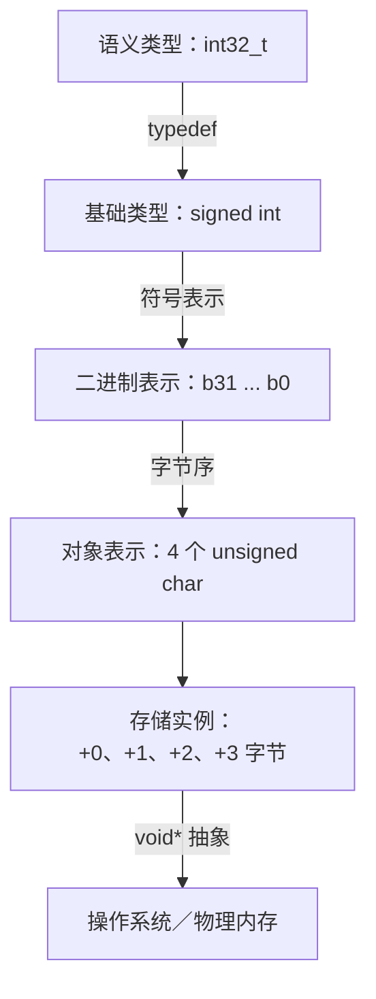

# 第 12 章：C 内存模型

本章介绍：

- 理解对象表示；
- 使用无类型指针与强制转换；
- 通过有效类型和对齐限制对象访问。

[[toc]]

指针为程序执行所处的环境和状态提供了一种抽象，也就是 **C 内存模型**。我们可以对（几乎）所有对象应用一元运算符 `&`，[^register-address] 取得其地址，再利用该地址检查并改变执行状态。

通过指针访问对象依然是一种抽象，因为 C 并不区分对象的“真实”位置。对象可能位于计算机的 RAM 中、磁盘文件中，甚至对应月球上某个温度传感器的输入输出端口；你不必关心。无论对象位于何处，C 都应当正确处理。

事实上，在现代操作系统上，通过指针得到的只是所谓的**虚拟内存**。它基本是一套虚构机制，把进程地址空间映射到机器的物理内存地址。发明这套机制，是为了让程序执行具有以下性质：

- **可移植：** 不必关心具体机器上的物理内存地址。
- **安全：** 读取或写入不属于当前进程的虚拟内存，既不会影响操作系统，也不会影响其他进程。

C 唯一必须关心的是指针所寻址对象的类型。每种指针类型都由另一类型——它的**基础类型**——派生而来，并且每种这样的派生类型都是彼此不同的新类型。

::: tip 要点 12-1
基础类型不同的指针类型彼此不同。
:::

内存模型除了提供物理内存的虚拟视图，还简化了我们观察对象的方式：它假定每个对象都是一组字节，这组字节称为**对象表示**（第 12.1 节）。[^object-binary] 联合体是检查对象表示的便利工具（第 12.2 节）。直接访问对象表示（第 12.3 节），可以对程序作出一些精细调整；但另一方面，这也为无意或有意操纵抽象机器状态打开了大门。相应工具包括无类型指针（第 12.4 节）和强制转换（第 12.5 节）。有效类型（第 12.6 节）与对齐（第 12.7 节）则描述了此类操作的形式边界和平台约束。

[^register-address]: 只有用关键字 `register` 声明的对象没有地址；见第 13.2.2 节。
[^object-binary]: 对象表示与第 5.1.3 节介绍的二进制表示有关，但二者并不是同一事物。

## 12.1 统一内存模型

尽管一般而言所有对象都有类型，内存模型还会再作一层简化：所有对象都是**字节的集合**。此前结合数组介绍的 `sizeof` 运算符，以对象所用字节数为单位测量对象大小。按照定义，三种彼此不同的类型恰好占用一个字节：字符类型 `char`、`unsigned char` 和 `signed char`。

::: tip 要点 12.1-1
按照定义，`sizeof(char)` 等于 `1`。
:::

下图以一种平台为例，展示 `int32_t` 值与内存之间的不同抽象层。该平台把 `int32_t` 映射为 32 位 `signed int`，并采用小端对象表示。



所有对象不仅都能在较低层次按字符类型的数量计算大小，甚至还能像字符类型数组一样接受检查和操作。稍后会看到具体做法，现在先记住以下结论。

::: tip 要点 12.1-2
任何对象 `A` 都可以视为 `unsigned char[sizeof A]`。
:::

::: tip 要点 12.1-3
指向字符类型的指针具有特殊地位。
:::

遗憾的是，用于组成所有其他对象类型的类型，源自此前处理字符串字符时见过的 `char`。这仅仅是历史偶然，不应作过度解读；尤其要明确区分两种不同用途。

::: tip 要点 12.1-4
字符和字符串数据使用 `char` 类型。
:::

::: tip 要点 12.1-5
所有对象类型都以 `unsigned char` 类型作为基本单元。
:::

`signed char` 的重要性远低于另外两种类型。

如前所述，`sizeof` 运算符按照对象占用多少个 `unsigned char` 计算其大小。

::: tip 要点 12.1-6
`sizeof` 运算符可以用于对象和对象类型。
:::

此前的讨论还让我们能够区分 `sizeof` 的两种语法形式：带圆括号与不带圆括号。用于对象时，两种形式都可以；用于类型时，则必须使用圆括号。

::: tip 要点 12.1-7
类型 `T` 的所有对象都具有大小 `sizeof(T)`。
:::

## 12.2 联合体

现在来看一种检查对象各个字节的方法。首选工具是 `union`。它的声明与 `struct` 相似，语义却不同：

```c
typedef union unsigned_inspect unsigned_inspect;

union unsigned_inspect {
    unsigned val;
    unsigned char bytes[sizeof(unsigned)];
};

unsigned_inspect twofold = {.val = 0xAABBCCDD};
```

这种联合体不会把不同类型的对象汇集到一个更大的对象中，而是让同一个对象叠加多种不同的类型解释。因此，它正适合检查另一类型对象的各个字节。

先判断各个字节的预期值。稍微宽泛地说，可以把无符号数中与各字节对应的不同部分称为**表示数字**。因为这些字节被视为 `unsigned char`，它们可以取得从 `0` 到 `UCHAR_MAX`（含）的值，所以可以把整个数理解成以 `UCHAR_MAX + 1` 为基数书写的数。

在作者的机器上，一个 `unsigned` 类型值可以用 `sizeof(unsigned) == 4` 个这样的表示数字表达。示例从最高位到最低位依次选择 `0xAA`、`0xBB`、`0xCC` 和 `0xDD`。其中 `CHAR_BIT` 表示字符类型的位数，完整的 `unsigned` 值可由下列表达式计算：

```c
((0xAA << (CHAR_BIT * 3))
 | (0xBB << (CHAR_BIT * 2))
 | (0xCC << CHAR_BIT)
 | 0xDD)
```

前面定义的联合体为观察同一个 `twofold` 对象提供了两个不同侧面：`twofold.val` 把它呈现为 `unsigned`，`twofold.bytes` 则把它呈现为 `unsigned char` 数组。由于 `twofold.bytes` 的长度恰好等于 `twofold.val` 的大小，它准确表示后者的所有字节，使我们能够通过全部表示数字检查 `unsigned` 值的对象表示：

```c
printf("value is 0x%.08X\n", twofold.val);
for (size_t i = 0; i < sizeof twofold.bytes; ++i) {
    printf("byte[%zu]: 0x%.02hhX\n", i, twofold.bytes[i]);
}
```

作者的计算机得到如下结果：[^try-endianness]

```ansi
~/build/modernC% code/endianness
value is 0xAABBCCDD
byte[0]: 0xDD
byte[1]: 0xCC
byte[2]: 0xBB
byte[3]: 0xAA
```

在这台机器上，输出先给出整数最低位的表示数字，然后逐步提高位序，最后打印最高位表示数字。因此，该机器中这种整数的内存表示会把低位表示数字放在高位表示数字之前。

标准没有统一规定这一点，它属于实现定义行为。

::: tip 要点 12.2-1
算术类型各个表示数字在内存中的顺序由实现定义。
:::

也就是说，平台提供方完全可以选择先存最高位数字，再逐个存放较低位数字。作者机器采用的这种存储顺序称为**小端序**（little-endian）；先存最高位表示数字的系统则称为**大端序**（big-endian）。[^end-name] 两种顺序都广泛用于现代处理器类型，有些处理器甚至能在运行过程中切换顺序。

从 C23 开始，头文件 `<stdbit.h>` 提供了一组宏，用于描述编译器实现的字节序：

| 平台字节序 | 宏 |
| --- | --- |
| 本机 | `__STDC_ENDIAN_NATIVE__` |
| 小端 | `__STDC_ENDIAN_LITTLE__` |
| 大端 | `__STDC_ENDIAN_BIG__` |
| 其他 | 与上述值不同 |

前面的输出还展示了另一项实现定义行为：示例利用了当前平台的一项特性，让一个表示数字恰好可以用两个十六进制数字整齐打印。换言之，它假定 `UCHAR_MAX + 1` 等于 `256`，而 `unsigned char` 的值位数 `CHAR_BIT` 等于 `8`。这同样属于实现定义行为。绝大多数平台——尤其是所有 POSIX 系统——确实具有这些性质，但仍有少数平台采用更宽的字符类型。

::: tip 要点 12.2-2
在大多数体系结构上，`CHAR_BIT` 等于 `8`，`UCHAR_MAX` 等于 `255`。
:::

示例检查的是最简单算术基础类型——无符号整数——的内存表示。其他基础类型具有更复杂的内存表示：有符号整数类型必须编码符号；浮点类型必须编码符号、尾数和指数；指针类型则可以遵循符合底层体系结构的任意内部约定。

::: details 练习 30
设计一个类似的联合体类型，检查 `double*` 等指针类型的各个字节。
:::

::: details 练习 31
使用这样的联合体，检查数组中两个连续元素的地址。
:::

::: details 练习 32
比较不同程序执行中同一个对象的地址。
:::

[^try-endianness]: 请在自己的机器上试运行这段代码。
[^end-name]: 两个名称来自率先存储的是数的“大端”还是“小端”。

## 12.3 内存与状态

所有对象的值共同构成抽象状态机的状态，也就构成一次具体执行的状态。C 内存模型通过 `&` 运算符，为（几乎）所有对象提供了近似唯一的位置；程序的不同部分可以通过指针访问并修改该位置。

这种能力会使确定一次执行的抽象状态困难得多，在许多情况下甚至不再可能：

```c
double blub(double const* a, double* b);

int main(void) {
    double c = 35;
    double d = 3.5;
    printf("blub is %g\n", blub(&c, &d));
    printf("after blub the sum is %g\n", c + d);
}
```

这里，我们（以及编译器）只能看到 `blub` 的声明，看不到定义，所以无法判断该函数会对实参所指对象做些什么。特别是，我们不知道对象 `d` 是否被修改，因此 `c + d` 的和可能是任何值。程序确实必须检查内存中的 `d`，才能得知调用 `blub` 之后的值。

再看一个接收两个指针实参的函数：

```c
double blub(double const* a, double* b) {
    double my_a = *a;
    *b = 2 * my_a;
    return *a; // 可能是 my_a，也可能是 2 * my_a。
}
```

这种函数可能在两种不同假定下运行。第一种情况下，两个实参是不同地址，`*a` 不会改变，返回值与 `my_a` 相同。第二种情况下，两个实参相同，例如调用 `blub(&c, &c)`，那么对 `*b` 赋值也会改变 `*a`。

通过不同指针访问同一个对象的现象称为**别名**（aliasing），它经常导致优化机会丢失。如果能够确定两个指针总是形成别名，或者确定它们绝不形成别名，一次执行可能具有的抽象状态都会大幅减少，优化器通常能充分利用这项知识。因此，C 强制把可能形成的别名限制在具有相同类型的指针之间。

::: tip 要点 12.3-1：别名
除字符类型外，只有基础类型相同的指针才能形成别名。
:::

稍微修改前面的示例，就能看到这项规则发挥作用：

```c
size_t blob(size_t const* a, double* b) {
    size_t my_a = *a;
    *b = 2 * my_a;
    return *a; // 必须等于 my_a。
}
```

这里的两个形参类型不同，所以 C 假定它们不会寻址同一个对象。实际上，对某个对象 `e` 调用 `blob(&e, &e)` 本身就是错误的，因为它无法匹配 `blob` 的原型。因此，执行到 `return` 语句时，可以确信对象 `*a` 没有改变，而且所需值已经保存在 `my_a` 中。

有一些办法可以欺骗编译器，用寻址同一对象的指针调用这种函数；后文会看到其中几种把戏。不要这样做——这条路只会通向深重的痛苦与绝望。这样做会使程序行为未定义，所以必须保证（并证明）没有发生别名。

相反，应当设法编写能够保护对象、使其永远不会形成别名的程序。有一个简单办法可以做到这一点。

::: tip 要点 12.3-2
避免使用 `&` 运算符。
:::

根据给定对象的性质，编译器可能发现其地址从未被取得，因而它根本无法形成别名。第 13.2 节将介绍对象的哪些性质可能影响这类判断，以及关键字 `register` 如何防止我们无意中取得地址。再往后的第 16.2 节则会说明：即使指针实参具有相同基础类型，关键字 `restrict` 也能指定它们的别名性质。

## 12.4 指向非特定对象的指针

如前所述，对象表示提供了一种视图，把对象 `X` 看成 `unsigned char[sizeof X]` 数组。该数组的起始地址具有 `unsigned char*` 类型，可以访问已经剥离原始类型信息的内存。

C 发明了一种强大工具，用更泛化的方式处理此类指针：让指针指向一种近似“非类型”的类型 `void`。

::: tip 要点 12.4-1
任何对象指针都能与 `void*` 相互转换。
:::

注意，这只适用于对象指针，不适用于函数指针。可以把保存现有对象地址的 `void*` 指针，看作指向承载该对象的存储实例的指针。

电话簿可以类比这种层次结构：人名对应引用对象的标识符；“手机”“住宅”或“工作”等条目分类对应类型；电话号码本身则近似地址，通常不是我们真正关心的信息。但电话号码又抽象掉了另一部电话具体位于何处（对应对象底层的存储实例）、电话本身是固定电话还是移动电话，以及网络究竟怎样把你连接到另一端的人等具体信息。

::: tip 要点 12.4-2
对象具有存储、类型和值。
:::

转换成 `void*` 不仅有明确定义，还保证在指针值方面具有良好行为。

::: tip 要点 12.4-3
把对象指针转换成 `void*`，再转换回原来的类型，是恒等操作。
:::

因此，转换为 `void*` 时唯一丢失的是类型信息；值保持不变。

::: tip 要点 12.4-4：第二项“避免”原则
避免使用 `void*`。
:::

它会彻底移除与地址关联的全部类型信息。只要能够避免，就不要使用。反方向的转换没有那么危险，特别是当某个 C 库调用返回 `void*` 时。

类型 `void` 本身不应当用于对象声明，因为这样无法产生任何可供操作的对象。

## 12.5 显式转换

若想检查对象 `X` 的对象表示，一种便利方式是设法把指向 `X` 的指针转换成 `unsigned char*`：

```c
double X;
unsigned char* Xp = &X; // 错误：不允许隐式转换。
```

好在 `double*` 到 `unsigned char*` 的这种隐式转换不受允许；必须以某种方式明确作出转换。

此前已经看到，在许多位置上，某种类型的值会隐式转换为另一类型的值（第 5.4 节）；窄整数类型也会在参与任何操作前先转换成 `int`。由此可见，窄类型只在非常特殊的情形下有意义：

- 必须节省内存，需要一个由小型值组成、规模确实非常大的数组。这里的“非常大”可能意味着数百万乃至数十亿个元素；在这种情况下，用窄类型存储值可能带来收益。
- 使用 `char` 表示字符和字符串，但不会用它们进行算术运算。
- 使用 `unsigned char` 检查对象字节，同样不会用它们进行算术运算。

指针类型转换更加微妙，因为它可能改变对象的类型解释。数据指针只允许两类隐式转换：与 `void*` 之间的转换，以及为目标类型增加限定符的转换。来看一些示例：

```c
float f = 37.0;          // 转换为 float。
double a = f;            // 转换回 double。
float* pf = &f;          // 类型精确匹配。
float const* pfc = &f;   // 转换：增加限定符。
void* pv = &f;           // 转换：指针转换为 void*。
float* pfv = pv;         // 转换：指针从 void* 转换回来。
float* pd = &a;          // 错误：指针类型不兼容。
double* pdv = pv;        // 使用时出错。
```

前两项涉及 `void*` 的转换（`pv` 和 `pfv`）已经有些棘手：指针来回转换，但我们注意让 `pfv` 的目标类型与 `f` 相同，所以一切正常。

接下来是错误部分。初始化 `pd` 时，编译器能够保护我们免遭严重故障。把指针赋给大小和解释均不相同的类型，可能且确实会造成严重破坏。任何符合标准的编译器都必须为这一行给出诊断。你现在应当充分理解，代码不应产生编译器警告（要点 1.2-3），也应当知道：修复这类错误前绝不能继续。

最后一行更糟：它包含错误，语法却完全正确。错误可能逃过检测，是因为第一次转换得到 `pv` 时，已经剥离了指针的全部类型信息；所以一般而言，编译器无法知道指针背后究竟是什么类型的对象。

除了此前见过的隐式转换，C 还允许通过**强制转换**进行显式转换。[^cast-form] 强制转换相当于告诉编译器：你比它更清楚情况，指针背后对象的类型并不是它认为的类型，所以它应当闭嘴。在作者实际见过的绝大多数用法里，编译器是对的，程序员是错的。即便经验丰富的程序员，也常会滥用强制转换，掩盖类型设计方面的糟糕决策。

::: tip 要点 12.5-1
不要使用强制转换。
:::

强制转换会剥夺宝贵信息。只要谨慎选择类型，就只有极其特殊的场合才需要它。

一种特殊场合，是需要在字节层面检查对象内容。像第 12.2 节那样围绕对象构造联合体并非始终可行，也可能过于复杂；这时可以使用强制转换：

```c
unsigned val = 0xAABBCCDD;
unsigned char* valp = (unsigned char*)&val;
for (size_t i = 0; i < sizeof val; ++i) {
    printf("byte[%zu]: 0x%.02hhX\n", i, valp[i]);
}
```

沿这个方向——从“对象指针”转换为“字符类型指针”——强制转换大体无害。[^compiler-cast]

[^cast-form]: 把表达式 `X` 强制转换为类型 `T`，形式为 `(T)X`。英文中的 cast 也有“施展法术”之意。
[^compiler-cast]: 不过，写作本书时，即便一款较新的编译器也会错误处理这段代码，误以为按字节访问的是未初始化数据。请尽量避免强制转换。

## 12.6 有效类型

为了应对指针可能为同一对象提供不同视图的情形，C 引入了**有效类型**概念。它严格限制对象可以怎样访问。

::: tip 要点 12.6-1：有效类型
必须通过对象的有效类型，或者通过指向字符类型的指针访问对象。
:::

联合体对象的有效类型是联合体类型，而不是任何成员类型，因此可以放宽联合体成员的规则。

::: tip 要点 12.6-2
只要相应字节表示构成访问类型的有效值，具有有效联合体类型的对象就可以随时访问任何成员。
:::

对目前见过的所有对象而言，确定有效类型都很容易。

::: tip 要点 12.6-3
具名对象或复合字面量的有效类型，就是其声明中的类型。
:::

后文还会看到另一类稍微复杂的对象。

这项规则没有例外，无法改变这类具名对象或复合字面量的类型。

::: tip 要点 12.6-4
具名对象与复合字面量必须通过声明类型，或者通过指向字符类型的指针访问。
:::

还要注意，所有这些规则对字符类型并不对称。任何对象都可以视为由 `unsigned char` 组成；但 `unsigned char` 数组不能通过其他类型使用：

```c
unsigned char A[sizeof(unsigned)] = {9};

/* 有效但无用，大多数强制转换都是如此。 */
unsigned* p = (unsigned*)A;

/* 错误：访问类型既不是有效类型，也不是字符类型。 */
printf("value %u\n", *p);
```

这里的访问 `*p` 是错误的，此后的程序状态未定义。这与前面处理联合体时形成强烈反差：第 12.2 节确实可以把一串字节视为 `unsigned char` 数组或 `unsigned`。

制定如此严格的规则有多个原因。C 标准引入有效类型的首要动机，就是处理第 12.3 节介绍的别名。实际上，别名规则（要点 12.3-1）源自有效类型规则（要点 12.6-1）。只要没有联合体参与，编译器就知道不能通过 `size_t*` 访问 `double`，因而可以假定二者是不同对象。

## 12.7 对齐

指针转换的反方向——从“字符类型指针”转换为“对象指针”——一点也不安全，原因不仅在于可能形成别名，还涉及 C 内存模型的另一项性质：**对齐**。

大多数非字符类型的对象不能从任意字节位置开始，通常必须从**字边界**开始。类型的对齐描述该类型对象可以从哪些字节位置开始。

如果强迫数据采用错误对齐，可能发生极其糟糕的事情。来看以下代码：

```c
int main(void) {
    enable_alignment_check();

    /* 复数值与字节的叠加视图。 */
    union {
        cdbl val[2];
        unsigned char buf[sizeof(cdbl[2])];
    } too_complex = {
        .val = {0.5 + 0.5 * I, 0.75 + 0.75 * I},
    };

    printf("size/alignment: %zu/%zu\n",
           sizeof(cdbl),
           alignof(cdbl));

    /* 遍历所有偏移量，在未对齐处崩溃。 */
    for (size_t offset = sizeof(cdbl); offset; offset /= 2) {
        printf("offset\t%zu:\t", offset);
        fflush(stdout);
        cdbl* bp = (cdbl*)(&too_complex.buf[offset]); // 对齐！
        printf("%g\t+%gI\t", creal(*bp), cimag(*bp));
        fflush(stdout);
        *bp *= *bp;
        printf("%g\t+%gI", creal(*bp), cimag(*bp));
        fputc('\n', stdout);
    }
}
```

开头声明的联合体与此前所见相似：一个数据对象（这里是 `complex double[2]`）与一个 `unsigned char` 数组叠加。程序的明显意图是让每次循环执行打印一行输出，并以 `offset` 的值作为行首。除了这部分代码稍显复杂，乍看之下并没有重大问题。

但在作者的机器上执行会得到：

```ansi
~/.../modernC/code$ ./crash
size/alignment: 16/8
offset 16: 0.75 +0.75I 0 +1.125I
offset 8:  0.5 +0I    0.25 +0I
offset 4:  Bus error
```

程序因“总线错误”（bus error）而崩溃，这是“数据总线对齐错误”之类描述的简称。真正有问题的是：

```c
cdbl* bp = (cdbl*)(&too_complex.buf[offset]); // 对齐！
```

右侧出现了一项指针强制转换：把 `unsigned char*` 转换成 `complex double*`。外围 `for` 循环让这项转换分别作用于从 `too_complex` 起始位置算起的字节偏移 `offset`，也就是 `16`、`8`、`4`、`2` 和 `1` 这些 2 的幂。由输出可见，`complex double` 在对齐为自身大小一半时似乎仍能正常工作，但对齐缩小到四分之一时，程序便崩溃了。

不同体系结构对未对齐访问的容忍程度不同，有时必须强制系统在这种条件下报错。示例开头使用以下函数强制崩溃：

::: info `enable_alignment_check`：为 i386 处理器启用对齐检查
Intel i386 处理器家族对数据未对齐具有相当高的容忍度。把代码移植到容忍度较低的体系结构时，这可能导致令人困惑的缺陷。

该函数也为这类处理器启用相应检查，以便尽早发现问题。作者从 [Ygdrasil 的博客](http://orchistro.tistory.com/206)找到这段代码。

```c
void enable_alignment_check(void);
```
:::

如果关心可移植代码——既然仍在阅读本书，你很可能确实关心——开发阶段尽早暴露错误极有帮助。[^crash-source] 因此，请把崩溃当作一项特性。关于这个主题，`crash.h` 中提到的博客文章给出了有趣讨论。

前面的代码还出现了一个新运算符 `alignof`，它给出特定类型的对齐。在实际代码中很少有机会使用它。C23 以前，该运算符拼写为 `_Alignof`；如果需要照顾旧代码或旧平台，应当包含 `<stdalign.h>` 以完成替换。

另一个关键字 `alignas` 可以强制按指定对齐分配对象；它从 C23 开始采用这一拼写，此前是 `_Alignas`。其实参可以是类型或表达式。如果已经知道平台能在数据采用某种对齐时更高效地完成特定操作，它就很有用。

例如，要强制一个复数对象按照自身大小对齐，而不是采用前面看到的半大小对齐，可以写成：

```c
alignas(sizeof(complex double)) complex double z;
```

或者，若已知平台对 `float[4]` 数组提供了高效向量指令：

```c
alignas(sizeof(float[4])) float fvec[4];
```

这些运算符无法规避有效类型规则（要点 12.6-1）。即使写成：

```c
alignas(unsigned) unsigned char A[sizeof(unsigned)] = {9};
```

第 12.6 节末尾的示例依然无效。

[^crash-source]: 函数内部所用代码可以在源文件 `crash.h` 中查看。

## 本章小结

- 内存与对象模型包含多层抽象：物理内存、虚拟内存、存储实例、对象表示和二进制表示。
- 每个对象都可以视为 `unsigned char` 数组。
- 联合体可以在同一对象表示上叠加不同对象类型。
- 可以根据特定数据类型的需要采用不同内存对齐。特别是，并非所有 `unsigned char` 数组都能用于表示任意对象类型。
