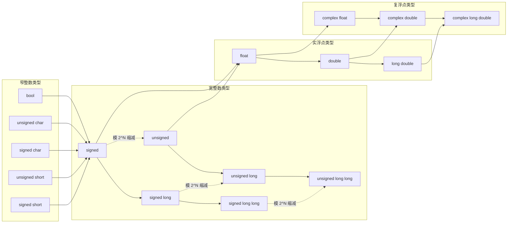

# 18 类型泛型编程

[[toc]]

::: info 本章内容

- 无处不在的类型泛型
- `_Generic` 表达式
- 使用 `auto` 和 `typeof` 进行类型推断
- 匿名函数

:::

类型泛型特性已经如此深入地融入 C，以至于大多数程序员或许根本没有意识到它们无处不在。我们首先辨认出贯穿本书、已经见过的若干种真正提供类型泛型的特性，并更系统地审视它们（见 18.1 节）。讨论涵盖适用于多种类型的运算符、类型提升与转换、宏、可变参数函数、函数指针和 `void` 指针。随后介绍 C11 带来的一项更复杂、可编程的特性：借助关键字 `_Generic` 进行泛型选择（18.2 节）。它让我们能够编写这样的代码：在编译时依固定的一组类型区分不同动作，例如面对 `float`、`double` 或 `long double` 值时，选择函数的不同变体。

`_Generic` 的一项缺点是，它通常只能处理预先规定的有限类型集合，因而很快就会导致情形数量组合爆炸。C23 引入一项称为**类型推断**的新特性（关键字 `auto`、`typeof` 和 `typeof_unqual`），它可以从给定表达式中一致地推断类型信息，避免编写这种复杂代码（18.3 节）。

遗憾的是，C23 还没有提供 C 类型泛型编程中经常使用的另一项特性：函数式抽象。主流编译器提供了几种实现此类特性的扩展。由于它们对代码简洁性、泛型能力、安全性和性能都很重要，18.4 节将简要回顾其中一些扩展。

## 18.1 C 固有的类型泛型特性

下面的讨论并非要涵盖我们此前见过的固有类型泛型特性的所有方面，而是要提醒你：它们无处不在，具有相对较高的复杂度，也可能存在缺陷。[^17]

[^17]: 这部分讨论先前发表于 Gustedt（2022）。

### 18.1.1 运算符

C 的第一项类型泛型特性是运算符。例如，二元运算符 `==` 和 `!=` 对所有宽整数类型（`signed`、`long`、`long long` 及其无符号变体）、所有浮点类型（`float`、`double`、`long double` 及其复数变体）和指针类型都有定义。更多细节见表 18.1。

**表 18.1　要求两侧类型相同的二元运算符所允许的类型**

| 运算符 | 宽整数 | 实浮点 | 复浮点 | 完整对象指针 | `void` 指针 | 函数指针 |
| --- | :---: | :---: | :---: | :---: | :---: | :---: |
| `==`、`!=` | × | × | × | × | × | × |
| `-` | × | × | × | × |  |  |
| `+`、`*`、`/` | × | × | × |  |  |  |
| `<`、`<=`、`>=`、`>` | × | × |  | × |  |  |
| `%`、`^`、`&`、`\|` | × |  |  |  |  |  |

因此，`a*b+c` 形式的表达式本身就已经是类型泛型的，程序员无须知道各操作数的具体类型。此外，如果操作数类型不一致，一套复杂的转换规则（见下节）会为所有这些运算强制形成相同类型。其他二元运算符——移位运算符、对象指针加法、数组下标——甚至无需转换，也能处理类型不同的操作数。

### 18.1.2 默认提升与转换

如果表 18.1 中运算符的操作数类型不一致，甚至属于这些运算符本来不支持的类型（`bool`、`char` 或 `short` 等窄整数类型），就会启动一套复杂的所谓提升与转换规则。图 18.1 给出概览。



_图 18.1：部分标准算术类型的向上转换。保值转换、窄类型到宽类型的整数提升或默认实参转换、有符号到无符号类型的模 $2^N$ 缩减，以及整数到浮点类型时可能发生的精度损失，共同构成图示关系；某些有符号与无符号类型间转换是否良好定义取决于平台。_

**转换。** 每当传给函数的算术实参，或者赋值、初始化右侧的表达式，不具备相应形参所要求的类型时，就会由一整套规则把实参类型转换为形参类型：

```c
printf("result is: %g\n", cosf(1));
```

这里，`cosf` 函数有一个 `float` 形参，所以先把 `int` 实参 `1` 转换为 `1.0f`。

图 18.1 展示 C 安排的向上转换。这些转换让我们不必为同一个函数编写多个版本，也让函数在一定程度上能够接收多种实参类型。

**提升与默认实参转换。** 在前一个示例中，`cosf` 的结果同样是 `float`；但 `printf` 是可变参数函数，无法处理 `float`。所以打印前会把该值转换为 `double`。

一般来说，某些数值类型不用于算术运算符或某些函数调用，而总会替换为更宽的类型。对整数类型而言，这种机制称为**提升**；对浮点类型而言，称为**默认实参转换**。

**默认算术转换。** 要确定算术运算的目标类型，还必须把这些概念提升到第二层。默认算术转换为二元算术运算符确定一个共同的“超类型”。例如，运算 `-1 + 1U` 首先进行取负运算，产生值为 $-1$ 的 `signed int`。随后为了进行算术转换，它把该值转换为 `unsigned int`（值为 `UINT_MAX`），再进行加法。结果是值为 0 的 `unsigned int`。

### 18.1.3 宏

C 预处理器是一项强大特性，用其他记号序列替换标识符（类对象宏）和伪函数调用（类函数宏）。结合默认算术提升，它可以为若干类任务提供类型泛型编程：

- 类型泛型表达式；
- 类型泛型声明和定义；
- 不是表达式的类型泛型语句。

#### 用于类型泛型表达式的宏

典型的类型泛型宏包含一个会被求值的算术表达式，并用默认算术转换确定目标类型。例如，下面的宏根据三个颜色通道计算灰度值：

```c
#define GRAY(R, G, B) (((R) + (G) + (B)) / 3)
```

它可用于任何能够表示颜色的类型。以 `unsigned char` 使用时，结果通常为 `int`；用于 `float` 值时，结果也为 `float`。

命名约定也能帮助我们编写类型泛型宏。这里，作为实参传入的结构体 `P` 具有成员 `r`、`g` 和 `b`：

```c
#define red(P) ((P).r)
#define green(P) ((P).g)
#define blue(P) ((P).b)
#define gray(P) (GRAY(red(P), green(P), blue(P)))
```

#### 用于声明和定义的宏

宏也可以提供类型声明和定义：

```c
#define declareColor(N) typedef struct N N
#define defineColor(N, T) struct N { T r; T g; T b; }

declareColor(color8);
declareColor(color64);
declareColor(colorF);
declareColor(colorD);
```

请注意，这些宏定义要求宏调用后带分号。因此，这些调用在语法上类似函数调用：

```c
typedef struct color8 color8;
typedef struct color64 color64;
typedef struct colorF colorF;
typedef struct colorD colorD;
```

随后可以生成这些结构体类型的定义：

```c
defineColor(color8, uint8_t);
defineColor(color64, uint64_t);
defineColor(colorF, float);
defineColor(colorD, double);
```

这些行展开为：

```c
struct color8 { uint8_t r; uint8_t g; uint8_t b; };
struct color64 { uint64_t r; uint64_t g; uint64_t b; };
struct colorF { float r; float g; float b; };
struct colorD { double r; double g; double b; };
```

#### 可放置为语句的宏

宏还可以把多条不需要返回值的语句组合起来。遗憾的是，要用这种技巧正确编码，通常必须作出取舍：代码会变丑，可维护性也会受损。

下面展示 C 中泛型宏编程的常见做法。代码可用于任意结构体类型 `T`，但该类型必须有名为 `mut` 的 `mtx_t` 成员，以及名为 `data`、与类型 `BASE` 赋值相容的成员：[^18]

```c:line-numbers=1
#define dataCondStore(T, BASE, P, E, D) \
    do {                                \
        T *_pr_p = (P);                 \
        BASE _pr_expected = (E);        \
        BASE _pr_desired = (D);         \
        bool _pr_c;                     \
        do {                            \
            mtx_lock(&_pr_p->mtx);      \
            _pr_c = (_pr_p->data == _pr_expected); \
            if (_pr_c) _pr_p->data = _pr_desired;  \
            mtx_unlock(&_pr_p->mtx);    \
        } while (!_pr_c);               \
    } while (false)
```

按这种方式编码，宏有若干优点：

- 它可以在语法上用于任何可放置 `void` 函数的位置。这由粗陋的外层 `do ... while(false)` 循环实现。
- 宏形参至多求值一次。这通过声明辅助对象来求取并保存宏实参值实现。请注意，定义这些辅助对象需要知道类型 `T` 和 `BASE`。
- 还可以把更多辅助对象（这里是 `_pr_c`）约束在宏的作用域内。

此外，它还为局部对象使用命名约定，尽量减少与宏使用上下文中既有标识符发生命名冲突的可能。不过，这种命名约定并非万无一失。尤其是，嵌套使用多个此类宏时，它们之间可能发生出人意料的相互作用。

[^18]: 第 20 章将介绍如何用 `mtx_t` 类型进行线程编程。

### 18.1.4 可变参数函数

我们已经见过 C 标准提供的另一种类型泛型接口工具：`printf` 这样的可变参数函数。

```c
int printf(char const format[static 1], ...);
```

请记住，`...` 表示可以传给函数的任意实参列表；函数调用可以接收多少实参、各自是什么类型，主要取决于实现者与用户之间的约定。不过也有显著例外：使用 `...` 记法时，所有窄整数实参或 `float` 实参都会转换（见图 18.1）。

如前所述，对 C 标准库中的此类接口，现代编译器通常可以根据格式字符串检查实参。相比之下，用户规定的函数通常不经检查，可能造成严重的安全问题。

### 18.1.5 函数指针

函数指针（11.4 节）让我们能够处理依赖另一个函数的算法。例如，C 库函数 `qsort` 或 `bsearch` 的形参 `compar`，允许我们把这些函数用于任何已经定义比较概念的类型。

### 18.1.6 `void` 指针

`qsort` 和 `bsearch` 使用的比较函数，其接口自身也包含类型泛型元素，也就是类型为 `void` 指针的形参：

```c
typedef int compar_t(void const *, void const *);
```

这里约定，这类函数的指针形参表示指向同一种对象类型 `BASE` 的指针。因此，只要尊重目标限定，数据指针就可以与 `void` 指针来回转换。优点是可以迅速写出这种比较接口（进而写出搜索或排序接口）；缺点是保证类型安全完全是用户的责任。

### 18.1.7 类型泛型 C 库函数

C99 引入 `<tgmath.h>`，C 由此获得第一种显式的类型泛型库接口。其思路是，余弦等功能应当以单一接口——类型泛型宏 `cos`——呈现给用户，而不是分别为 `double`、`float` 和 `long double` 实参提供函数 `cos`、`cosf` 和 `cosl`。

至少对单实参函数，预期似乎很清楚：功能应返回与实参同类型的值。从某种意义上说，这种类型泛型宏只是把 C 的运算符（它们本身就是类型泛型的）扩展为一组规定清晰、理解充分的函数。一项重要性质是，`<tgmath.h>` 中每个类型泛型宏都表示 `<math.h>` 或 `<complex.h>` 中的有限函数集合。许多宏通过检查实参大小来选择函数指针；这利用了一个事实：它们所处理的实参类型具有大小各不相同的表示。

C23 最近又借鉴这一思路，引入新的类型泛型接口，为某些 C 库函数的指针实参保留 `const` 契约。这些函数包括：

- `<string.h>` 中的 `memchr`、`strchr`、`strpbrk`、`strrchr` 和 `strstr`；
- `<wchar.h>` 中的 `wcschr`、`wcspbrk`、`wcsrchr`、`wcsstr` 和 `wmemchr`；
- `<stdlib.h>` 中的 `bsearch`。

这些函数如今具有类型泛型宏接口，保证以目标类型带 `const` 限定的指针实参调用时，只返回带相同限定的指针：

```c
#include "c23-fallback.h"

char const unmut_str[] = "haystack";
char mut_str[] = "hoystack";
char const needle[] = "stack";

char *mut_pos0 = strstr(unmut_str, needle);             // 错误
char const *unmut_pos0 = strstr(unmut_str, needle);     // 可行
char *mut_pos1 = strstr(mut_str, needle);               // 可行
char const *unmut_pos1 = strstr(mut_str, needle);       // 可行
char *mut_pos2 = (strstr)(unmut_str, needle);           // 可能发生无效访问
```

对 `mut_pos0`，类型检查保证不会让指向 `const` 限定数组 `unmut_str` 中子串的无限定指针泄漏进程序。相比之下，`mut_pos2` 的初始化式使用函数接口而不是类型泛型宏，所以返回无限定指针。如果用 `mut_pos2` 修改目标字符串，程序可能失败。

C11 还在 `<stdatomic.h>` 中增加了一整组新的类型泛型函数，第 20 章将详细介绍。困难在于，原子类型的数量可能没有上界，其中一些大小相同，语义却不同，所以类型泛型接口不能只依靠实参大小映射到有限的函数集合。实现通常必须借助语言扩展来实现这些接口。

## 18.2 泛型选择

C11 为 C 语言带来的一项真正新增内容，是对显式类型泛型编程的直接语言支持。它引入新特性**泛型选择**，主要用于实现类似 `<tgmath.h>` 中接口的类型泛型宏，也就是由输入表达式的类型引导，从有限的可能集合中作出选择。

具体新增的是关键字 `_Generic`，它引出具有如下形式的主表达式：

```c
_Generic(控制表达式,
         类型1: 表达式1,
         ...,
         类型N: 表达式N)
```

它与 `switch` 语句非常相似。不过，**控制表达式**只取其类型（稍后会作补充）；结果是表达式 $\text{表达式}_1\ldots\text{表达式}_N$ 之一，由相应的类型 $\text{类型}_1\ldots\text{类型}_N$ 选出，其中一项可以只写关键字 `default`。

最简单的用例之一，也是 C 委员会最初设想的主要用途，是让 `_Generic` 在若干函数指针间作出选择，从而提供类型泛型宏接口。基本示例是 `<tgmath.h>` 的 `fabs` 等接口。`_Generic` 本身不是宏特性，但可以方便地用于宏展开。如果忽略复浮点类型，`fabs` 的宏可以写成：

```c
#define fabs(X)             \
    _Generic((X),           \
             float: fabsf,  \
             long double: fabsl, \
             default: fabs)(X)
```

这个 `fabs` 宏区分两种特定类型：`float` 和 `long double`，分别选择对应函数 `fabsf` 和 `fabsl`。如果实参 `X` 是其他任何类型，就映射到默认情形 `fabs`。也就是说，`double` 和整数类型等其他算术类型都映射到函数 `fabs`。[练习 19][练习 20]

确定所得函数指针后，再把它应用到 `_Generic` 主表达式后面的实参列表 `(X)`。

宏 `min` 是一个更完整的示例。它为两个实数值的最小值实现类型泛型接口。代码为三种浮点类型定义三个不同的 `inline` 函数，再以与 `fabs` 类似的方式使用。区别在于，这些函数需要两个实参而不是一个，所以 `_Generic` 表达式必须对两种类型的组合作出决定。它用两个实参之和作为控制表达式。因此，加法运算的实参会触发实参提升和转换，使 `_Generic` 表达式为两种类型中较宽的一种选择函数；如果两个实参都是整数，则选择 `double` 函数。

这与只提供一个 `long double` 函数之类的做法不同：具体实参的类型信息不会丢失。

::: tip 要点 18.2 #1
`_Generic` 表达式的结果类型，就是所选表达式的类型。
:::

::: details 练习 19
找出宏展开中的这个 `fabs` 不会再次展开的两个原因。
:::

::: details 练习 20
扩展 `fabs` 宏，使其覆盖复浮点类型。
:::

::: info `min`：浮点值的类型泛型最小值
```c [generic.h]
#define min(A, B)             \
    _Generic((A) + (B),       \
             float: minf,     \
             long double: minl, \
             default: mind)((A), (B))

static inline
double mind(double a, double b) [[__unsequenced__]] {
    return a < b ? a : b;
}

static inline
long double minl(long double a, long double b)
    [[__unsequenced__]] {
    return a < b ? a : b;
}

static inline
float minf(float a, float b) [[__unsequenced__]] {
    return a < b ? a : b;
}
```
:::

这与条件运算符 `a ? b : c` 的情形形成对照。后者的返回类型由 `b` 和 `c` 两种类型组合计算。条件运算符必须这样做，因为 `a` 在不同运行中可能不同，`b` 或 `c` 都可能选中。`_Generic` 则根据类型作选择，该选择在编译时固定。因此，编译器可以预先知道选择结果的类型。

在我们的示例中，可以确信，所有使用该接口生成的代码都不会采用比程序员预见的类型更宽的类型。尤其是，`min` 宏应当总能使编译器针对相关类型内联适当代码。[练习 21][练习 22]

::: tip 要点 18.2 #2
把 `_Generic` 与内联函数结合使用，可以增加优化机会。
:::

::: details 练习 21
扩展 `min` 宏，使其覆盖所有宽整数类型。
:::

::: details 练习 22
继续扩展 `min`，使其也覆盖指针类型。
:::

下面这个替换标准函数 `snprintf` 的宏也遵循这一思路。它使用宏 `isice` 来检测实参是否为整数常量表达式（ICE，见 5.6.2 节），这里不展示该宏。

::: info `snprintf`：检查实参的类型泛型接口
我们区分两种情形。第一种，首个实参是 `nullptr`，此时强制第二个实参为 0，并调用函数 `snprintf`。第二种，首个实参不是 `nullptr`，此时调用函数 `snprintf_swapped`；该函数只交换前两个实参。由于它先接收大小实参，再接收缓冲区，因此缓冲区可以规定为依赖该大小的数组形参。

```c [generic.h]
#define snprintf(S, N, F, ...)                                      \
    _Generic((S),                                                   \
        nullptr_t:                                                  \
            (snprintf)(nullptr, GENERIC_IF(isice(N), (N), 0),       \
                       F __VA_OPT__(,) __VA_ARGS__),                 \
        default:                                                    \
            snprintf_swapped(                                      \
                _Generic((S), nullptr_t: 1, default: (N)),          \
                _Generic((S), nullptr_t: (char[1]){ 0 }, default: (S)), \
                (F) __VA_OPT__(,) __VA_ARGS__))
```
:::

它看起来有点复杂，因为第二部分——对 `snprintf_swapped` 的调用——必须是有效调用，编译器才不会挑出问题。第一种情形仍相对简单。首个实参为 `nullptr` 的调用：

```c
snprintf(nullptr, n, format, a, b, c)
```

会替换为把 `n` 换成 0 的调用；一对额外圆括号强调这不是宏的递归调用，而是直接调用 C 库函数：

```c
(snprintf)(nullptr, 0, format, a, b, c)
```

如果以缓冲区（其类型不是 `nullptr_t`）调用宏，效果就如同调用：

```c
snprintf_swapped(n, buffer, format, a, b, c)
```

这样的调用把大小放在缓冲区之前，允许编译器检查已知缓冲区是否足够大。[^23]

整个机制之所以有效，是因为泛型选择的两个分支无论如何都会展开成有效代码。对第一种 `nullptr_t` 情形，这很清楚：即使宏以缓冲区调用，所得表达式仍是有效的调用表达式。第二种默认分支更棘手。假如 `S` 为 `nullptr`，而我们试图使用：

```c
snprintf_swapped((N), (S), (F) __VA_OPT__(,) __VA_ARGS__)
```

它就会解析成对 `snprintf_swapped` 的无效调用，因为该函数要求第二个实参为非空指针：

```c
snprintf_swapped(n, nullptr, format, a, b, c)
```

即使这个版本的调用永远不会求值，我们仍必须保证：第一，它在语法上正确；第二，编译器不会诊断那些实际上永远不会选中的错误实参组合。两个内层泛型选择为 `S` 具有 `nullptr_t` 类型的情形提供哑实参，从而作出保证。这里，`nullptr_t` 是一种区别于所有指针类型的独立类型，这一事实至关重要；C23 以前没有 `nullptr` 和 `nullptr_t`，很难作出这种区分。

::: tip 要点 18.2 #3
`_Generic` 中的所有候选表达式 $\text{表达式}_1\ldots\text{表达式}_N$ 都必须有效。
:::

[^23]: 写作本书时，有些编译器（例如 GCC 12）已经能够检测编译时可见的此类问题，另一些（例如 Clang 16）还不能。不过总体趋势是，编译器会尽可能推断越界情况；未来它们会做得更好。

怎样理解泛型选择控制表达式的“类型”，稍有歧义，因此 C17 对 C11 的表述作了澄清。实际上，如前面的示例所暗示，该类型是表达式**如同传给函数时**所具有的类型。尤其意味着：

- 如果控制表达式的类型带有限定符，就丢弃这些限定符；
- 数组类型转换为指向基础类型的指针类型；
- 函数类型转换为函数指针。

::: tip 要点 18.2 #4
`_Generic` 表达式中的类型表达式只应采用无限定类型，不应采用数组类型或函数类型。
:::

这并不表示类型表达式不能是指向上述类型之一的指针，例如指向限定类型的指针、指向数组的指针，或函数指针。不过总体而言，这条规则简化了编写类型泛型宏的任务，因为无须考虑限定符的所有组合。限定符有三种（指针类型有四种），否则每种基础类型的各种组合会产生 8 种（甚至 16 种）不同的类型表达式。下面的 `MAXVAL` 示例已经相当长，它为 15 种可排序类型各设一个特殊情形；如果还要跟踪限定，就必须专门处理 120 种情形！

::: info `MAXVAL`：`X` 所属类型的最大值
```c [generic.h]
#define MAXVAL(X)                         \
    _Generic((X),                         \
        bool: (bool)+1,                   \
        char: (char)+CHAR_MAX,            \
        signed char: (signed char)+SCHAR_MAX, \
        unsigned char: (unsigned char)+UCHAR_MAX, \
        signed short: (signed short)+SHRT_MAX, \
        unsigned short: (unsigned short)+USHRT_MAX, \
        signed: INT_MAX,                  \
        unsigned: UINT_MAX,               \
        signed long: LONG_MAX,            \
        unsigned long: ULONG_MAX,         \
        signed long long: LLONG_MAX,      \
        unsigned long long: ULLONG_MAX,   \
        float: FLT_MAX,                   \
        double: DBL_MAX,                  \
        long double: LDBL_MAX)
```
:::

这是 `_Generic` 表达式的一种不同用法。此前我们选择函数指针，再调用函数；这里的结果值是整数常量表达式。函数调用绝不可能实现这一点，只用普通宏来实现又会非常繁琐。[练习 24]

`maxof` 又使用一种转换技巧，去掉一些我们可能不感兴趣的情形。这里，控制表达式的特殊形式增添了额外能力。如果 `identifier` 是对象或类型，表达式 `0+(identifier)+0` 都有效。如果它是对象，就使用对象的类型，并像其他表达式一样解释；随后对其施行整数提升，并推断结果类型。

如果它是类型，`(identifier)+0` 就读作把 `+0` 强制转换为类型 `identifier`。再从左侧加上 `0+`，仍能保证必要时施行整数提升。所以，无论 `XT` 是类型 `T`，还是类型为 `T` 的表达式 `X`，结果都相同。[练习 25][练习 26][练习 27]

::: info `maxof`：`XT` 的提升后最大值
`XT` 可以是表达式或类型名。所得值是送入 `+` 等算术运算时的最大值。

窄类型会得到提升，通常提升为 `signed`，在少数体系结构上也可能提升为 `unsigned`。

```c [generic.h]
#define maxof(XT)                         \
    _Generic(0 + (XT) + 0,                \
        signed: INT_MAX,                  \
        unsigned: UINT_MAX,               \
        signed long: LONG_MAX,            \
        unsigned long: ULONG_MAX,         \
        signed long long: LLONG_MAX,      \
        unsigned long long: ULLONG_MAX,   \
        float: FLT_MAX,                   \
        double: DBL_MAX,                  \
        long double: LDBL_MAX)
```
:::

`_Generic` 表达式中的类型表达式还有一项要求：必须能在编译时无歧义地作出选择。

::: tip 要点 18.2 #5
`_Generic` 表达式中的类型表达式必须指代彼此不相容的类型。
:::

::: tip 要点 18.2 #6
`_Generic` 表达式中的类型表达式不能是指向 VLA 的指针。
:::

::: details 练习 24
为最小值编写类似的宏。
:::

::: details 练习 25
使用 `_Generic` 编写宏 `PROMOTE(XT, A)`：`XT` 和 `A` 都具有标准宽整数类型，宏以 `XT` 的类型返回 `A` 的值。例如，`PROMOTE(1u, 3)` 返回 `3u`。
:::

::: details 练习 26
使用 `_Generic` 编写宏 `SIGNEDNESS(XT)`：`XT` 具有标准宽整数类型，宏根据该类型的有符号性返回 `false` 或 `true`。例如，`SIGNEDNESS(1l)` 返回 `true`。
:::

::: details 练习 27
使用 `_Generic` 编写宏 `mix(A, B)`，计算两个标准宽整数类型值 `A` 和 `B` 的最大值。如果二者有符号性相同，结果类型应为二者中较宽的类型；如果有符号性不同，返回类型应为能够容纳两种类型所有正值的无符号类型。
:::

函数指针调用以外的模型可能很方便，但也有陷阱。下面尝试用 `_Generic` 实现 `TRACE_VALUE1` 所用的两个宏 `TRACE_FORMAT` 和 `TRACE_CONVERT`。`TRACE_FORMAT` 很直接：区分六种情形。默认情形没有匹配任何算术类型，于是假设实参具有指针类型。此时，为了成为 `fprintf` 的正确实参，必须把指针转换为 `void*`。我们的目标是通过 `TRACE_CONVERT` 实现这种转换。

::: info `TRACE_VALUE1`：无须指定格式即可跟踪值
这个变体能够正确处理非 `void` 指针。可以通过修改 `TRACE_FORMAT` 中的说明符来调整格式。

```c [macro_trace.h]
#define TRACE_VALUE1(F, X)                                      \
    do {                                                        \
        if (TRACE_ON)                                           \
            fprintf(stderr,                                    \
                    TRACE_FORMAT("%s:" STRGY(__LINE__) ": " F, X), \
                    __func__, TRACE_CONVERT(X));                \
    } while (false)
```
:::

::: info `TRACE_FORMAT`：返回适用于 `fprintf` 的格式
实参 `F` 必须是字符串字面量，所以返回值也会是字符串字面量。

```c [macro_trace.h]
#define TRACE_FORMAT(F, X)                      \
    _Generic((X) + 0LL,                         \
        unsigned long long: "" F " %llu\n",  \
        long long: "" F " %lld\n",           \
        float: "" F " %.8f\n",               \
        double: "" F " %.12f\n",             \
        long double: "" F " %.20Lf\n",       \
        default: "" F " %p\n")
```
:::

第一次尝试可以写成：

```c
#define TRACE_CONVERT_WRONG(X)                  \
    _Generic((X) + 0LL,                         \
        unsigned long long: (X) + 0LL,          \
        /* ... */                               \
        default: ((void *){ } = (X)))
```

它使用与 `TRACE_PTR1` 相同的技巧，把指针转换为 `void*`。遗憾的是，这个实现是错误的（见要点 18.2 #3）。例如，如果 `X` 是 `unsigned long long`（假设为 `1LL`），默认情形会读作：

```c
((void *){ } = (1LL))
```

这会把非零整数赋给指针，属于错误。[^28]

[^28]: 请记住，从非零整数到指针的转换必须通过强制转换显式完成。

我们用一个返回实参自身或 `nullptr` 的宏解决问题。

::: info `TRACE_POINTER`：强制得到可解释为指针值的值
任何指针都会原样返回，其他算术值则得到 `nullptr`。

```c [macro_trace.h]
#define TRACE_POINTER(X)                       \
    _Generic((X) + 0LL,                        \
        unsigned long long: nullptr,           \
        long long: nullptr,                    \
        float: nullptr,                        \
        double: nullptr,                       \
        long double: nullptr,                  \
        default: (X))
```
:::

这段代码的优点是，`TRACE_POINTER(X)` 调用总能赋给 `void*`。要么 `X` 本身是指针，因此可赋给 `void*`；要么它属于其他算术类型，宏调用结果就是 `nullptr`。合在一起，`TRACE_CONVERT` 如下。

::: info `TRACE_CONVERT`：把 `X` 提升为宽整数、浮点数或 `void*`
如果 `X` 是指针，则提升为 `void*`。

```c [macro_trace.h]
#define TRACE_CONVERT(X)                       \
    _Generic((X) + 0LL,                        \
        unsigned long long: (X) + 0LL,         \
        long long: (X) + 0LL,                  \
        float: (X) + 0LL,                      \
        double: (X) + 0LL,                     \
        long double: (X) + 0LL,                \
        default: ((void *){ nullptr } = TRACE_POINTER(X)))
```
:::

::: warning 挑战 18：整数常量表达式
能够在不求取表达式的情况下检验某项特性的宏，有助于在编译时区分代码将采用的分支。因此，下面编写的宏绝不能求取其实参；一般来说，宏本身还应产生 `bool` 类型的整数常量表达式。

- 编写 `is_null_pointer_constant`，检验表达式 `X`（它要么是值为零的整数常量，要么是 `void*` 指针）是否为空指针常量。利用如下事实：

  ```c
  true ? (struct toto *)0 : (X)
  ```

  如果 `X` 是空指针常量，该表达式具有 `struct toto*` 类型；如果 `X` 是一个类型为 `void*`、但不是空指针常量的指针，则表达式具有 `void*` 类型。

- 编写 `is_zero_ice`，检测实参是否为值为零的整数常量表达式（ICEV0）。利用如下事实：把这种 ICEV0 强制转换为 `void*` 后，它是空指针常量；任何其他整数表达式，即使强制转换为 `void*`，也绝不是空指针常量。
- 编写 `isice`，检测实参是否为整数常量表达式。
:::

## 18.3 类型推断

除泛型选择外，C23 还增加了一些新特性，可以根据表达式（或类型名）推断类型，从而避免不同情形的组合爆炸。

### 18.3.1 `auto` 特性

第一项特性使用关键字 `auto`。C23 以前，该关键字主要是自动存储期对象的一个多余存储类说明符。现在，它还用于表示可以根据初始化式推断对象的类型。下面的泛型 `SWAP` 宏含有三个类型经过推断的对象声明：

```c:line-numbers=11 [swap.c]
#define SWAP(X, Y)                                            \
    do {                                                      \
        /* 这两个对象承担函数形参的角色。它们保证只求取一次  \
           表达式 X 和 Y；二者可能是复杂的左值表达式，      \
           其中带有会求值并产生副作用的子表达式。 */         \
        auto const swap_p1 = &(X);                            \
        auto const swap_p2 = &(Y);                            \
        static_assert_compatible(*swap_p1, *swap_p2,          \
            "to exchange values, '"                         \
            #X "' and '" #Y                                  \
            "' must have compatible types");                 \
        auto swap_tmp = *swap_p1;                             \
        *swap_p1 = *swap_p2;                                  \
        *swap_p2 = swap_tmp;                                  \
    } while (false)
```

事实上，这个宏把函数 `swap_double`（第 11 章）推广到任何非数组对象类型。可以在宏中区分四个组成部分：

- 外壳是一个人为构造的 `do ... while(false)` 循环，保证宏调用的行为类似 `void` 函数调用（回顾要点 10.2.1 #2）。
- 一部分负责捕获宏形参，使其只求值一次。如果规定的是函数，形参列表就会保证这一点；这里的组成部分承担相同角色。
- 一部分检查类型的某项性质。稍后会看到其工作方式。
- 一部分包含真正发挥作用的代码；这里与函数 `swap_double` 非常相似。

要实现泛型，重要的是不对可能使用的类型作出假设。声明中使用 `auto` 而不是某种类型，保证声明的类型与每次具体调用的特定实参一致。`swap_p1` 和 `swap_p2` 分别以带一元 `&` 运算符的表达式初始化，所以其类型分别是指向表达式 `X` 和 `Y` 所属类型的指针。`swap_tmp` 的类型是 `swap_p1` 所指向的类型，也就是表达式 `X` 的类型。除 `auto` 外，两个指针还带有 `const` 限定，因此在这段代码内部不能改变这些指针。

还要注意，我们为这些对象采用 `swap` 前缀的名称，降低它们与调用周围上下文中的其他名称发生冲突的可能。在本例中，这种可能仍然存在：如果 `Y` 引用了外层名称 `swap_p1`，执行宏时就会改用刚定义的同名局部对象。这是内部采用无保护复合语句的宏技巧所固有的缺陷。我们永远无法确信所选名称不会与未知的用户代码名称冲突。

::: tip 要点 18.3.1 #1
在宏内部，用已经写入文档的命名约定保护局部对象。
:::

除了不知道基础类型的类型泛型宏，函数内部的辅助对象也可能适合采用 `auto` 声明。这样可以保证声明在类型上始终与代码中的其他声明一致。例如：

```c
auto y = 3 * x;
```

如果 `x` 的定义离 `y` 很远，而且类型可能发生改变，这种写法会更合适。假如我们深信 `x` 永远是 `float`，转而写成：

```c
float y = 3 * x;
```

那么有朝一日把 `x` 改为 `double` 后，初始化中的精度损失可能不会引起注意。

::: tip 要点 18.3.1 #2
必须确保类型一致时，使用 `auto` 定义。
:::

### 18.3.2 `typeof` 特性

如我们所见，`auto` 提供了一种为对象推断类型的方式；在需要这类特性的大多数情形中，它已经足够。对更复杂的情形，C23 引入另外两项特性：`typeof` 和 `typeof_unqual`。原则上，它们甚至可以取代 `auto` 特性。此前 `y` 的 `auto` 定义实际上可以改写为：

```c
typeof(3 * x) y = 3 * x;
```

不过在少数情形中，`x` 也许会求值两次，而且我们可能还要留意限定符（见后文）。事实上，凡是原本可以放置 `typedef` 名称的地方，都可以使用 `typeof` 运算符。在这个示例中，我们也可以定义：

```c
typedef float type_of_x_y;
```

随后保证 `x` 和 `y` 的定义始终使用名称 `type_of_x_y`。这一切说明，使用 `typedef` 或 `typeof` 时，要确保类型一致可能很困难。

::: tip 要点 18.3.2 #1
声明对象时，优先使用 `auto`，而不是 `typeof`。
:::

下面用于检验类型相容性的宏定义（`SWAP` 需要它），展示了 `typeof` 的一种用法，很难用 `auto` 声明替代：

```c:line-numbers=4 [swap.c]
#define static_assert_compatible(A, B, REASON)               \
    static_assert(_Generic((typeof(A) *)nullptr,             \
                           typeof(B) *: true,                \
                           default: false),                  \
                  "expected compatible types: " REASON     \
                  ", have " #A " and " #B "")
```

这段代码通过强制转换为 `typeof(A)*`，并把 `typeof(B)*` 作为选择项中的类型名，对 `A` 和 `B` 使用 `typeof`。由此，我们可以在需要类型的上下文中使用 `A` 和 `B`。泛型选择特性结合 `typeof` 的性质，又保证 `A` 和 `B` 都不会求值。因此，只要必须保证两个非数组对象类型相容，就能在其他宏内部安全使用该宏。[练习 29][练习 30]

`typeof` 甚至使多形参类型匹配成为可能：

```c:line-numbers=340 [generic.h]
#define pow(X, Y)                                                \
    _Generic(                                                    \
        (void (*)(typeof((X) + (Y) + 0ULL),                     \
                  typeof((Y) + 0ULL)))nullptr,                  \
        /* 第二个实参是整数。 */                                 \
        void (*)(float, unsigned long long): pownf,             \
        void (*)(double, unsigned long long): pown,             \
        void (*)(unsigned long long, unsigned long long): pown, \
        void (*)(long double, unsigned long long): pownl,       \
        /* 第二个实参是浮点数。 */                               \
        void (*)(float, float): powf,                            \
        void (*)(long double, float): powl,                      \
        void (*)(long double, double): powl,                     \
        void (*)(long double, long double): powl,                \
        /* 第二个实参是浮点数，第一个是 double 或整数。 */       \
        default: pow)                                            \
    ((X), (Y))
```

这里，控制表达式生成具有两个实参类型 `T` 和 `S` 的函数指针：

```c
(void (*)(T, S))nullptr
```

该指针取决于宏实参 `X` 和 `Y`。`T` 是类型 `typeof((X)+(Y)+0ULL)`，`S` 是 `typeof((Y)+0ULL)`。`T` 和 `S` 都可能得到某种标准浮点类型或 `unsigned long long`。对 `S`，只考虑实参 `Y`；对 `T`，同时使用 `X` 和 `Y`。这样可以检测 `Y` 是否为整数类型。如果是，就使用 C 库函数 `pown`（C23 新增）；否则，如果 `Y` 是浮点类型，就使用 `pow`。借助该宏，第二个实参为整数时可以用经过优化的函数 `pown` 计算整数次幂。

这个示例说明，C23 结合 `_Generic` 与 `typeof` 确实可以实现这类接口；但它也说明，类型实参的组合数量可能迅速爆炸。为了避开部分复杂度，只把 `typeof` 和 `typeof_unqual` 运算符用于泛型函数的返回类型，也许更容易：

```c
static inline long double absolute(long double absolute_x) {
    return absolute_x < 0.0L ? -absolute_x : absolute_x;
}

#define absolute(X) ((typeof_unqual(X))absolute(X))
```

这里，用类中最宽类型的一个简单 `static inline` 函数实现功能；宏把类型向下强制转换回原精度，从而提供类型泛型。在许多情形中，调用方应当能很好地整合并优化这种代码，无须进行复杂的 `_Generic` 情形分析。这里使用 `typeof_unqual` 而不是 `typeof`，是为了强调函数调用具有无限定的返回类型。

这种技巧甚至可以与 `_Generic` 组合，降低 `_Generic` 宏的复杂度：

```c
#define pow(X, Y)                                                \
    ((typeof_unqual((X) + (Y) + 0.0F))                          \
        _Generic((Y) + 0ULL,                                    \
                 unsigned long long: pownl,                     \
                 default: powl)                                 \
        ((X), (Y)))
```

如果 `Y` 是整数，`(Y)+0ULL` 具有 `unsigned long long` 类型，选择项为 `pownl`；否则选择 `powl`。随后把函数调用的返回值向下强制转换为某种浮点类型，也就是能够容纳 `X`、`Y` 和 `0.0F` 的最窄无限定浮点类型。

这个版本可能不如前面讨论的版本高效，因为它总是使用 C 库函数的 `long double` 版本。但至少能够保证以尽可能高的精度计算结果。

::: details 练习 29
此前给出的 `static_assert_compatible` 版本在收到一个数组和一个指针时，也会检测到可能的不匹配。修改该宏，使它接收基础类型为 `b` 的数组或指针 `A`，并检验 `B` 是否与 `b*` 相容。
:::

::: details 练习 30
利用你的发现改进 `static_assert_compatible` 定义，使它拒绝数组实参或函数指示符。指向数组的指针和函数指针仍应有效。
:::

::: warning 挑战 19：类型特征
`typeof` 运算符与 `_Generic` 组合起来相当强大，可以提供**类型特征**，也就是在编译时查询类型某些性质的操作。如果实参值的类型满足某些条件，借助类型特征就能更高效地实现类型泛型功能（例如两个值的最大值或最小值）。下面编写的类型特征宏，应当允许 `XT` 实参既可以是表达式（不含暴露在外的逗号），也可以是类型名；所得 `bool` 类型值本身还应是整数常量表达式。

- 先热身：编写宏 `tozero`，使用 `typeof` 为给定算术表达式或类型名提供该类型的零；再编写类似的 `tonull`，为指针表达式或类型提供空指针。无论在什么情况下，结果都绝不能求取实参 `XT`，并应分别是整数常量表达式、算术常量表达式或地址常量表达式。
- C23 有许多整数类型（至少 139 种），不可能在泛型选择中完整列出。使用挑战 18 中的 `tozero` 和 `is_zero_ice`，检验 `XT` 是否具有整数类型，写成 `isinteger`。
- 使用挑战 18 中的 `isice`，检测 `XT` 是否为 VLA，写成 `isvla`。利用如下事实：VLA 的 `sizeof` 绝不是整数常量表达式。
- 对指针类型，分别编写宏 `is_const_target` 和 `is_volatile_target`，检验目标类型是否带 `const` 或 `volatile` 限定。再使用这些宏检验实参本身是否带限定，写成 `is_const` 和 `is_volatile`。
- 编写宏 `is_potentially_negative`，检查类型是否可能允许负值。用有符号和无符号整数类型、`char` 和实浮点类型测试该宏。
- 编写宏 `issigned` 和 `isunsigned`，分别检查类型是否有符号或无符号。浮点类型、指针或 `char` 绝不能识别为有符号或无符号。
- 为 `void` 指针编写检验宏 `is_void_target`，为 `void` 表达式编写 `is_void`。
:::

## 18.4 匿名函数

前面讨论的做法——把 `SWAP` 的内容包在 `do { ... } while(false)` 中——并不完全令人满意。事实上，凡是可以放置 `void` 函数调用的上下文，并非都能使用这个宏。更一般地说，用这种技巧实现的宏不是表达式。它们无法用于本来可以放置宏表达式的位置（例如 `for` 循环中的第三个表达式）；更重要的是，它们不能返回值。

遗憾的是，C23 尚未提供解决这个问题的通用工具；不过许多编译器都有几种非常相似的扩展。首先要介绍 GCC 和一些相关编译器提供的**复合表达式**构造。用这种技巧实现 `SWAP` 宏如下：

```c:line-numbers=29 [swap.c]
#define SWAP(X, Y)                                            \
    /* 复合表达式构造从这里开始。 */                          \
    ({                                                        \
        /* 这两个对象承担函数形参的角色。它们保证只求取一次  \
           表达式 X 和 Y；二者可能是复杂的左值表达式，      \
           其中带有会求值并产生副作用的子表达式。 */         \
        auto const swap_p1 = &(X);                            \
        auto const swap_p2 = &(Y);                            \
        static_assert_compatible(*swap_p1, *swap_p2,          \
            "to exchange values, '"                         \
            #X "' and '" #Y                                  \
            "' must have compatible types");                 \
        auto swap_tmp = *swap_p1;                             \
        *swap_p1 = *swap_p2;                                  \
        *swap_p2 = swap_tmp;                                  \
        /* 保证表达式的类型为 void。 */                        \
        (void)0;                                              \
    })
```

这里包裹代码的语法糖是 `({ ... (void)0; })`。这个构造使整段代码成为表达式并具有值，也就是末尾的 `(void)0`。除此之外，它的工作方式与 `do { ... } while(false)` 构造非常相似：周围作用域中的标识符不受保护，甚至还允许借助 `goto` 语句和标签跳入、跳出代码。

Objective-C 以及带有特定 C 扩展的 Clang，提供了另一种工具，称为 **block 闭包**；它避免了其中一些缺点：

```objective-c:line-numbers=4 [swap.m]
#define SWAP(X, Y)                  \
    (                               \
        /* block 构造从这里开始。 */ \
        void ^                      \
        /* 没有其他形参，所以列表为 void。 */ \
        (void) {                    \
            /* 与其他 SWAP 示例相同的函数体 */ \
        }                           \
        /* 现在可以立即调用这个 block，不传实参。 */ \
        ()) /* 表达式结束 */
```

这里的语法糖是 `void^(void){ ... }()`。也就是说，它类似一个没有名称（由记号 `^` 取代）、形参列表为空的 `void` 函数声明。随后紧跟一对圆括号 `()`，不传实参地直接调用这个匿名函数。

与此前见过的做法相比，这种 block 闭包可以访问调用周围上下文中的对象，但默认只允许读取；只有经过特殊标记的对象才能在 block 闭包中修改。与函数一样，执行到函数体末尾或遇到 `return` 语句时，对 block 闭包的调用终止。

最后同样重要的是，C++ 引入了 lambda，一些 C 编译器可能已经支持。Lambda 更清楚地区分可以读取周围作用域中哪些对象，以及何时读取。宏中的语法糖是 `[ ... ](void){ ... }()`，同样很像一个函数定义后紧跟一次不带实参的立即调用：

```cpp:line-numbers=4 [swap.cpp]
#define SWAP(X, Y)                    \
    (                                 \
        /* lambda 构造从这里开始。 */   \
        [                             \
            /* 这两个捕获承担函数形参的角色，读取 X 和 Y…… */ \
            swap_p1 = &(X),           \
            swap_p2 = &(Y)]           \
        /* 实际形参列表为空。 */        \
        (void) {                      \
            /* 与上面相同的函数体 */    \
        }                             \
        /* 现在可立即调用这个 lambda 值，不传实参。 */ \
        ()) /* 表达式结束 */
```

第一部分位于方括号 `[ ... ]` 内，汇集所谓的 lambda **捕获**。只有这一部分可以读取周围上下文。我们感兴趣的捕获类型语法很简单：一个标识符，后接 `=`，再接初始化式。其语义与此前用法类似，也就是如同通过 `auto` 进行类型推断，并对对象施加 `const` 限定。宏调用 `SWAP(a, b)` 展开后（去掉外围圆括号）类似：

```cpp
[swap_p1 = &(a), swap_p1 = &(b)](void) {
    /* static_assert_compatible 的展开 */
    auto swap_tmp = *swap_p1;
    *swap_p1 = *swap_p2;
    *swap_p2 = swap_tmp;
}()
```

同样，也有允许写入对象的访问语法，不过超出了这里的讨论范围。

Lambda 调用表达式的结果类型根据第一条可能执行的 `return` 语句推断。如果没有 `return`，如本例所示，整个表达式就是 `void` 表达式，也就是行为如同调用了返回类型为 `void` 的函数。

显然，对这里的 `void` 表达式而言，这些匿名函数扩展并不十分有趣；`do { ... } while(false)` 惯用法能够满足大多数用途。如果结果类型要根据宏实参推断，这些扩展就更有意思。

计算两个值 `X` 和 `Y` 的最大值似乎是一项简单任务。乍看之下，应当可以把下面的表达式塞入宏：

```c
(X < Y) ? Y : X
```

遗憾的是，它有几项缺点。第一，依结果而定，`X` 或 `Y` 会求值两次：一次用于比较，另一次用于所选分支。可以用匿名函数避免这一困难。下面使用 GCC 的复合表达式构造，其结果为块中最后一个表达式的值：

```c:line-numbers=54 [swap.c]
#define MAX_EQSIGN(X, Y)                        \
    /* 复合表达式构造从这里开始。 */            \
    ({                                          \
        /* 这两个捕获承担函数形参的角色，读取 X 和 Y。 */ \
        auto const max_x = (X);                 \
        auto const max_y = (Y);                 \
        /* 函数体从这里开始。 */                \
        /* 两种类型必须具有相同的有符号性。 */  \
        (max_x < max_y) ? max_y : max_x;        \
    })
```

本质上，这就是先前的表达式。如果两种类型具有相同的有符号性，隐式整数转换的魔法就会保证结果采用能够容纳最大值的类型。

只有当一个表达式为有符号类型、另一个为无符号类型时，这种做法的第二项缺点才会显现。此时，比较结果和整个表达式都不符合预期。例如，假设 `X` 为 `-1`，`Y` 为 `1u`（无符号）；在比较中，`-1` 会转换为无符号数，得到很大的数 `UINT_MAX`。表达式的结果具有 `unsigned` 类型，值为 `UINT_MAX`。

下面这个更泛化的宏解决了问题。只有两个实参值同号时，才直接比较；否则分别把每个值与 0 比较，选择结果为正的那个值：[练习 31]

```c:line-numbers=66 [swap.c]
#define MAX(X, Y)                                        \
    /* 复合表达式构造从这里开始。 */                     \
    ({                                                   \
        auto const max_x = (X);                          \
        auto const max_y = (Y);                          \
        /* 函数体从这里开始。 */                         \
        ((isnegative(max_x) && !isnegative(max_y))       \
            ? max_y                                      \
            : ((isnegative(max_y) && !isnegative(max_x)) \
                ? max_x                                  \
                : /* 二者同号。 */                       \
                  ((max_x < max_y) ? max_y : max_x)));   \
    })
```

这里同样由 C 标准定义的隐式转换完成正确工作，提供能够容纳结果的类型。[练习 32]

::: details 练习 31
按 `MAX` 的需要编写小宏 `isnegative`。
:::

::: details 练习 32
证明 `MAX` 的结果类型始终能够容纳最大值运算的数学结果。
:::

::: warning 挑战 20：最大值与最小值类型泛型宏
当 `X` 和 `Y` 的类型具有不同有符号性时，`MAX` 宏也许还有优化空间。实现一个改进版本，利用已经实现的类型特征适当区分情形，使每种情形中的比较次数最少。这里，类型特征是 ICE 这一性质对优化至关重要；这样编译器才能消除对给定实参而言不可到达的分支。

为两个整数值 `X` 和 `Y` 提供同样的最小值功能更加棘手，因为这种运算的数学结果未必能装入与最大值运算相同的类型。首先请说服自己：即使 `X` 和 `Y` 类型不同，其中一种类型也一定能够容纳最小值运算的结果。事实上，即使两种类型都是无符号的，也只需使用其中较窄的类型作为运算结果类型。

编写宏 `minunsigned`：收到两个无符号表达式或类型名时，返回一个值为零、类型为二者中较窄无符号类型的 ICE。再用它实现宏 `minreturn`，返回一个值为零的 ICE，其类型能够容纳两个实参的最小值。最后，用它实现最小值运算 `MIN`，对所有整数类型的两两组合都返回数学上正确的值。
:::

## 小结

- 类型泛型特性在 C 中无处不在。
- 使用 `_Generic` 进行泛型选择，可以实现依赖某个特定类型集合的类型泛型接口。
- 使用 `auto` 进行类型推断，有助于让相互依赖的声明保持类型一致。
- 使用 `typeof` 进行类型推断，可以检验类型及其性质，也可以把结果表达式转换回依宏实参而定的类型。
- 匿名函数是 C 标准之外的扩展，允许我们把便利的泛型操作实现为宏。
