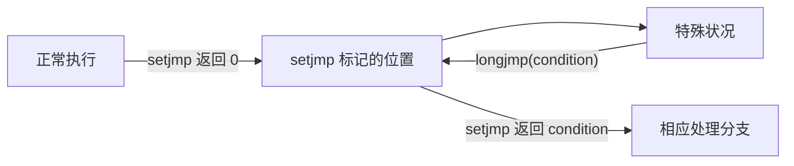

# 19 控制流的变化

[[toc]]

::: info 本章内容

- 理解 C 语句的正常定序
- 在代码中进行短跳转与长跳转
- 函数控制流
- 处理信号

:::

程序执行的控制流（见图 2.1）描述程序代码中的各条语句如何**定序**，也就是哪条语句在哪条语句之后执行。到目前为止，我们主要考察的代码，都允许根据语法和控制表达式推导控制流。这样一来，每个函数都可以描述成基本块的层次组合。**基本块**是一段极大的语句序列：一旦从第一条语句开始执行，就会无条件地一直执行到最后一条；而且只要执行序列中的任何语句，就必定从第一条开始。

如果假设所有条件语句和循环语句都使用 `{}` 复合语句，那么简化来看，一个基本块：

- 开始于复合语句的左花括号 `{`，或 `case` 标签、跳转标签；
- 结束于相应复合语句的右花括号 `}`，或者结束于接下来遇到的以下内容：
  - 作为 `case` 标签或跳转标签目标的语句；
  - 条件语句或循环语句的函数体；
  - `return` 语句；
  - `goto` 语句；
  - 对某个特定集合中函数的调用。

在这个定义中，一般的函数调用并不例外：它们只会暂时挂起基本块的执行，而不会结束基本块。能够结束基本块的特定函数中，有些我们已经认识，包括以属性 `[[noreturn]]` 标记的 `exit` 和 `abort` 等函数。另一个这样的函数是 `setjmp`；如后文所述，它可能返回多次。

如果代码仅由基本块组成，并用 `if`／`else`[^33] 或循环语句把它们缝合起来，就有双重优势：人很容易阅读，编译器也能获得优化机会。人和编译器都可以直接推导基本块中对象和复合字面量的生存期与访问模式，再掌握这些基本块如何通过层次组合融入所属函数。

Nishizeki 等人（1977）很早就为 Pascal 程序中的这种结构化方法奠定了理论基础；Thorup（1995）又把它扩展到 C 和其他命令式语言。他们证明，结构化程序——也就是不含 `goto` 或其他任意跳转构造的程序——具有一种恰好符合树状结构的控制流，可以根据程序的语法嵌套推导出来。除非迫不得已，否则应当坚持这种编程模型。

不过，有些特殊状况需要特殊手段。一般来说，程序控制流的变化可能来自：

- **条件语句：** `if`／`else` 和 `switch`／`case`；
- **循环语句：** `do {} while()`、`while()` 和 `for()`；
- **函数调用：** `return` 语句或 `[[noreturn]]` 属性；
- **短跳转：** `goto` 与标签；
- **长跳转：** `setjmp`／`longjmp` 和 `getcontext`／`setcontext`；[^34]
- **中断：** 信号与信号处理函数；
- **线程：** `thrd_create` 和 `thrd_exit`。

这些控制流变化会遮蔽执行的抽象状态。粗略来说，人或机械读者必须跟踪的知识复杂度，在上面的列表中从上到下逐步增加。到目前为止，我们只见过前四种构造。它们对应语言特性，由语法（例如关键字）或运算符（例如函数调用的 `()`）确定。后三种由 C 库接口引入，可以让程序控制流跨越函数边界跳转（`longjmp`），由程序外部事件触发（中断），甚至建立并发控制流，也就是另一条执行线程。

对象受到意外控制流影响时，可能出现各种困难：

- 对象可能在生存期外使用；
- 对象可能在未初始化时使用；
- 优化可能错误解释对象值（`volatile`）；
- 对象可能只修改了一部分（`sig_atomic_t`、`atomic_flag`，或者具有无锁性质并采用 `relaxed` 一致性的 `_Atomic`）；
- 对对象的更新可能以意外方式定序（所有 `_Atomic`）；
- 必须保证**临界区**内部独占执行（`mtx_t`）。

由于访问构成程序状态的对象会变得复杂，C 提供了一些帮助应对这些困难的特性。它们已经在上面的列表中用圆括号注明，以下各节将详细讨论。

[^33]: `switch`／`case` 语句会让这种看法稍微复杂一些。
[^34]: 后一组函数在 POSIX 系统中定义。

## 19.1 一个详细示例

为了展示其中大多数概念，我们将讨论一段核心示例代码：名为 `basic_blocks` 的递归下降解析器。核心函数 `descend` 见清单 19.1。

这段代码服务于若干目的。首先，它显然展示了后文将讨论的几项特性：

- 短跳转（`goto`，见 19.3 节）；
- 递归（见 19.4 节）；
- 长跳转（`longjmp`，见 19.5 节）；
- 中断处理（见 19.6 节）。

但至少同样重要的是，这大概是本书到目前为止处理过的最困难代码；对有些人而言，它甚至可能是见过的最复杂代码。不过，它只有 36 行，仍能装进一屏，也凭自身证明 C 代码可以非常紧凑而高效。理解它可能需要数小时，但请不要绝望：你也许还不知道，如果已经认真学完本书前面的内容，就已经准备好了。

这个函数实现一个递归下降解析器：它识别从 `stdin` 得到的文本中的 `{}` 构造，并依 `{}` 的嵌套关系缩进输出文本。更形式化地说，使用 Backus-Naur 范式（BNF）[^35]，该函数依据递归定义检测文本，并通过改变行结构和缩进，以适当格式打印这样的程序：

```text
program := some-text★ ['{' program '}' some-text★]★
```

[^35]: BNF 是对计算机可读语言的形式化描述。这里，`program` 递归定义为一段文本序列，后面可以跟零个或多个用花括号包围的程序序列。

**清单 19.1　用于代码缩进的递归下降解析器**

```c:line-numbers=57 [basic_blocks.c]
static
char const *descend(char const *act,
                    unsigned dp[restrict static 1], // 不好
                    size_t len, char buffer[static len],
                    jmp_buf jmpTarget) {
    if (dp[0] + 3 > sizeof head) longjmp(jmpTarget, tooDeep);
    ++dp[0];
NEW_LINE:                              // 循环输出
    while (!act || !act[0]) {          // 循环输入
        if (interrupt) longjmp(jmpTarget, interrupted);
        act = skipspace(fgets(buffer, len, stdin));
        if (!act) {                    // 流结束
            if (dp[0] != 1) longjmp(jmpTarget, plusL);
            else goto ASCEND;
        }
    }
    fputs(&head[sizeof head - (dp[0] + 2)], stdout); // 行首

    for (; act && act[0]; ++act) {     // 该行剩余部分
        switch (act[0]) {
            case left:                 // 遇左花括号则下降
                act = end_line(act + 1, jmpTarget);
                act = descend(act, dp, len, buffer, jmpTarget);
                act = end_line(act + 1, jmpTarget);
                goto NEW_LINE;
            case right:                // 遇右花括号则返回
                if (dp[0] == 1) longjmp(jmpTarget, plusR);
                else goto ASCEND;
            default:                   // 打印字符并继续
                putchar(act[0]);
        }
    }
    goto NEW_LINE;
ASCEND:
    --dp[0];
    return act;
}
```

从操作层面描述，该程序处理文本，尤其是以一种特殊方式缩进 C 代码或类似文本。把清单 3.1 中的程序文本送入它，会看到如下输出：

```text [终端]
> ./code/basic_blocks < code/heron.c
| #include <stdlib.h>
| #include <stdio.h>
| /* lower and upper iteration limits centered around 1.0 */
| static double const eps1m01 = 1.0 - 0x1P-01;
| static double const eps1p01 = 1.0 + 0x1P-01;
| static double const eps1m24 = 1.0 - 0x1P-24;
| static double const eps1p24 = 1.0 + 0x1P-24;
| int main(int argc, char* argv[argc+1])
>| for (int i = 1; i < argc; ++i)
>>| // process args
>>| double const a = strtod(argv[i], 0); // arg -> double
>>| double x = 1.0;
>>| for (;;)
>>>| // by powers of 2
>>>| double prod = a*x;
>>>| if (prod < eps1m01) x *= 2.0;
>>>| else if (eps1p01 < prod) x *= 0.5;
>>>| else break;
>>>|
>>| for (;;)
>>>| // Heron approximation
>>>| double prod = a*x;
>>>| if ((prod < eps1m24) || (eps1p24 < prod))
>>>| x *= (2.0 - prod);
>>>| else break;
>>>|
>>| printf("heron: a=%.5e,\tx=%.5e,\ta*x=%.12f\n",
>>| a, x, a*x);
>>|
>| return EXIT_SUCCESS;
>|
```

也就是说，`basic_blocks` “吃掉”花括号 `{}`，转而用一串 `>` 字符缩进代码：每增加一层 `{}` 嵌套，就多加一个 `>`。

若要从高层了解函数如何做到这一点，可以先抽去所有尚不了解的函数和对象，只看第 76 行开始的 `switch` 语句及其外围 `for` 循环：

```c
static
char const *descend(/* ... */) {
    ++dp[0];
NEW_LINE:
    /* ... */
    for (/* ... */) {
        switch (/* ... */) {
            case left:  /* ... */ goto NEW_LINE;
            case right: /* ... */ goto ASCEND;
            default:    /* ... */
        }
    }
    goto NEW_LINE;
ASCEND:
    --dp[0];
    return /* ... */;
}
```

它根据当前字符进行选择，区分三种情形。最简单的是默认情形：打印普通字符，前进到下一个字符，再开始下一次迭代。

另外两种情形处理 `{` 和 `}` 字符。遇到左花括号时，知道文本必须再多缩进一级 `>`，因此再次递归进入同一个函数 `descend`（见第 79 行）。相反，遇到右花括号时，就转到 `ASCEND`，终止当前递归层。递归深度本身由 `dp[0]` 处理：进入时递增（第 63 行），退出时递减（第 91 行）。

如果你是第一次尝试理解这个程序，其余部分都是噪声。这些噪声用来处理行结束、左花括号或右花括号过多等特殊情形。稍后会更详细地说明这一切如何工作。

## 19.2 定序

在研究程序控制流怎样以出人意料的方式改变之前，必须更好地理解 C 语句的正常次序保证什么、又不保证什么。4.6 节已经看到，C 表达式的求值未必遵循书写顺序。例如，函数实参可以按任意顺序求值。构成各实参的不同表达式甚至可以由编译器自行决定交错求值，或者根据执行时资源是否可用来交错。我们称函数实参表达式彼此**未定序**。

之所以只建立宽松的求值规则，有若干原因。其一是便于实现优化编译器。与其他编程语言相比，编译所得代码高效始终是 C 的一项优势。

另一个原因是，如果没有令人信服的数学或技术基础，C 不会任意施加限制。从数学上说，`a+b` 中的两个操作数 `a` 和 `b` 可以自由交换。强加求值顺序会破坏这条规则，关于 C 程序的论证也会变得更复杂。

没有线程时，C 主要用**序列点**形式化这些规则。程序语法规定中的这些点，会强制执行串行化。稍后还会看到其他规则，它们在某些表达式的求值之间强制定序，却不蕴含序列点。

从高层看，C 程序可以视为依次到达的一系列序列点；两个序列点之间的代码可以按任意顺序执行、交错执行，或者遵守其他特定定序约束。最简单的情形是，两条语句用分号隔开时，序列点之前的语句先序于序列点之后的语句。

不过，即使存在序列点，也未必在两个表达式之间规定某个特定顺序；它只规定必然存在某种顺序。为了看清这一点，考虑函数 `add`：它会修改第一个指针形参 `x` 所对应的对象。把这个函数用于 `printf` 的实参，具有良好定义：

```c:line-numbers=3 [sequence_point.c]
unsigned add(unsigned *x, unsigned const *y) [[unsequenced]] {
    return *x += *y;
}

int main(void) {
    unsigned a = 3;
    unsigned b = 5;
    printf("a = %u, b = %u\n", add(&a, &b), add(&b, &a));
}
```

回顾 4.6 节：`printf` 的两个实参可以按任意顺序求值；稍后将看到，序列点规则说明 `add` 函数调用会强制产生序列点。因此，这段代码有两种可能结果：要么完整执行第一次 `add`，随后执行第二次；要么反过来。

第一种可能中：

- `a` 改为 8，并返回该值；
- `b` 改为 13，并返回该值。

执行输出为：

```text [终端]
a = 8, b = 13
```

第二种可能中：

- `b` 改为 8，并返回该值；
- `a` 改为 11，并返回该值。

输出为：

```text [终端]
a = 11, b = 8
```

因此，尽管这个程序的行为有定义，C 标准却没有完全确定其结果。C 标准把这种状况称为：两次调用彼此**不确定定序**。这不只是理论讨论；两个常用的开源 C 编译器 GCC 和 Clang，对这段简单代码就会作出不同选择。我要再次强调：这一切全都是有定义的行为。不要期待编译器对这种问题发出警告。

::: tip 要点 19.2 #1
函数中的副作用可能导致不确定的结果。
:::

下面列出 C 语法定义的所有序列点：

- 一条语句结束时，即遇到分号 `;` 或右花括号 `}`；
- 逗号运算符 `,` 前面的表达式结束时；[^36]
- 声明结束时，即遇到分号 `;` 或逗号 `,`；[^37]
- `if`、`switch`、`for`、`while` 的控制表达式结束时，以及条件求值 `?:`、短路求值 `||` 和 `&&` 的控制表达式结束时；
- 函数调用的函数指示符（通常是函数名）和函数实参都完成求值之后、实际调用之前；[^38]
- `return` 语句结束时。

除序列点蕴含的限制外，还有其他定序限制。前两条多少显而易见，但仍应明确写出。

::: tip 要点 19.2 #2
任何运算符的具体运算，都后序于其所有操作数的求值。
:::

::: tip 要点 19.2 #3
通过赋值、递增或递减运算符更新对象的效果，后序于其操作数的求值。
:::

函数调用还有一条附加规则：函数执行总会在其他任何表达式之前完成。

::: tip 要点 19.2 #4
函数调用相对于调用方的所有求值都有定序关系。
:::

如前所述，这种关系可能是不确定定序，但无论如何仍是定序。另一类不确定定序表达式来自初始化式。

::: tip 要点 19.2 #5
数组类型或结构体类型的初始化列表表达式彼此不确定定序。
:::

最后，C 库还定义了一些序列点：

- IO 函数中的各个格式说明符完成动作之后；
- 任何 C 库函数返回之前；[^39]
- 调用搜索和排序所用的比较函数之前和之后。

后两条为 C 库函数施加了与普通函数类似的规则。之所以需要这些规则，是因为 C 库本身未必以 C 实现。

[^36]: 请小心：分隔函数实参的逗号不属于这一类。
[^37]: 结束枚举常量声明的逗号同样如此。
[^38]: 这里把函数指示符置于与函数实参相同的层次。
[^39]: 请注意，实现为宏的库函数可能不定义序列点。

## 19.3 短跳转

我们已经见过一项中断 C 程序通常控制流的特性：`goto`。希望你还记得 15.6 节，它通过两种构造实现：标签标记代码位置，`goto` 语句跳转到同一函数内部的这些标记位置。

我们也已经看到，这类跳转对局部对象的生存期和可见性有复杂影响。特别是，在循环内部定义的对象，与在由 `goto` 重复执行的一组语句内部定义的对象，生存期有所不同。[^40] 考虑下面两段代码，它们都在循环中定义一个局部对象（复合字面量）：

::: code-group
```c [while 循环]
size_t *ip = nullptr;
while (something)
    ip = &(size_t){ fun() };  /* 生存期随 while 结束。 */
/* 良好：资源已经释放。 */
printf("i is %d", *ip);      /* 不好：对象已经死亡。 */
```

```c [goto 重试]
size_t *ip = nullptr;
RETRY:
ip = &(size_t){ fun() };      /* 生存期继续。 */
if (condition) goto RETRY;
/* 不好：资源仍被占用。 */
printf("i is %d", *ip);      /* 良好：对象仍然存活。 */
```
:::

复合字面量的地址赋给一个指针，因此对象在循环外仍可访问，例如可以用于 `printf` 语句。

两段代码看起来语义等价，实际上并非如此。第一段中，与复合字面量对应的对象，其生存期关联到 `while` 语句次级块的执行。

::: tip 要点 19.3 #1
每次迭代都会定义局部对象的一个新实例。
:::

因此，表达式 `*ip` 对对象的访问无效。如果删去示例中的 `printf`，`while` 循环的优势在于可以复用复合字面量所占资源。

第二个示例则没有这种限制：复合字面量定义的作用域是整个外围块。因此，在离开该块前，对象始终存活（要点 13.3 #1）。这未必是好事：对象会占用原本可以重新分配的资源。

不需要 `printf` 语句（或类似访问）时，第一段代码更清晰，也有更好的优化机会。因此，大多数情况下应优先采用第一段。

::: tip 要点 19.3 #2
`goto` 只应用于控制流的特殊变化。
:::

这里的“特殊”通常意味着遇到一种过渡性错误状况，需要进行局部清理，如 15.6 节所见。但它也可以表示某种特定算法条件，如清单 19.1 所示。

这里有两个标签 `NEW_LINE` 和 `ASCEND`，两个常量 `left` 和 `right`，它们反映解析的实际状态。要打印新行时，`NEW_LINE` 充当跳转目标；遇到 `}` 或流结束时，使用 `ASCEND`。检测到左花括号或右花括号时，常量 `left` 和 `right` 用作 `case` 标签。

这里之所以需要 `goto` 和标签，是因为两种状态分别在函数中的两个位置、两个不同嵌套层次检测到。此外，标签名称反映各自用途，从而提供关于结构的附加信息。

[^40]: 见 ISO 9899:2011 6.5.2.5 第 16 段。

## 19.4 函数

函数 `descend` 的复杂之处不只在扭曲的局部跳转结构；它还是递归函数。如前所述，C 处理递归函数的方式相当简单。

::: tip 要点 19.4 #1
每次函数调用都会定义局部对象的一个新实例。
:::

因此，同时处于活动状态的同一函数的不同递归调用通常不会相互作用；每次调用都有自己的一份程序状态。


_图 19.1：函数调用的控制流；`return` 跳转到调用之后的下一条指令。_

但这里由于存在指针，这项原则有所削弱。`buffer` 和 `dp` 所指向的数据会修改。对 `buffer` 而言，这大概无法避免，因为它要容纳读入的数据。但 `dp` 可以（也应当）改为一个简单的 `unsigned` 实参。[练习 41] 当前实现之所以把 `dp` 作为指针，只是因为希望错误发生时仍能跟踪嵌套深度。所以，如果抽去尚未解释的 `longjmp` 调用，使用这种指针并不好：程序状态更难跟踪，也会错失优化机会。[练习 42]

在这个具体示例中，`dp` 带 `restrict` 限定，没有传给 `longjmp` 调用（马上讨论），并且只在开头递增、结尾递减，所以 `dp[0]` 恰在函数返回之前恢复原值。从外部看，`descend` 仿佛完全没有改变该值。

如果调用方可以看见 `descend` 的函数代码，优秀的优化编译器就能推导出 `dp[0]` 没有因调用而改变。假如 `longjmp` 并不特殊，这会是一次很好的优化机会。马上会看到，`longjmp` 的存在如何使这项优化失效，并引出一个隐蔽缺陷。

::: details 练习 41
修改 `descend`，让它接收 `unsigned depth`，而不是指针。
:::

::: details 练习 42
比较初始版本与去掉 `dp` 指针的版本所生成的汇编输出。
:::

## 19.5 长跳转

函数 `descend` 还可能遇到无法修复的特殊状况。我们用一个枚举类型为它们命名。这里，无法写入 `stdout` 时到达 `eofOut`，`interrupted` 则表示正在运行的程序收到了异步信号。后文将讨论这个概念。

::: info `state`：解析算法的特殊状态
| 枚举项 | 含义 |
| --- | --- |
| `execution` | 正常执行 |
| `plusL` | 左花括号过多 |
| `plusR` | 右花括号过多 |
| `tooDeep` | 嵌套太深，无法处理 |
| `eofOut` | 输出结束 |
| `interrupted` | 被信号中断 |

```c [basic_blocks.c]
enum state {
    execution = 0, //!< 正常执行
    plusL,         //!< 左花括号过多
    plusR,         //!< 右花括号过多
    tooDeep,       //!< 嵌套太深，无法处理
    eofOut,        //!< 输出结束
    interrupted,   //!< 被信号中断
};
```
:::

我们使用函数 `longjmp` 处理这些状况，并把相应调用直接放在代码识别到该状况的位置：

- `tooDeep` 很容易在函数开头识别；
- 不在第一递归层却遇到输入流结束时，可以检测出 `plusL`；只有此前遇到左花括号（因此进入递归），却直到输入结束都未找到对应右花括号时，才会发生这种情况；
- 在第一递归层遇到右花括号时，发生 `plusR`；
- 写入 `stdout` 返回文件结束（EOF）状况时，到达 `eofOut`；
- 每次从 `stdin` 读取新行前，检查 `interrupted`。

由于 `stdout` 采用行缓冲，我们只在写出 `'\n'` 字符时检查 `eofOut`。这发生在短函数 `end_line` 内部：

```c:line-numbers=45 [basic_blocks.c]
char const *end_line(char const s[static 1], jmp_buf jmpTarget) {
    if (putchar('\n') == EOF) longjmp(jmpTarget, eofOut);
    return skipspace(s);
}
```

函数 `longjmp` 有一个配套宏 `setjmp`，后者用于建立 `longjmp` 调用可以引用的跳转目标。头文件 `<setjmp.h>` 提供以下原型：

```c
[[noreturn]] void longjmp(jmp_buf target, int condition);
int setjmp(jmp_buf target); // 通常是宏，而不是函数
```

函数 `longjmp` 同样具有 `[[noreturn]]` 属性，所以可以确信，一旦检测到某个特殊状况，当前 `descend` 调用的执行绝不会继续。

::: tip 要点 19.5 #1
`longjmp` 绝不会返回调用方。
:::

这对优化器是有价值的信息。`descend` 在五处调用 `longjmp`，编译器可以大幅简化分支分析。例如，在 `!act` 检验之后，可以假设进入 `for` 循环时 `act` 非空。

普通语法标签只能在声明它的同一函数内充当 `goto` 目标。相比之下，`jmp_buf` 是不透明对象，可以在任何地方声明；只要仍然存活且内容有效，就可以使用。在 `descend` 中，我们只使用一个 `jmp_buf` 类型的跳转目标，并把它声明为局部对象。这个跳转目标在基础函数 `basic_blocks` 中设置，该函数充当 `descend` 的接口（见清单 19.2）。它主要由一个大型 `switch` 语句组成，处理所有不同状况。



_图 19.2：`setjmp` 与 `longjmp` 的控制流；`longjmp` 跳转到 `setjmp` 标记的位置。_

**清单 19.2　递归下降解析器的用户接口**

```c:line-numbers=97 [basic_blocks.c]
void basic_blocks(void) {
    char buffer[maxline];
    unsigned depth = 0;
    char const *format =
        "All matching %0.0d '%c' '%c' pairs have been closed correctly\n";
    jmp_buf jmpTarget;
    switch (setjmp(jmpTarget)) {
        case 0:
            descend(nullptr, &depth, maxline, buffer, jmpTarget);
            break;
        case plusL:
            format =
                "Warning: %d '%c' have not been closed properly "
                "(expected '%c')\n";
            break;
        case plusR:
            format =
                "Error: closing too many (%d) '%c' parenthesis "
                "with additional '%c'\n";
            break;
        case tooDeep:
            format =
                "Error: nesting (%d) of '%c' '%c' constructs is too deep\n";
            break;
        case eofOut:
            format =
                "Error: EOF for stdout at %d open '%c', expecting "
                "same amount of '%c'\n";
            break;
        case interrupted:
            format =
                "Interrupted at level %d of '%c' '%c' nesting\n";
            break;
        default:
            format =
                "Error: unknown error within (%d) '%c' '%c' constructs\n";
    }
    fflush(stdout);
    fprintf(stderr, format, depth, left, right);
    if (interrupt) {
        SH_PRINT(stderr, interrupt,
                 "is somebody trying to kill us?");
        raise(interrupt);
    }
}
```

通过正常控制流到达这里时，选择 `switch` 的分支 0。这是 `setjmp` 的基本原则之一。

::: tip 要点 19.5 #2
通过正常控制流到达时，`setjmp` 调用把调用位置标记为跳转目标，并返回 0。
:::

如前所述，调用 `longjmp` 时，`jmpTarget` 必须仍然存活且有效。因此，对局部对象而言，不能已经离开其声明的作用域；否则对象已经死亡。要保持有效，调用 `longjmp` 时，`setjmp` 的整个上下文还必须处于活动状态。这里让 `jmpTarget` 与 `setjmp` 调用声明在同一作用域，避免了复杂情况。

::: tip 要点 19.5 #3
离开 `setjmp` 调用的作用域，会使跳转目标失效。
:::

进入 `case 0` 并调用 `descend` 后，可能落入某个特殊状况，再调用 `longjmp` 终止解析算法。控制会返回 `jmpTarget` 标记的调用位置，仿佛刚刚从 `setjmp` 调用返回。唯一可见的差别是，此时的返回值变成传给 `longjmp` 的第二个实参 `condition`。例如，如果在一次 `descend` 递归调用开头遇到 `tooDeep` 状况，随后调用 `longjmp(jmpTarget, tooDeep)`，就会跳回 `switch` 的控制表达式，并取得返回值 `tooDeep`。执行随后从相应的 `case` 标签继续。

::: tip 要点 19.5 #4
`longjmp` 调用把控制直接转移到 `setjmp` 设置的位置，效果如同后者返回了实参 `condition`。
:::

不过要注意：规范已经采取预防措施，不可能作弊而第二次走上正常路径。

::: tip 要点 19.5 #5
传给 `longjmp` 的 `condition` 实参如果是 0，会替换为 1。
:::

`setjmp`／`longjmp` 机制非常强大，可以避免从一整串函数调用中逐层返回。在我们的示例中，假设输入程序允许的最大嵌套深度为 30，那么检测到 `tooDeep` 状况时，会同时存在 30 次活动的 `descend` 递归调用。采用普通的错误返回策略，就要逐层返回，并在每一层完成一些工作。调用 `longjmp` 可以截短所有这些返回，直接继续执行 `basic_blocks` 中的 `switch`。

由于允许 `setjmp`／`longjmp` 作出一些简化假设，这个机制出乎意料地高效。依处理器体系结构而定，通常只需要 10 到 20 条汇编指令。库实现采用的策略一般相当简单：`setjmp` 把栈指针和指令指针等关键硬件寄存器保存到 `jmp_buf` 对象中；`longjmp` 再从中恢复这些寄存器，并把控制传回保存的指令指针。[^43]

`setjmp` 作出的一项简化与返回有关。其规范称它返回 `int` 值，但不能在任意表达式内使用该值。

::: tip 要点 19.5 #6
`setjmp` 只能用于条件语句控制表达式内的简单比较。
:::

所以，它可以像示例一样直接用于 `switch` 语句，也可以用 `==`、`<` 等进行检验；但不能把 `setjmp` 的返回值用于赋值。这保证只会把 `setjmp` 的值与一组已知值比较；从 `longjmp` 返回时，环境中的变化可能只是控制条件效果的某个特殊硬件寄存器。

如前所述，`setjmp` 调用对执行环境的保存和恢复非常有限，只保存并恢复最少的必要硬件寄存器。它不会采取任何措施来保留局部优化，甚至不会考虑调用位置可能第二次到达。

::: warning 要点 19.5 #7
优化与 `setjmp` 调用的相互作用很糟糕。
:::

执行并测试示例代码时，会发现对 `setjmp` 的简单用法存在问题。如果输入一个缺少右花括号 `}` 的不完整程序，从而触发 `plusL` 状况，我们期待看到类似以下诊断：

```text [终端]
Warning: 3 '{' have not been closed properly (expected '}')
```

依编译优化级别而定，无论输入程序如何，看到的很可能不是 3，而是 0。这是因为优化器的分析基于一个假设：`switch` 的各个 `case` 互斥。只有执行经过 `case 0`，从而调用 `descend` 时，它才预期 `depth` 的值发生改变。根据对 `descend` 的检查（见 19.4 节），我们知道 `depth` 的值总会在返回前恢复原值，所以编译器可以假设该值不会沿这条代码路径改变。其余分支也都不改变 `depth`，于是编译器可以假设，`fprintf` 调用中的 `depth` 始终为 0。

因此，对在 `setjmp` 正常代码路径中修改、又在某条特殊路径中引用的对象，优化无法作出正确假设。对此只有一种解决办法。

::: warning 要点 19.5 #8
跨越 `longjmp` 发生修改的对象必须带 `volatile` 限定。
:::

在语法上，限定符 `volatile` 的应用方式与此前见过的其他限定符 `const` 和 `restrict` 类似。如果给 `depth` 的声明加上该限定符：

```c
unsigned volatile depth = 0;
```

并相应修改 `descend` 原型，对该对象的所有访问都会使用实际存储的值。试图对其值作出假设的优化都会受到阻止。

::: tip 要点 19.5 #9
每次访问 `volatile` 对象时，都从内存重新加载。
:::

::: tip 要点 19.5 #A
每次修改 `volatile` 对象时，都把它存入内存。
:::

因此，`volatile` 对象免受优化影响；换个负面说法，它们会阻碍优化。所以，只有确实需要时，才应把对象设为 `volatile`。[练习 44]

最后，请注意 `jmp_buf` 类型的一些细微之处。记住，它是不透明类型：绝不能对其结构或各个字段作出假设。

::: tip 要点 19.5 #B
`jmp_buf` 的 `typedef` 隐藏了一个数组类型。
:::

由于它是不透明类型，我们不知道数组基础类型的任何信息；姑且称之为 `jmp_buf_base`。

- `jmp_buf` 类型的对象不能作为赋值目标；
- `jmp_buf` 函数形参会改写为指向 `jmp_buf_base` 的指针；
- 这种函数始终引用原始对象，而不是副本。

从某种意义上说，这模拟了一种按引用传递机制；C++ 等其他编程语言为此提供显式语法。一般来说，使用这个技巧并不好：`jmp_buf` 对象的语义取决于它是在局部声明，还是作为函数形参。例如，在 `basic_blocks` 中，该对象不可赋值；而在 `descend` 中，类似的函数形参因为被改写为指针，所以可以修改。此外，也很难对它使用现代 C 更具体的形参声明，例如：

```c
jmp_buf_base jmpTarget[restrict const static 1]
```

这样的声明意在坚持：函数内部不应改变指针；指针不得为空；对它的访问可以视为函数所独占。[练习 45] 如今我们不会再这样设计类型，你也不应照搬这个技巧定义自己的类型。

::: details 练习 44
你所编写的 `descend` 版本按值传递 `depth`；遇到 `plusL` 状况时，可能无法正确传播深度。请保证把该值复制到一个能够供 `basic_blocks` 中 `fprintf` 调用使用的对象。
:::

::: details 练习 45
使用 C23 的 `typeof` 特性为 `jmp_buf_base` 定义 `typedef`。
:::

[^43]: 若要熟悉相关词汇，可以阅读或重读 13.5 节。

## 19.6 信号处理函数

如前所述，`setjmp`／`longjmp` 可以处理在代码执行期间由我们自行检测到的特殊状况。**信号处理函数**用于处理以不同方式产生的特殊状况，也就是由程序外部事件触发的状况。从技术上说，这类外部事件分为两种：硬件中断，又称陷阱或同步信号；软件中断，又称异步信号。

第一种发生在处理设备遇到无法应对的严重故障时，例如发现除以零，寻址不存在的内存组，或者在操作较宽整数类型的指令中使用未对齐地址。这种事件与程序执行同步，直接由故障指令引起，所以总能知道中断是在哪条具体指令处触发的。

第二种发生在操作系统或运行时系统决定程序应当终止时，例如超过某个截止期限，用户发出终止请求，或者我们所知的世界即将毁灭。这种事件是**异步**的，因为它可能落在一条多阶段指令中间，使执行环境停在中间状态。

大多数现代处理器都有处理硬件中断的内置特性：**中断向量表**。该表由平台所知的各种硬件故障作为索引，条目是指向过程的指针，也就是指向**中断处理函数**的指针；发生相应故障时会执行这些过程。因此，如果处理器检测到故障，执行就会自动离开用户代码，转而执行中断处理函数。这样的机制不可移植，因为不同平台的故障名称和位置不同；处理起来也很繁琐，因为要编写一个简单应用程序，就得为所有中断提供全部处理函数。

C 的信号处理函数为我们提供一种抽象，以可移植方式处理硬件和软件两类中断。其工作方式类似前面对硬件中断的描述，但具有以下特点：

- （部分）故障的名称经过标准化；
- 所有故障都有默认处理函数（大多由实现定义）；
- （大多数）处理函数可以特化。

列表中的每一项都带有括号保留，因为仔细观察会发现，C 的信号处理接口相当初步；所有平台都有自己的扩展和特殊规则。

::: warning 要点 19.6 #1
C 的信号处理接口非常有限，只应用于最简单的情形。
:::


_图 19.3：中断后的控制流；从信号处理函数返回，会跳到中断发生的位置。_

图 19.3 展示一个已处理信号的控制流。正常控制流在应用程序无法预见的位置中断，信号处理函数开始执行并完成一些任务；之后，控制在恰好相同的位置、以中断时恰好相同的状态恢复。

接口定义在头文件 `<signal.h>` 中。C 标准区分六个不同的值，称为**信号编号**。下面给出标准中的确切定义。其中三个值通常由硬件中断引起：[^46]

| 信号 | 定义 |
| --- | --- |
| `SIGFPE` | 错误的算术运算，例如除以零，或运算结果溢出 |
| `SIGILL` | 检测到无效的函数映像，例如无效指令 |
| `SIGSEGV` | 对存储的无效访问 |

另外三个通常由软件或用户触发：

| 信号 | 定义 |
| --- | --- |
| `SIGABRT` | 异常终止，例如由 `abort` 函数发起的终止 |
| `SIGINT` | 收到交互式注意信号 |
| `SIGTERM` | 发送给程序的终止请求 |

具体平台还会有其他信号编号；标准为此保留所有以 `SIG` 开头的标识符。按 C 标准，这些编号的用法未定义，但本身没有什么不好。这里的“未定义”确实就是字面含义：如果使用它，就必须由 C 标准之外的其他权威来源来定义，例如平台提供者。因此，代码会变得不那么可移植。

对每个可能的信号编号，系统都保存一种**处置方式**，控制捕获信号时执行的动作。处理信号有两种标准处置方式，也都用符号常量表示。`SIG_DFL` 为具体信号恢复平台默认处理函数，`SIG_IGN` 表示忽略该信号。除此之外，程序员还可以编写自己的信号处理函数。解析器的处理函数看起来很简单：

::: info `signal_handler`：最小信号处理函数
更新信号计数后，对大多数信号只需把信号值存入 `interrupt` 并返回。

```c [basic_blocks.c]
static void signal_handler(int sig) {
    sh_count(sig);
    switch (sig) {
        case SIGTERM: quick_exit(EXIT_FAILURE);
        case SIGABRT: _Exit(EXIT_FAILURE);
#ifdef SIGCONT
        // 继续正常操作
        case SIGCONT: return;
#endif
        default:
            /* 把处理方式重置为默认值。 */
            signal(sig, SIG_DFL);
            interrupt = sig;
            return;
    }
}
```
:::

可以看到，这样的信号处理函数接收信号编号 `sig` 作为实参，再根据该编号进行选择。这里专门处理信号编号 `SIGTERM` 和 `SIGABRT`。所有其他信号都通过以下方式处理：把该编号的处理函数重置为默认值，把编号存入全局对象 `interrupt`，随后返回中断发生的位置。

信号处理函数的类型必须与以下类型相容：[^47]

::: info `sh_handler`：信号处理函数原型
```c [sighandler.h]
typedef void sh_handler(int);
```
:::

也就是说，它接收信号编号作为实参，不返回任何值。因此，这个接口相当有限，无法传递足够的信息，尤其无法传递信号发生的位置和具体情形。

信号处理函数通过调用 `signal` 建立，正如 `signal_handler` 中所见。这里用它把信号处置方式重置为默认值。`signal` 是 `<signal.h>` 提供的两个函数接口之一：

```c
sh_handler *signal(int, sh_handler *);
int raise(int);
```

`signal` 的返回值是该信号先前处于活动状态的处理函数；发生错误时，则为特殊值 `SIG_ERR`。在信号处理函数内部，只应使用 `signal` 改变本次调用所接收的同一信号编号的处置方式。

解析器的 `main` 函数在循环中使用该函数，尽可能为所有信号编号建立处理函数：

```c:line-numbers=184 [basic_blocks.c]
// 建立信号处理函数
for (unsigned i = 1; i < sh_known; ++i)
    sh_enable(i, signal_handler);
```

这里的函数 `sh_enable` 与 `signal` 具有相同接口，但提供更多关于调用是否成功的信息：

::: info `sh_enable`：启用信号处理函数并捕获错误
```c [sighandler.c]
sh_handler *sh_enable(int sig, sh_handler *hnd) {
    sh_handler *ret = signal(sig, hnd);
    if (ret == SIG_ERR) {
        SH_PRINT(stderr, sig, "failed");
        errno = 0;
    } else if (ret == SIG_IGN) {
        SH_PRINT(stderr, sig, "previously ignored");
    } else if (ret && ret != SIG_DFL) {
        SH_PRINT(stderr, sig, "previously set otherwise");
    } else {
        SH_PRINT(stderr, sig, "ok");
    }
    return ret;
}
```
:::

例如，在我的机器上，程序启动时会给出以下信息：

```text [终端]
sighandler.c:96: #1 (0 times), unknown signal number, ok
sighandler.c:96: SIGINT (0 times), interactive attention signal, ok
sighandler.c:96: SIGQUIT (0 times), keyboard quit, ok
sighandler.c:96: SIGILL (0 times), invalid instruction, ok
sighandler.c:96: #5 (0 times), unknown signal number, ok
sighandler.c:96: SIGABRT (0 times), abnormal termination, ok
sighandler.c:96: SIGBUS (0 times), bad address, ok
sighandler.c:96: SIGFPE (0 times), erroneous arithmetic operation, ok
sighandler.c:89: SIGKILL (0 times), kill signal, failed: Invalid argument
sighandler.c:96: #10 (0 times), unknown signal number, ok
sighandler.c:96: SIGSEGV (0 times), invalid access to storage, ok
sighandler.c:96: #12 (0 times), unknown signal number, ok
sighandler.c:96: #13 (0 times), unknown signal number, ok
sighandler.c:96: #14 (0 times), unknown signal number, ok
sighandler.c:96: SIGTERM (0 times), termination request, ok
sighandler.c:96: #16 (0 times), unknown signal number, ok
sighandler.c:96: #17 (0 times), unknown signal number, ok
sighandler.c:96: SIGCONT (0 times), continue if stopped, ok
sighandler.c:89: SIGSTOP (0 times), stop process, failed: Invalid argument
```

第二个函数 `raise` 可用于把指定信号递送给当前执行。此前已经在 `basic_blocks` 末尾使用它，把捕获的信号递送给预先安装的处理函数。

[^46]: 标准称这些为“计算异常”。
[^47]: 不过标准没有定义这样的类型。

信号机制与 `setjmp`／`longjmp` 相似：记住当前执行状态，把控制流交给信号处理函数，再通过处理函数的返回恢复原执行环境并继续执行。区别在于，没有用 `setjmp` 调用标记某个特殊执行点。

::: warning 要点 19.6 #2
信号处理函数可以在执行的任何位置介入。
:::

对我们的示例而言，有意思的信号编号是软件中断 `SIGABRT`、`SIGTERM` 和 `SIGINT`；通常可以用 Ctrl-C 等特殊按键组合把它们发送给应用程序。前两个分别调用 `_Exit` 和 `quick_exit`。因此，程序收到这些信号时，执行会终止：前者不调用任何清理处理函数；后者则遍历以 `at_quick_exit` 注册的清理处理函数列表。

`SIGINT` 会选择信号处理函数的默认分支，最终返回中断发生的位置。

::: tip 要点 19.6 #3
从信号处理函数返回后，执行在中断发生的确切位置恢复。
:::

如果中断发生在函数 `descend` 中，执行起初会像什么也没发生一样继续。只有处理完当前输入行、需要新行时，才检查对象 `interrupt`，再调用 `longjmp` 逐步结束执行。实际上，中断前后的唯一差别，是 `interrupt` 改变了值。

我们还特殊处理 C 标准未描述的信号编号 `SIGCONT`（在我的操作系统 POSIX 上存在）。为了保持可移植性，它的使用受到条件防护。这个信号用于继续执行先前停止的程序，也就是恢复已经挂起的执行。此时唯一需要做的是返回。根据定义，我们完全不希望程序状态发生任何修改。

与 `setjmp`／`longjmp` 机制还有一项区别：对后者，`setjmp` 返回值会改变执行路径；信号处理函数则不应改变执行状态。必须设计适当约定，把信息从信号处理函数传给正常程序。与 `longjmp` 一样，信号处理函数可能修改的对象必须带 `volatile` 限定。编译器无法知道中断处理函数可能在哪里介入，因此，凡是会通过信号处理发生改变的对象，编译器对它作出的所有假设都可能错误。不过，信号处理函数还面临另一项困难。

::: tip 要点 19.6 #4
任何一条 C 语句都可能对应多条处理器指令。
:::

例如，一个 `double x` 可能存放在两个普通机器字中；把 `x` 写入（赋值给）内存，可能需要两条不同的汇编语句，分别写入两半。

只考虑此前讨论的正常程序执行时，把一条 C 语句拆成多条机器语句没有问题。这种细微差别无法直接观察。[^48] 引入信号后，情况便改变了。如果赋值进行到一半时被信号打断，`x` 就只写入了一半，信号处理函数会看见它的不一致版本：一半对应旧值，另一半对应新值。这种僵尸表示（一半在这里、一半在那里）甚至可能不是 `double` 的有效值。

::: tip 要点 19.6 #5
信号处理函数需要操作不可中断的类型。
:::

这里，**不可中断操作**指在信号处理函数的上下文中始终表现为不可分割的操作：它要么表现为尚未开始，要么表现为已经完成。这通常不意味着操作真的没有拆分，只表示我们观察不到这种拆分。信号处理函数介入时，运行时系统可能必须强制保证这项性质。

C 有三类类型提供不可中断操作：

- 类型 `sig_atomic_t`，最小宽度为 8 位的整数类型；
- 类型 `atomic_flag`；
- 其他所有具有无锁性质的原子类型。

第一类存在于所有历史 C 平台上。像示例中的对象 `interrupt` 那样用它存储信号编号没有问题，但除此之外，它的保证相当有限。只有内存加载（求值）和存储（赋值）操作已知不可中断；其他操作并非如此，而且宽度可能十分有限。

::: warning 要点 19.6 #6
`sig_atomic_t` 类型的对象不应用作计数器。
:::

一个简单的 `++` 操作实际上可能拆成三步（加载、递增和存储），也很容易溢出。后者可能触发硬件中断；如果此时本来就位于信号处理函数内部，情况会非常糟糕。

后两类直到 C11 为支持线程才引入（见第 20 章）。只有平台没有定义特性检验宏 `__STDC_NO_ATOMICS__`，并且已经包含头文件 `<stdatomic.h>` 时，它们才存在。函数 `sh_count` 使用这些特性，稍后会看到示例。

异步信号的处理函数不应以不受控制的方式访问或改变程序状态，所以也不能调用会这样做的其他函数。可以在这种上下文中使用的函数称为**异步信号安全**函数。一般来说，仅凭接口规范很难知道函数是否具有这项性质；C 标准只为少数函数作出保证：

- 终止程序的 `[[noreturn]]` 函数 `abort`、`_Exit` 和 `quick_exit`；
- 针对信号处理函数本次所接收的同一信号编号调用 `signal`；
- 操作原子对象的一些函数（马上讨论）。

::: warning 要点 19.6 #7
除非另有明确规定，否则 C 库函数并非异步信号安全。
:::

所以，仅按 C 标准本身，信号处理函数不能调用 `exit`，也不能进行任何形式的 IO；但它可以使用 `quick_exit` 和 `at_quick_exit` 处理函数执行一些清理代码。

如前所述，C 对信号处理函数的规定非常有限，具体平台往往允许更多操作。因此，以可移植方式处理信号十分繁琐；通常应当按层次处理特殊状况，正如示例所展示的那样：

- 可以在局部检测并处理的特殊状况，可以用 `goto` 配合有限数量的标签处理；
- 无须或无法在局部处理的特殊状况，只要可能，就应从函数返回特殊值，例如返回空指针而不是指向对象的指针；
- 会改变全局程序状态的特殊状况，如果以特殊方式返回的代价高昂或过程复杂，可以用 `setjmp`／`longjmp` 处理；
- 引发信号的特殊状况可以由信号处理函数捕获，但应在处理函数返回后，于正常执行流中处理。

由于 C 标准连规定的信号列表都很有限，处理各种可能状况会变得复杂。

[^48]: 只能从程序外部观察到，因为这样的程序可能耗时超出预期。

::: info `sh_pairs`：为每个可能信号保存一对信号信息字符串
可用 `sh_known` 查询该数组的大小。另见 `SH_PRINT`，它会使用这些信息。代码还根据条件加入一些常用扩展。

```c [sighandler.c]
sh_pair const sh_pairs[] = {
    /* 执行错误 */
    SH_PAIR(SIGFPE, "erroneous arithmetic operation"),
    SH_PAIR(SIGILL, "invalid instruction"),
    SH_PAIR(SIGSEGV, "invalid access to storage"),
#ifdef SIGBUS
    SH_PAIR(SIGBUS, "bad address"),
#endif
    /* 作业控制 */
    SH_PAIR(SIGABRT, "abnormal termination"),
    SH_PAIR(SIGINT, "interactive attention signal"),
    SH_PAIR(SIGTERM, "termination request"),
#ifdef SIGKILL
    SH_PAIR(SIGKILL, "kill signal"),
#endif
#ifdef SIGQUIT
    SH_PAIR(SIGQUIT, "keyboard quit"),
#endif
#ifdef SIGSTOP
    SH_PAIR(SIGSTOP, "stop process"),
#endif
#ifdef SIGCONT
    SH_PAIR(SIGCONT, "continue if stopped"),
#endif
#ifdef SIGINFO
    SH_PAIR(SIGINFO, "status information request"),
#endif
};
```
:::

为了处理超出 C 标准所规定集合的信号编号，我们使用 `SH_PAIR` 把信号编号与描述关联起来：

```c:line-numbers=7 [sighandler.c]
#define SH_PAIR(X, D) [X] = { .name = #X, .desc = "" D "", }
```

它初始化一个 `sh_pair` 类型的对象：

::: info `sh_pair`：保存信号信息的一对字符串
```c [sighandler.h]
struct sh_pair {
    char const *name;
    char const *desc;
};
typedef struct sh_pair sh_pair;
```
:::

各个值对的集合随后保存在数组 `sh_pairs` 中。`#ifdef` 条件指令保证可以使用非标准信号名，`SH_PAIR` 中的指派初始化式让我们能够按任意顺序指定它们。

随后可以用数组大小计算 `sh_known` 所表示的已知信号编号数量：

```c:line-numbers=38 [sighandler.c]
size_t const sh_known = sizeof sh_pairs / sizeof sh_pairs[0];
```

如果平台对原子的支持足够充分，还可以利用这些信息定义一个原子计数器数组，跟踪特定信号触发的次数：

```c:line-numbers=33 [sighandler.h]
#if ATOMIC_LONG_LOCK_FREE > 1
/**
 ** @brief 跟踪每种可能信号进入信号处理函数的次数。
 **
 ** 不要直接使用这个数组。
 **
 ** @see sh_count 更新这些信息。
 ** @see SH_PRINT 使用这些信息。
 **/
extern _Atomic(unsigned long) sh_counts[];

/**
 ** @brief 在信号处理函数中使用它，跟踪信号 @a sig
 ** 的调用次数。
 **
 ** @see sh_counted 使用这些信息。
 **/
inline
void sh_count(int sig) {
    if (sig < sh_known) ++sh_counts[sig];
}

inline
unsigned long sh_counted(int sig) {
    return (sig < sh_known) ? sh_counts[sig] : 0;
}

#else
```

以 `_Atomic` 规定的对象可以使用与相同基础类型的其他对象一样的运算符（这里是 `++`）。一般来说，这类对象保证避免与其他线程发生竞态条件（马上讨论）；如果类型具有无锁性质，操作还不可中断。这里用特性检验宏 `ATOMIC_LONG_LOCK_FREE` 检查后一项性质。[^49]

用户接口是 `sh_count` 和 `sh_counted`。如果计数器数组可用，它们就使用该数组；否则，在查询 `ATOMIC_LONG_LOCK_FREE` 的 `#else` 分支中替换为平凡函数：

```c:line-numbers=61 [sighandler.h]
#else
inline
void sh_count(int sig) {
    // 空
}

inline
unsigned long sh_counted(int sig) {
    return 0;
}
#endif
```

信号处理函数是标准 C 中发展得不太充分的一项特性；平台通常提供能力更强的特有扩展。为了保持可移植，应当尽量只使用最低限度的功能，并在信号处理函数之外解决程序的大部分逻辑。

[^49]: 请注意，不只是 `long` 有类似宏；这里只是示例恰好需要 `long`。

## 小结

- 即使没有并行线程或异步信号，C 代码的执行也不总是线性定序。因此，有些求值的结果可能取决于编译器选择的顺序。
- `setjmp` 和 `longjmp` 是跨越一整串嵌套函数调用处理特殊状况的强大工具。它们可能与优化相互作用，要求以 `volatile` 限定保护某些对象。
- C 处理同步和异步信号的接口十分初步。因此，信号处理函数应尽可能少做工作，只在全局标志中标记中断状况的类型；随后应切回被中断的上下文，在那里处理中断状况。
- 只能使用 `volatile sig_atomic_t`、`atomic_flag` 或其他无锁原子数据类型，在信号处理函数内外传递信息。
