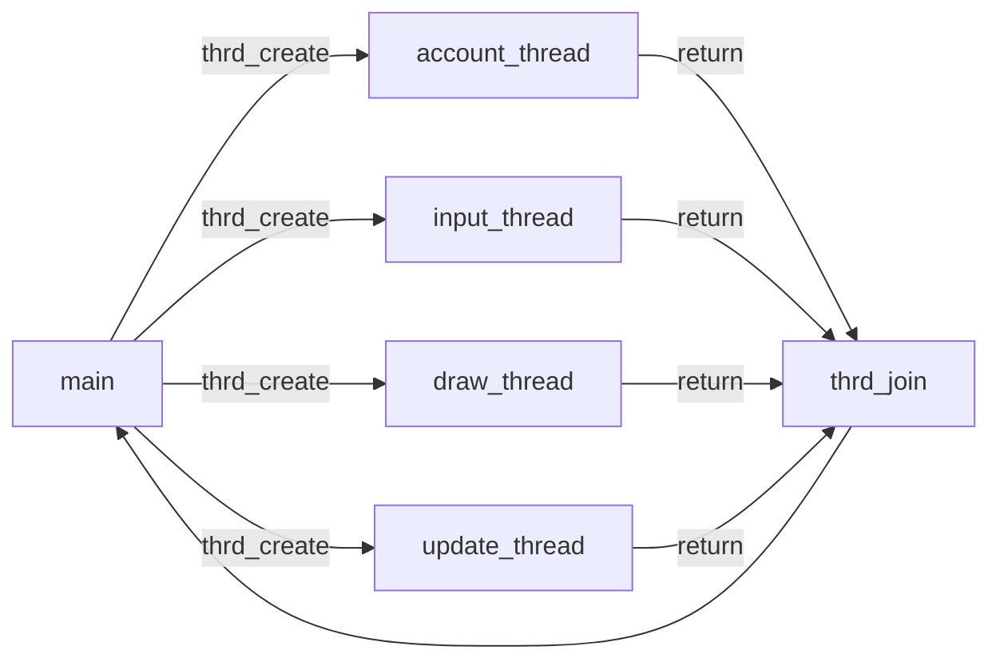
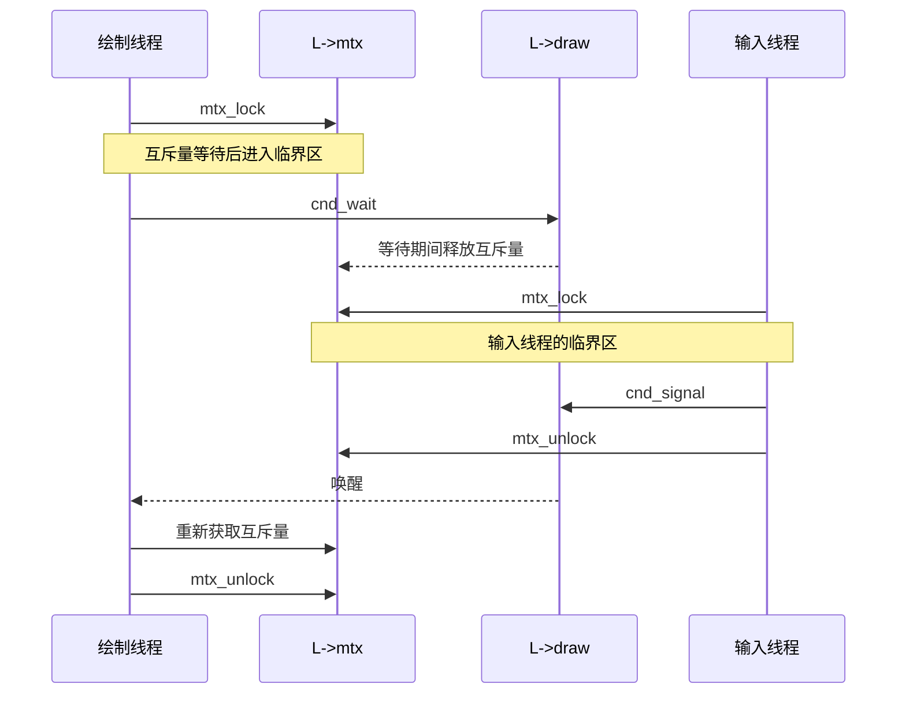
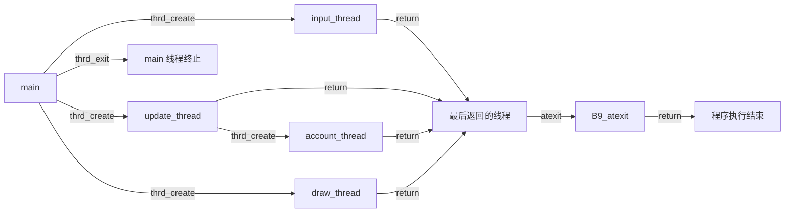

# 20. 线程

[[toc]]

本章涵盖：

- 线程间控制
- 初始化和销毁线程
- 使用线程局部数据
- 临界数据与临界区
- 通过条件量通信

线程是控制流的另一种变化形式，使我们能够并发推进若干任务。这里的“任务”是程序所要完成工作的一部分，不同任务彼此之间可以完全不交互，或者只进行少量交互。

本章的主要示例是一个称为 B9 的简单游戏，它是 Conway“生命游戏”的一种变体（参见 Gardner [1970]）。游戏模拟一个由原始“细胞”组成的矩阵；细胞依照极其简单的规则出生、存活和死亡。我们把游戏分成四项不同任务，每项任务都反复推进。细胞经历一个个生命周期，在每个周期中计算所有细胞的出生或死亡事件。终端中的图形显示则经历一个个绘制周期，以终端允许的最快速度更新。用户会不定期地在其间敲击按键，从而在选定位置添加细胞。图 20.1 概略展示了 B9 中的这些任务。



**图 20.1　B9 五个线程的控制流**

四项任务如下：

| 任务 | 职责 |
| --- | --- |
| 绘制（Draw） | 在终端中绘制细胞矩阵的图像（见图 20.2） |
| 输入（Input） | 捕获按键、更新光标位置并创建细胞 |
| 更新（Update） | 从一个生命周期到下一个生命周期更新游戏状态 |
| 计数（Account） | 与更新任务紧密配合，统计每个细胞周围存活细胞的数量 |

示例中的任务通过一个 `life` 类型的数据结构进行通信。随着讨论推进，会逐步看到该结构的不同成员，例如表示行数和列数的 `n0`、`n1`，以及追踪总体状态的 `finished`、`accounted`。为了便于跟上内容，阅读本章时最好同时查看示例源码。

每项任务都由一个线程执行；线程遵循自己的控制流，很像一个独立的小程序。如果平台拥有多个处理器或核心，这些线程可以同时执行。即使平台不具备这种能力，系统也会交错执行各线程。对于用户而言，整个执行过程看起来就像各项任务所处理的事件同时发生。这一点对示例至关重要，因为无论玩家是否敲击键盘，我们都希望游戏看起来在持续进行。

C 主要通过两个函数接口来处理线程：一个启动新线程，另一个等待该线程终止。自 C11 起，它们由头文件 `<threads.h>` 提供：

::: details 图 20.2：B9 的终端画面
画面在一个矩形区域中显示若干细胞和当前光标位置，底部状态栏类似如下：

```text
20 FPS, 383 iterations, 74 birth9, 383 constellations, 5.18 quotient
```

**图 20.2　B9 的屏幕截图，其中显示了若干细胞和光标位置**
:::

```c
#include <threads.h>
typedef int (*thrd_start_t)(void*);
int thrd_create(thrd_t*, thrd_start_t, void*);
int thrd_join(thrd_t, int*);
```

这里，`thrd_create` 的第二个实参是 `thrd_start_t` 类型的函数指针。新线程启动时会执行这个函数。从 `typedef` 可以看出，该函数接收一个 `void*` 指针并返回 `int`。`thrd_t` 是一种不透明类型，用来标识新创建的线程。

在示例中，`main` 内的四次 `thrd_create` 调用创建了与四项任务相对应的四个线程。这些线程与原始的 `main` 线程并发执行。最后，`main` 等待四个线程终止，也就是与它们汇合。四个线程从各自启动时所用的初始函数返回，便直接到达终止点。因此，四个函数的声明如下：

```c
static int update_thread(void*);
static int draw_thread(void*);
static int input_thread(void*);
static int account_thread(void*);
```

`main` 会分别在独立线程中启动这四个函数；四个函数全都接收一个指针（声明为 `void*`），指向保存游戏状态的对象（假定其类型为 `life`）：

**`B9.c`**

```c:line-numbers=201
/* Create an object that holds the game's data. */
life L = LIFE_INITIALIZER;
life_init(&L, n0, n1, M);
/* Creates four threads that all operate on that same object
   and collects their IDs in "thrd" */
thrd_t thrd[4];
thrd_create(&thrd[0], update_thread, &L);
thrd_create(&thrd[1], draw_thread, &L);
thrd_create(&thrd[2], input_thread, &L);
thrd_create(&thrd[3], account_thread, &L);
/* Waits for the update thread to terminate */
thrd_join(thrd[0], nullptr);
/* Tells everybody that the game is over */
L.finished = true;
ungetc('q', stdin);
/* Waits for the other threads */
thrd_join(thrd[1], nullptr);
thrd_join(thrd[2], nullptr);
thrd_join(thrd[3], nullptr);
```

四个线程函数中最简单的是 `account_thread`。函数接口必须与 `thrd_create` 所期待的函数指针类型 `thrd_start_t` 兼容，所以它只能接收一个 `void*` 形参。因此，该函数的第一个动作是把形参 `Lv` 重新解释为指向 `life` 的指针 `L`，随后进入 `while` 循环，直到工作结束：

**`B9.c`**

```c:line-numbers=99
int account_thread(void* Lv) {
  life* restrict L = Lv;
  while (!L->finished) {
    // Blocks until there is work
    ...
  }
  return 0;
}
```

该循环的核心调用任务专用函数 `life_account`，随后检查从自身角度来看游戏是否应当结束：

**`B9.c`**

```c:line-numbers=107
// VVVVVVVVVVVVVVVVVVVVVVVVVVVVVVVVVVVVVVVVVVVVVVVVV
life_account(L);
if ((L->last + repetition) < L->accounted) {
  L->finished = true;
}
// ^^^^^^^^^^^^^^^^^^^^^^^^^^^^^^^^^^^^^^^^^^^^^^^^^
```

这里的终止条件是：游戏此前是否已经进入过同一个由 `repetition` 个游戏布局组成的序列；`repetition` 会设为某个恒定的启发式值。

另外三个函数的实现与此类似。它们都把实参重新解释为指向 `life` 的指针，然后进入处理循环，直至检测到游戏已经结束。在循环内部，它们用相对简单的逻辑完成当前迭代中的特定任务。例如，`draw_thread` 的内部部分如下：

**`B9.c`**

```c:line-numbers=78
// VVVVVVVVVVVVVVVVVVVVVVVVVVVVVVVVVVVVVVVVVVVVVVVVV
if (L->n0 <= 30) life_draw(L);
else life_draw4(L);
L->drawn++;
// ^^^^^^^^^^^^^^^^^^^^^^^^^^^^^^^^^^^^^^^^^^^^^^^^^
```

它会根据当前游戏是否不超过 30 行，在两个不同的绘制函数之间作出选择。

## 20.1 简单的线程间控制

我们已经见过两种在线程之间进行控制的工具：`thrd_join` 函数和数据成员 `finished`。

首先，`thrd_join` 允许一个线程等待另一个线程结束。前面 `main` 与其他四个线程汇合时就是如此。这确保 `main` 线程实际上只会在所有其他线程终止之后才终止，因而程序执行会一直保持存活和一致，直至最后一个线程消失。

另一个工具是 `life` 结构的成员 `finished`，你甚至可能没有意识到它也是控制工具。由于所有线程共享该数据结构，这个成员可在线程之间传达条件。这里，它保存一个 `bool` 值；任意线程检测到会终止游戏的条件时，该值就为 `true`。

与信号处理程序类似，多个线程同时对共享对象作出相互冲突的动作，必须极其谨慎地处理。

::: tip 要点 20.1 #1
如果线程 T0 写入非原子对象，而另一个线程 T1 同时读取或写入该对象，执行就会失败。
:::

一般来说，讨论不同线程时，甚至很难确定“同时”究竟应当表示什么（很快就会讨论）。要避免这种情形，唯一的机会就是排除所有可能相互冲突的访问。如果可能出现同时进行、又没有保护的访问，就称为竞态条件。

在示例中，除非采取专门预防措施，否则即使是对 `finished` 这样的 `bool` 进行更新，也可能在线程之间拆分开来。如果两个线程交错访问它，更新就可能把状态搅乱，导致未定义的程序状态。编译器无法知道特定对象是否可能遭遇竞态条件，因此必须由我们明确告知。最简单的办法，是采用处理信号时已经见过的工具：原子类型。这里，`life` 结构有几个用 `_Atomic` 说明的成员：

**`life.h`**

```c:line-numbers=40
// Parameters that will dynamically be changed by
// different threads
_Atomic(size_t) constellations; //< Constellations visited
_Atomic(size_t) x0;             //< Cursor position, row
_Atomic(size_t) x1;             //< Cursor position, column
_Atomic(size_t) frames;         //< FPS for display
_Atomic(bool) finished;         //< This game is finished.
```

对这些成员的访问保证是原子的。其中包括已经熟悉的 `finished`，也包括若干用于在输入与绘制任务之间通信的成员，尤其是光标的当前位置。

::: tip 要点 20.1 #2
从不同线程中的执行来看，对原子对象进行的标准操作不可分割，并且可线性化。
:::

这里，线性化性确保我们也能针对两个不同线程中计算的先后顺序进行推理。在示例中，如果一个线程看到 `finished` 已经修改（设为 `true`），它就知道：设置该对象的线程已经完成了自己应当完成的所有动作。从这个意义上说，线性化性把定序的纯句法性质（第 19.2 节）扩展到了线程。

因此，对原子对象的操作也能帮助我们确定线程中的哪些部分并非同时执行，从而保证它们之间不会发生竞态条件。第 21.1 节会看到，怎样用“先于”关系对此作出形式化描述。

由于原子对象在语义上不同于普通对象，声明它们的主要句法是原子说明符：已经见过的关键字 `_Atomic`，后跟圆括号，括号内是原子类型所派生自的类型。还有另一种句法，把 `_Atomic` 当作原子限定符使用，形式类似其他限定符 `const`、`volatile` 和 `restrict`。在下面的说明中，`A` 和 `B` 的两种不同声明分别等价：

```c
extern _Atomic(double (*)[45]) A;
extern double (*_Atomic A)[45];
extern _Atomic(double) (*B)[45];
extern double _Atomic (*B)[45];
```

它们分别指代同一对象：`A` 是指向含 45 个 `double` 元素的数组的原子指针；`B` 是指向含 45 个原子 `double` 元素的数组的指针。

限定符记法存在陷阱：它可能让人以为 `_Atomic` 限定符与其他限定符相似，实际上这种相似性十分有限。请看下面这个采用三种不同“限定符”的示例：

```c
double var;
// Valid: adding const qualification to the pointed-to type
extern double const* c = &var;
// Valid: adding volatile qualification to the pointed-to type
extern double volatile* v = &var;
// Invalid: pointers to incompatible types
extern double _Atomic* a = &var;
```

因此，最好不要养成把原子类型视作限定类型的习惯。

::: tip 要点 20.1 #3
声明原子对象时，请使用说明符句法 `_Atomic(T)`。
:::

`_Atomic` 的另一项限制是不能应用于数组类型：

```c
_Atomic(double[45]) C; // Invalid: atomic cannot be applied to arrays.
_Atomic(double) D[45]; // Valid: atomic can be applied to array base.
```

这仍然不同于以相似方式“限定”的类型：

```c
typedef double darray[45];
// Invalid: atomic cannot be applied to arrays.
darray _Atomic E;
// Valid: const can be applied to arrays.
darray const F = { }; // Applies to base type
double const F[45];   // Compatible declaration
```

::: tip 要点 20.1 #4
不存在原子数组类型。
:::

本章稍后还会看到另一个保证线性化性的工具：`mtx_t`。不过，原子对象远比它高效，也容易使用。

::: tip 要点 20.1 #5
原子对象是强制排除竞态条件的首选工具。
:::

## 20.2 无竞态的初始化与销毁

对于线程共享的任何数据，都必须先把它设成受控良好的初始状态，之后才能进行任何并发访问；最终销毁之后，也绝不能再访问。初始化有几种办法，下面按优先顺序列出：

1. 具有静态存储期的共享对象，会在任何执行开始之前初始化。
2. 具有自动存储期或已分配存储期的共享对象，可以在发生任何共享访问之前，由创建它们的线程正确初始化。
3. 对于需要动态初始化信息、且具有静态存储期的共享对象：
   1. 如果信息在启动时可用，应当在创建其他任何线程之前由 `main` 初始化；
   2. 如果信息在启动时不可用，则必须使用 `call_once` 初始化。

因此，后一种工具 `call_once` 只在非常特殊的情况下才需要：

```c
void call_once(once_flag* flag, void cb(void));
```

与 `atexit` 类似，`call_once` 登记一个回调函数 `cb`，使它恰好在执行过程中的一个位置调用。函数 `call_once` 和类型 `once_flag` 由头文件 `<threads.h>`（自 C11 起）及 `<stdlib.h>`（自 C23 起）提供。

下面的代码片段给出基本用法：

```c
/* Interface */
extern FILE* errlog;
once_flag errlog_flag;
extern void errlog_fopen(void);

/* Incomplete implementation; discussed shortly */
FILE* errlog = nullptr;
once_flag errlog_flag = ONCE_FLAG_INIT;
void errlog_fopen(void) {
  srand(time());
  unsigned salt = rand();
  static char const format[] = "/tmp/error-%#X.log";
  char fname[16 + sizeof format];
  snprintf(fname, sizeof fname, format, salt);
  errlog = fopen(fname, "w");
  if (errlog) {
    setvbuf(errlog, 0, _IOLBF, 0); // Enables line buffering
  }
}

/* Usage */
/* ... inside a function before any use ... */
call_once(&errlog_flag, errlog_fopen);
/* ... now use it ... */
fprintf(errlog, "bad, we have weird value %g!\n", weird);
```

这里有一个需要动态初始化的全局对象 `errlog`；其初始化要调用 `time`、`srand`、`rand`、`snprintf`、`fopen` 和 `setvbuf`。每次使用该对象之前，都应调用 `call_once`，并使用同一个 `once_flag`（这里是 `errlog_flag`）以及同一个回调函数（这里是 `errlog_fopen`）。

因此，与 `atexit` 不同，回调会连同一个特定对象一起登记，也就是 `once_flag` 类型的对象。这个不透明类型保证自身含有足够状态，以便：

- 判断某次特定的 `call_once` 调用是否为所有线程中的第一次；
- 只在此时调用回调；
- 绝不再次调用该回调；
- 阻挡所有其他线程，直至这唯一一次回调调用终止。

这样，任何使用方线程都可以确信对象已经正确初始化，而不会覆盖其他线程可能完成的初始化。C 标准要求大多数流函数不产生竞态；唯二例外是很快会用到的 `fopen` 和 `fclose`。

::: tip 要点 20.2 #1
正确初始化的 `FILE*` 可以由多个线程无竞态地使用。
:::

这里，“无竞态”只表示程序始终处于良好定义状态，并不表示文件中不会出现来自不同线程、彼此搅在一起的输出行。要避免这种情况，必须保证一次 `fprintf` 或类似调用总能完整打印一整行。

::: tip 要点 20.2 #2
并发写操作应当一次打印完整的一行。
:::

要组织好对象的无竞态销毁，可能困难得多，因为初始化和销毁对数据的访问并不对称。在对象生存期开始时，往往很容易判断存在（以及何时存在）唯一使用方；如果不专门追踪，要判断是否仍有其他线程正在使用对象就很困难。

::: tip 要点 20.2 #3
销毁和解分配共享动态对象需要格外谨慎。
:::

设想一下：一次耗时整整一小时、弥足珍贵的执行，恰好在结束前试图把结果写入文件时崩溃。

在 B9 示例中，我们采用了一项简单策略，确保对象 `L` 可以由所有创建出的线程安全使用。它在所有线程创建之前初始化，只有在与所有创建出的线程汇合之后才不复存在。

对于 `once_flag` 示例中的对象 `errlog`，要看出应当何时从某个线程内部关闭流，就没那么容易。最简单的办法是等到确定周围已经没有其他线程，也就是退出整个程序执行时：

```c
/* Complete implementation */
FILE* errlog = nullptr;
static void errlog_fclose(void) {
  if (errlog) {
    fputs("\n*** closing log ***\n", errlog);
    fclose(errlog);
    errlog = nullptr;
  }
}
static void errlog_fflush(void) {
  if (errlog) {
    fputs("\n*** flushing log ***\n", errlog);
    fflush(errlog);
  }
}
once_flag errlog_flag = ONCE_FLAG_INIT;
void errlog_fopen(void) {
  atexit(errlog_fclose);
  at_quick_exit(errlog_fflush);
  ...
}
```

这里引入另外两个回调 `errlog_fclose` 和 `errlog_fflush`，确保所有消息都打印到文件中。为了保证正常退出程序时执行第一个函数，用 `atexit` 登记它。如果程序通过 `quick_exit` 终止（例如从信号处理程序终止；参见第 19.6 节），关闭文件也许已经代价过高，因此只用 `at_quick_exit` 登记第二个函数。进入初始化函数 `errlog_fopen` 后，这两个处理程序会立即登记。

## 20.3 线程局部数据

避免竞态条件最容易的办法，是严格分离各线程所访问的数据。其他所有解决办法，例如前面见过的原子对象，以及稍后会看到的互斥量和条件量，都复杂得多，代价也高得多。访问线程局部数据的最佳方式是使用局部对象。

::: tip 要点 20.3 #1
通过函数实参传递线程特定数据。
:::

::: tip 要点 20.3 #2
在线程的局部对象中保存线程特定状态。
:::

如果这不可行（或者可能过于复杂），可以用一种特殊存储类和一种专用数据类型来处理线程局部数据。`thread_local` 是存储类说明符，会强制为如此声明的对象创建线程特定副本。

::: tip 要点 20.3 #3
`thread_local` 对象在每个线程中都有一个独立实例。
:::

也就是说，`thread_local` 对象必须以类似静态存储期对象的方式声明：要么在文件作用域中声明，要么在其他位置同时声明为 `static`（参见第 13.2 节的表 13.1）。所以，它们不能动态初始化。

::: tip 要点 20.3 #4
如果能在编译期确定初始化，请使用 `thread_local`。
:::

如果仅有存储类说明符仍然不够，因为还必须进行动态初始化和销毁，就可以使用同样来自 `<threads.h>` 头文件的线程特定存储 `tss_t`。它把线程特定数据的标识抽象成一个称为键（key）的不透明 ID，并提供设置或取得数据的访问函数：

```c
void* tss_get(tss_t key);          // Returns a pointer to an object
int tss_set(tss_t key, void* val); // Returns an error indication
```

创建键时，用 `tss_dtor_t` 类型的函数指针说明在线程末尾调用、用于销毁线程特定数据的函数：

```c
typedef void (*tss_dtor_t)(void*);         // Pointer to a destructor
int tss_create(tss_t* key, tss_dtor_t dtor); // Returns an error indication
void tss_delete(tss_t key);
```

## 20.4 临界数据与临界区

`life` 结构的其他部分无法如此轻易地保护。它们对应体积较大的数据，例如游戏棋盘上的位置。你也许还记得，数组不能用 `_Atomic` 说明；即使用一些技巧勉强做到，结果也不会很高效。因此，除了声明成员 `Mv`（游戏矩阵）和 `visited`（用于散列已经访问过的布局）外，我们还声明了一个特殊成员 `mtx`：

**`life.h`**

```c:line-numbers=15
mtx_t mtx;                        //< Mutex that protects Mv
cnd_t draw;                       //< cnd that controls drawing
cnd_t acco;                       //< cnd that controls accounting
cnd_t upda;                       //< cnd that controls updating

void* restrict Mv;               //< bool M[n0][n1];
bool (*visited)[life_maxit];      //< Hashing constellations
```

成员 `mtx` 采用特殊类型 `mtx_t`，这是一种同样来自 `<threads.h>` 的互斥量（mutex，取 mutual exclusion 之意）类型。它用来在代码中明确划定的一部分（临界区）访问临界数据 `Mv` 时保护该数据。

这个互斥量最简单的使用情形位于输入线程的中心位置（清单 20.1 第 145 行），其中 `mtx_lock` 和 `mtx_unlock` 两次调用保护对 `life` 数据结构 `L` 的访问。

**清单 20.1　B9 的输入线程函数**

```c:line-numbers=121
int input_thread(void* Lv) {
  termin_unbuffered();
  life* restrict L = Lv;
  constexpr size_t len = 32;
  char command[len];
  do {
    auto c = getchar();
    command[0] = c;
    switch(c) {
      case GO_LEFT : life_advance(L,  0, -1); break;
      case GO_RIGHT: life_advance(L,  0, +1); break;
      case GO_UP   : life_advance(L, -1,  0); break;
      case GO_DOWN : life_advance(L, +1,  0); break;
      case GO_HOME : L->x0 = 1; L->x1 = 1; break;
      case ESCAPE  :
        ungetc(termin_translate(termin_read_esc(len, command)), stdin);
        continue;
      case '+': if (L->frames < 128) L->frames++; continue;
      case '-': if (L->frames > 1) L->frames--; continue;
      case ' ':
      case 'b':
      case 'B':
        mtx_lock(&L->mtx);
        // VVVVVVVVVVVVVVVVVVVVVVVVVVVVVVVVVVVVVVVVVVVVVVVVV
        life_birth9(L);
        // ^^^^^^^^^^^^^^^^^^^^^^^^^^^^^^^^^^^^^^^^^^^^^^^^^
        cnd_signal(&L->draw);
        mtx_unlock(&L->mtx);
        continue;
      case 'q':
      case 'Q':
      case EOF: goto FINISH;
    }
    cnd_signal(&L->draw);
  } while (!(L->finished || feof(stdin)));
FINISH:
  L->finished = true;
  return 0;
}
```

这个例程主要由输入循环构成，而输入循环又包含一个大型 `switch`，根据用户在键盘上键入的不同字符进行分派。只有两个分支需要这种保护：`'b'` 和 `'B'`，它们会强制让当前光标位置周围的 $3\times3$ 细胞簇“出生”。其他分支只与原子对象交互，因此可以安全修改它们。

锁定和解锁互斥量的效果很简单。`mtx_lock` 调用会阻塞调用方线程，直到能够保证没有其他线程位于由同一个互斥量保护的临界区中。我们说，`mtx_lock` 获取互斥量上的锁并持有它，随后 `mtx_unlock` 释放锁。使用 `mtx` 还会像前面使用原子对象那样提供线性化性。获取互斥量 M 的线程可以确信，其他线程释放同一个互斥量 M 之前完成的所有操作都已经生效。

::: tip 要点 20.4 #1
互斥量操作提供线性化性。
:::

C 的互斥量锁定接口定义如下：

```c
int mtx_lock(mtx_t*);
int mtx_unlock(mtx_t*);
int mtx_trylock(mtx_t*);
int mtx_timedlock(mtx_t* restrict,
                  struct timespec const* restrict);
```

另外两项调用分别允许我们测试另一个线程是否已经持有锁（`mtx_trylock`，因而可以避免等待），或者只等待最长一段时间（`mtx_timedlock`，因而可以避免永久阻塞）。后一项调用只有在初始化时使用 `mtx_timed`，把互斥量初始化为定时互斥量后才允许使用，很快就会讨论这一点。

还有两项用于动态初始化和销毁的调用：

```c
int mtx_init(mtx_t*, int);
void mtx_destroy(mtx_t*);
```

与更复杂的线程接口不同，必须调用 `mtx_init`；`mtx_t` 没有定义静态初始化。

::: tip 要点 20.4 #2
每个互斥量都必须用 `mtx_init` 初始化。
:::

`mtx_init` 的第二个形参说明互斥量的一项特定性质。它必须是下面四个值之一：

- `mtx_plain`
- `mtx_timed`
- `mtx_plain|mtx_recursive`
- `mtx_timed|mtx_recursive`

你大概已经猜到，使用 `mtx_plain`（而不是 `mtx_timed`）会控制能否使用 `mtx_timedlock`。附加性质 `mtx_recursive` 允许同一个线程在没有预先解锁的情况下，连续多次调用 `mtx_lock` 及类似函数。

::: tip 要点 20.4 #3
持有非递归互斥量的线程，不得再为该互斥量调用任何锁定函数。
:::

名称 `mtx_recursive` 表明，它主要用于递归函数：函数进入临界区时调用 `mtx_lock`，离开时调用 `mtx_unlock`。

::: tip 要点 20.4 #4
持有递归互斥量的线程调用 `mtx_unlock` 的次数达到获取锁的次数后，该互斥量才会释放。
:::

::: tip 要点 20.4 #5
线程终止之前，必须释放其锁定的互斥量。
:::

::: tip 要点 20.4 #6
线程只能对自己持有的互斥量调用 `mtx_unlock`。
:::

由此可以归纳出一条简单的经验法则。

::: tip 要点 20.4 #7
每次成功锁定互斥量，都恰好对应一次 `mtx_unlock` 调用。
:::

根据平台不同，每次调用 `mtx_init` 时，互斥量可能绑定一项分配给它的系统资源。该资源可能是额外内存（例如一次 `malloc` 调用的结果），也可能是某种特殊硬件。因此，互斥量到达生存期末尾后，务必释放这类资源。

::: tip 要点 20.4 #8
互斥量必须在生存期末尾销毁。
:::

因此，特别要在下面两个时点调用 `mtx_destroy`：

- 具有自动存储期的互斥量离开作用域之前；
- 动态分配的互斥量所占内存释放之前。

## 20.5 通过条件量通信

前面看到，输入任务不太需要防范竞态；计数任务的情况正好相反（见清单 20.2）。它的全部工作由 `life_account` 调用完成：扫描整个位置矩阵，统计每个位置周围有多少存活细胞。

**清单 20.2　B9 的计数线程函数**

```c:line-numbers=99
int account_thread(void* Lv) {
  life* restrict L = Lv;
  while (!L->finished) {
    // Blocks until there is work
    mtx_lock(&L->mtx);
    while (!L->finished && (L->accounted == L->iteration))
      life_wait(&L->acco, &L->mtx);

    // VVVVVVVVVVVVVVVVVVVVVVVVVVVVVVVVVVVVVVVVVVVVVVVVV
    life_account(L);
    if ((L->last + repetition) < L->accounted) {
      L->finished = true;
    }
    // ^^^^^^^^^^^^^^^^^^^^^^^^^^^^^^^^^^^^^^^^^^^^^^^^^

    cnd_signal(&L->upda);
    mtx_unlock(&L->mtx);
  }
  return 0;
}
```

**清单 20.3　B9 的更新线程函数**

```c:line-numbers=35
int update_thread(void* Lv) {
  life* restrict L = Lv;
  size_t changed = 1;
  size_t birth9 = 0;
  while (!L->finished && changed) {
    // Blocks until there is work
    mtx_lock(&L->mtx);
    while (!L->finished && (L->accounted < L->iteration))
      life_wait(&L->upda, &L->mtx);

    // VVVVVVVVVVVVVVVVVVVVVVVVVVVVVVVVVVVVVVVVVVVVVVVVV
    if (birth9 != L->birth9) life_torus(L);
    life_count(L);
    changed = life_update(L);
    life_torus(L);
    birth9 = L->birth9;
    if (L->iteration != SIZE_MAX) L->iteration++;
    else L->finished = true;
    // ^^^^^^^^^^^^^^^^^^^^^^^^^^^^^^^^^^^^^^^^^^^^^^^^^

    cnd_signal(&L->acco);
    cnd_signal(&L->draw);
    mtx_unlock(&L->mtx);
    life_sleep(1.0/L->frames);
  }
  return 0;
}
```

类似地，更新线程和绘制线程主要由外层循环中的一个临界区构成：清单 20.3 和清单 20.4 展示了所执行的动作。临界区之后还有一次 `life_sleep` 调用，使执行暂停一段时间。这确保这些线程只以与图形帧率相对应的频率运行。

在三个线程中，临界区大都覆盖循环体。除真正的计算外，这些临界区首先都有一个阶段：线程暂停，直到需要进行新的计算。更确切地说，对于计数线程，有一个条件循环；只有游戏已经结束，或者另一个线程推进了迭代计数时，才能离开该循环。

内层循环体会调用 `life_wait`；该函数让调用方线程暂停 1 秒，或者等待某个特定事件发生：

**`life.c`**

```c:line-numbers=17
int life_wait(cnd_t* cnd, mtx_t* mtx) {
  struct timespec now;
  timespec_get(&now, TIME_UTC);
  now.tv_sec += 1;
  return cnd_timedwait(cnd, mtx, &now);
}
```

它的主要成分是一次 `cnd_timedwait` 调用；该函数接收一个 `cnd_t` 类型的条件量、一个互斥量以及一个绝对时间限制。

**清单 20.4　B9 的绘制线程函数**

```c:line-numbers=64
int draw_thread(void* Lv) {
  life* restrict L = Lv;
  size_t x0 = 0;
  size_t x1 = 0;
  fputs(ESC_CLEAR ESC_CLRSCR, stdout);
  while (!L->finished) {
    // Blocks until there is work
    mtx_lock(&L->mtx);
    while (!L->finished
           && (L->iteration <= L->drawn)
           && (x0 == L->x0)
           && (x1 == L->x1)) {
      life_wait(&L->draw, &L->mtx);
    }
    // VVVVVVVVVVVVVVVVVVVVVVVVVVVVVVVVVVVVVVVVVVVVVVVVV
    if (L->n0 <= 30) life_draw(L);
    else life_draw4(L);
    L->drawn++;
    // ^^^^^^^^^^^^^^^^^^^^^^^^^^^^^^^^^^^^^^^^^^^^^^^^^

    mtx_unlock(&L->mtx);

    x0 = L->x0;
    x1 = L->x1;
    // No need to draw too quickly
    life_sleep(1.0/40);
  }
  return 0;
}
```

这类条件量用于标识线程可能希望等待的条件。在示例中，已经见过 `life` 的三个条件量成员声明：`draw`、`acco` 和 `upda`。它们分别对应绘制、计数和更新任务在继续执行自身工作前需要检验的条件。正如前面看到的，计数任务使用：

```c
while (!L->finished && (L->accounted == L->iteration))
  life_wait(&L->acco, &L->mtx);
```

更新任务和绘制任务则分别使用：

```c
while (!L->finished && (L->accounted < L->iteration))
  life_wait(&L->upda, &L->mtx);
```

以及：

```c
while (!L->finished
       && (L->iteration <= L->drawn)
       && (x0 == L->x0)
       && (x1 == L->x1)) {
  life_wait(&L->draw, &L->mtx);
}
```

每个循环中的条件都反映了相应任务在何种情况下有工作可做。最重要的是，务必不要混淆条件量与条件表达式：条件量充当条件的某种标识，而 `cnd_t` 等待函数即使在条件表达式毫无变化时也可能返回。

::: tip 要点 20.5 #1
从 `cnd_t` 等待返回后，必须再次检查表达式。
:::

因此，所有 `life_wait` 调用都放在检查条件表达式的循环内部。

在示例中，这一点也许显而易见，因为底层使用的是 `cnd_timedwait`，调用可能仅仅因为超时而返回。但即使使用没有计时的等待条件接口，调用也可能提前返回。在示例代码中，游戏结束时调用最终也可能返回，所以条件表达式始终包含对 `L->finished` 的检验。

`cnd_t` 有四个主要控制接口：

```c
int cnd_wait(cnd_t*, mtx_t*);
int cnd_timedwait(cnd_t* restrict, mtx_t* restrict,
                  struct timespec const* restrict);
int cnd_signal(cnd_t*);
int cnd_broadcast(cnd_t*);
```

第一个接口的工作方式与第二个类似，但没有超时；如果从未向 `cnd_t` 形参发出信号，线程可能永远无法从调用中返回。

`cnd_signal` 和 `cnd_broadcast` 位于控制过程的另一端。前面已经在 `input_thread` 和 `account_thread` 中见过第一项。它们确保等待相应条件量的一个线程（`cnd_signal`）或所有线程（`cnd_broadcast`）被唤醒，并从 `cnd_wait` 或 `cnd_timedwait` 调用返回。例如，输入任务会通知绘制任务：游戏布局中的某些内容已经改变，应当重新绘制棋盘：

**`B9.c`**

```c:line-numbers=154
cnd_signal(&L->draw);
```

等待条件函数的 `mtx_t` 形参承担重要角色。调用等待函数时，调用方线程必须持有该互斥量。等待期间会暂时释放互斥量，让其他线程可以完成自己的工作，使条件表达式成立。等待调用即将返回之前会重新获取锁，此时便可以安全、无竞态地访问临界数据。

图 20.3 展示输入线程与绘制线程、互斥量以及相应条件量之间的典型交互。交互涉及六次函数调用：四次用于各自的临界区和互斥量，两次用于条件量。



**图 20.3　输入线程与绘制线程之间由互斥量 `L->mtx` 和条件量 `L->draw` 管理的控制流。临界区在原图中以灰色阴影表示。等待方重新获取互斥量之前，条件量始终与该互斥量关联。**

等待调用中条件量与互斥量的耦合必须谨慎处理。

::: tip 要点 20.5 #2
同一个条件量在同一时刻只能与一个互斥量配合使用。
:::

不过，最佳实践大概是永远不要更换与某个条件量配合使用的互斥量。

示例还表明，同一个互斥量可以对应许多条件量：我们同时让一个互斥量与三个不同的条件量配合使用。许多应用都必然需要这样做，因为不同角色的线程访问同一资源时，所依据的条件表达式各不相同。

如果多个线程等待同一个条件量，并由一次 `cnd_broadcast` 调用唤醒，它们不会同时醒来，而会在逐一重新获取互斥量时依次醒来。

与互斥量类似，C 的条件量可能绑定宝贵的系统资源。因此，它们必须动态初始化，也应当在生存期末尾销毁。

::: tip 要点 20.5 #3
`cnd_t` 必须动态初始化。
:::

::: tip 要点 20.5 #4
`cnd_t` 必须在生存期末尾销毁。
:::

相应接口十分直接：

```c
int cnd_init(cnd_t* cond);
void cnd_destroy(cnd_t* cond);
```

## 20.6 更复杂的线程管理

在 `main` 中见过创建线程并与之汇合后，我们也许会觉得线程采用某种层级组织。事实并非如此：只要知道线程的 ID，也就是它的 `thrd_t`，就足以处理它。只有一个线程恰好拥有一项特殊性质。

::: tip 要点 20.6 #1
从 `main` 返回或调用 `exit` 会终止所有线程。
:::

如果创建其他线程后想终止 `main`，就必须采取一些预防措施，以免过早终止其他线程。下面这个修改后的 B9 `main` 给出了一种策略：

**`B9-detach.c`**

```c:line-numbers=209
life L = LIFE_INITIALIZER;

void B9_atexit(void) {
  /* Puts the board in a nice final picture */
  L.iteration = L.last;
  life_draw(&L);
  life_destroy(&L);
}

int main (int argc, char* argv[argc+1]) {
  /* Uses command-line arguments for the size of the board */
  size_t n0 = 30;
  size_t n1 = 80;
  if (argc > 1) n0 = strtoull(argv[1], nullptr, 0);
  if (argc > 2) n1 = strtoull(argv[2], nullptr, 0);
  /* Create an object that holds the game's data. */
  life_init(&L, n0, n1, M);
  atexit(B9_atexit);
  /* Creates four threads that operate on the same object and
     discards their IDs */
  thrd_create(&(thrd_t){0}, update_thread, &L);
  thrd_create(&(thrd_t){0}, draw_thread, &L);
  thrd_create(&(thrd_t){0}, input_thread, &L);
  /* Ends this thread nicely and lets the threads go on nicely */
  thrd_exit(0);
}
```

首先，必须用函数 `thrd_exit` 终止 `main`。与 `return` 不同，它确保相应线程终止时不会影响其他线程。其次，必须让 `L` 成为全局对象，因为我们不希望它的生存期随 `main` 终止而结束。为了安排必要的清理，还要安装一个 `atexit` 处理程序。修改后的控制流如图 20.4 所示。



**图 20.4　B9-detach 五个线程的控制流。最后返回的线程执行 `atexit` 处理程序。**

这种不同的管理方式造成一项后果：创建出的四个线程实际上永远不会得到汇合。每个已经终止却从未汇合的线程都会占用一些资源，这些资源会一直保留到执行结束。因此，良好的编码风格要求告诉系统某个线程永远不会汇合；我们称之为分离相应线程。为此，需要在各线程函数开头插入 `thrd_detach` 调用。我们还从那里启动计数线程，而不再像前面那样从 `main` 启动。

**`B9-detach.c`**

```c:line-numbers=38
/* Nobody should ever wait for this thread. */
thrd_detach(thrd_current());
/* Delegates part of our job to an auxiliary thread */
thrd_create(&(thrd_t){0}, account_thread, Lv);
life* restrict L = Lv;
```

线程管理还可以使用六个函数，其中 `thrd_current`、`thrd_exit` 和 `thrd_detach` 已经见过：

```c
thrd_t thrd_current(void);
int thrd_equal(thrd_t, thrd_t);
[[noreturn]] void thrd_exit(int);
int thrd_detach(thrd_t);
int thrd_sleep(struct timespec const*, struct timespec*);
void thrd_yield(void);
```

运行中的 C 程序，其线程数可能远远多于处理单元数。尽管如此，运行时系统应当可以通过在处理器上分配时间片，平稳地调度各线程。如果线程没有工作可做，就不应要求时间片，而应当把处理资源留给可能需要它们的其他线程。这正是控制数据结构 `mtx_t` 和 `cnd_t` 的主要功能之一。

::: tip 要点 20.6 #2
线程阻塞于 `mtx_t` 或 `cnd_t` 时，会释放处理资源。
:::

如果这还不够，另外两个函数可以暂停执行：

- `thrd_sleep` 允许线程暂停执行一段时间，使平台硬件资源在此期间可供其他线程使用；
- `thrd_yield` 终止当前时间片，等待下一次处理机会。

## 20.7 保证活性

正如第 15.3.4 节所见，死锁是可能危及多线程程序执行的严重不幸事件之一。遗憾的是，深入处理这一主题超出了本书范围；并行计算和分布式计算各自都是独立学科，足以写成整本书。

带线程的应用可能以两种根本不同的方式陷入停滞：

**死锁（deadlock）：** 所有线程都调用了某个互斥量锁定函数或条件等待函数，却永远无法从中唤醒。

**活锁（livelock）：** 至少两个线程在控制循环中运行，程序状态不断重复，并且这种重复不取决于任何外部输入。

第一种情形的简单示例，是线程 A 和 B 试图锁定两个互斥量 M 和 N。如果 A 先锁定 M，B 锁定 N，随后各自尝试锁定另一个互斥量，两个线程就都会阻塞，执行随之失败：

::: code-group
```c [线程 A]
mtx_lock(&M);
mtx_lock(&N); /* waiting for B */
```

```c [线程 B]
mtx_lock(&N);
mtx_lock(&M); /* waiting for A */
```
:::

避免这种情形的最佳办法，是遵循一条简单的经验法则。

::: tip 要点 20.7 #1
需要锁定多个互斥量的临界区，应当始终以相同顺序锁定这些互斥量。
:::

仅靠这条经验法则，就已经可以保证许多只使用互斥量（不使用条件量）的多线程程序不会死锁。例如：

- 每个临界区只锁定一个互斥量的程序；
- 各线程使用同一段程序代码、且恰好只有一个临界区的程序。

如果没有使用条件量，示例程序 B9 就属于第一类：它只有一个互斥量，也就是 `life` 结构的成员 `mtx`。由于我们只会有一个该类型的对象，所以任何临界区都只使用这一个特定互斥量，不使用其他互斥量。对于几个不同的 `cnd_t` 条件量，则要谨慎处理。

::: tip 要点 20.7 #2
为了避免死锁，请优先使用 `cnd_timedwait`，而不是 `cnd_wait`。
:::

事实上，唯一的条件等待函数位于 `life_wait` 内部，也就是对 `cnd_timedwait` 的一次调用。因此，可以断言 B9 永远不会死锁。

现在已经知道 B9 永远不会阻塞，但仍需确认它没有活锁。为此，首先注意下面的条件始终成立：

$$
L\mathtt{->accounted} \le L\mathtt{->iteration}
$$

它在初始时为真，因为 `L->iteration` 只会（由 `update_thread`）递增，绝不会重置为零。`L->accounted` 只会由 `life_account` 调用递增，因为该函数只从 `account_thread` 内部调用，而且调用时 `L->accounted` 不等于 `L->iteration`。

因此，如果假设整个应用没有进展，两个线程最终都会停留在各自反复调用 `life_wait` 的 `while` 循环中。此时，下列两种情形之一最终必会出现：

- `account_thread` 从 `life_wait` 返回，并且条件 `L->accounted < L->iteration` 成立；
- `update_thread` 从 `life_wait` 返回，并且条件 `L->accounted == L->iteration` 成立。

对于第一种情形，`account_thread` 会终止循环，并在成员 `L->accounted` 上取得进展。同样，对于第二种情形，`update_thread` 会终止循环，并在 `L->iteration` 上取得进展。无论如何，执行都会向前推进。

所以，如果没有用户输入，也没有满足终止条件，线程 `update_thread` 和 `account_thread` 就会交替经过各自的临界区，并分别在每次经过时递增两个成员 `L->iteration` 和 `L->accounted`。输入线程只能通过更改某些数据进行干预，而这可能改变终止条件。因此，B9 会一直推进，直到满足终止条件，或者计数器 `L->iteration` 到达时间尽头，也就是 `SIZE_MAX`。

这份关于 B9 活性的证明梗概，利用了程序状态中的计数器只会向前推进这一事实。对于程序用户而言，这些计数器是状态中无关紧要的部分；他们真正看到的是细胞的图形布局。在没有用户输入的情况下，经过一定时间（只要计数器足够宽），游戏一定会进入此前已经到达过的布局。所以，如果没有按键之类的外部事件，它看起来确实非常像活锁。B9 在计算终止条件时避免了这种情况：函数 `life_update` 会判断当前细胞布局此前是否出现过。[^ex50] 如果出现过，`update_thread` 就会宣布游戏结束。

一般来说，多线程程序越复杂，活性证明就越困难。凭借这个有限的示例，我们只能浅尝并发程序设计中可能遇到的种种困难。

::: info 挑战 21：使用线程进行并行排序
你能否以自己的归并排序实现（挑战 1 和挑战 14）为基础，用两个线程实现并行排序算法？也就是说，归并排序把输入数组一分为二，在各自线程中对每一半排序，随后像以前一样按顺序合并两半。请在两个线程内部以不同的顺序排序算法作为基础。

你能否把并行排序推广到 P 个线程，其中 $P=2^k$，$k=1,2,3,4$，而 $k$ 由命令行给出？

你能否测量并行化所带来的加速？它与测试平台拥有的核心数是否吻合？
:::

## 小结

- 务必确保共享数据在受到并发访问之前已经正确初始化。最好在编译期或 `main` 开头完成这件事。如果做不到，可以用 `call_once` 恰好触发一次初始化函数的执行。
- 线程最好只通过函数实参和自动对象操作局部数据。如果无法避免，也可以把线程特定数据创建为 `thread_local` 对象，或者通过 `tss_create` 创建。只有需要动态构造和销毁对象时，才使用后者。
- 线程之间共享的小型临界数据应当说明为 `_Atomic`。
- 临界区（操作不受保护的共享数据的代码路径）必须受到保护，通常使用 `mtx_t` 互斥量。
- 线程之间带条件的处理依赖关系，用 `cnd_t` 条件量建模。
- 如果线程不能依靠 `main` 进行事后清理，就应当用 `thrd_detach` 分离，并把所有清理代码放入 `atexit` 和/或 `at_quick_exit` 处理程序。
- 验证使用互斥量和条件量的多线程程序是否具有活性，可能是一项很有挑战的任务。

[^ex50]: **练习 50**　证明：如果没有用户输入，经过有限次迭代后，B9 一定会再次访问此前访问过的细胞布局。
