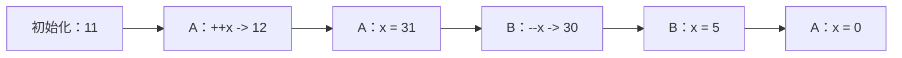
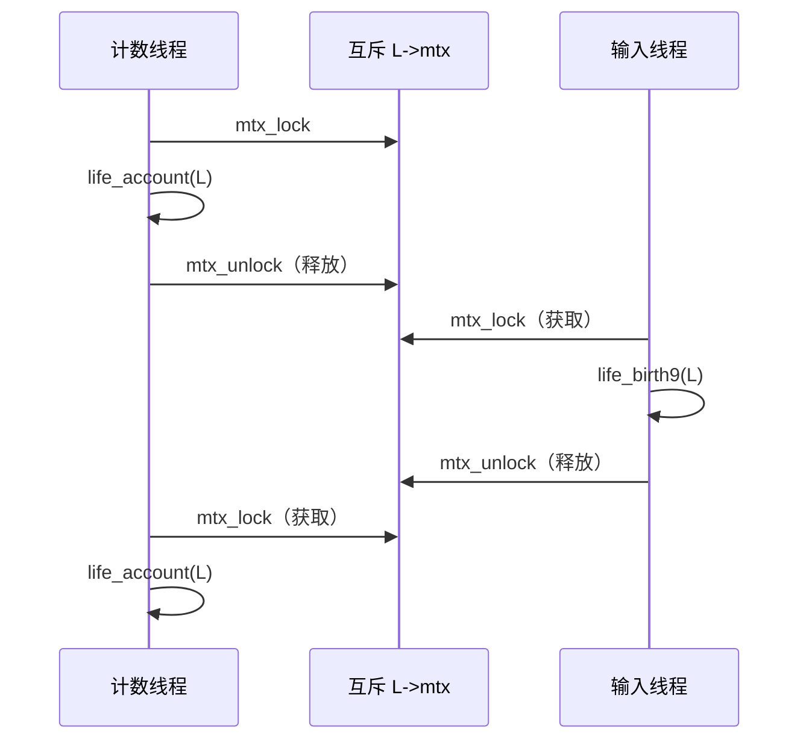
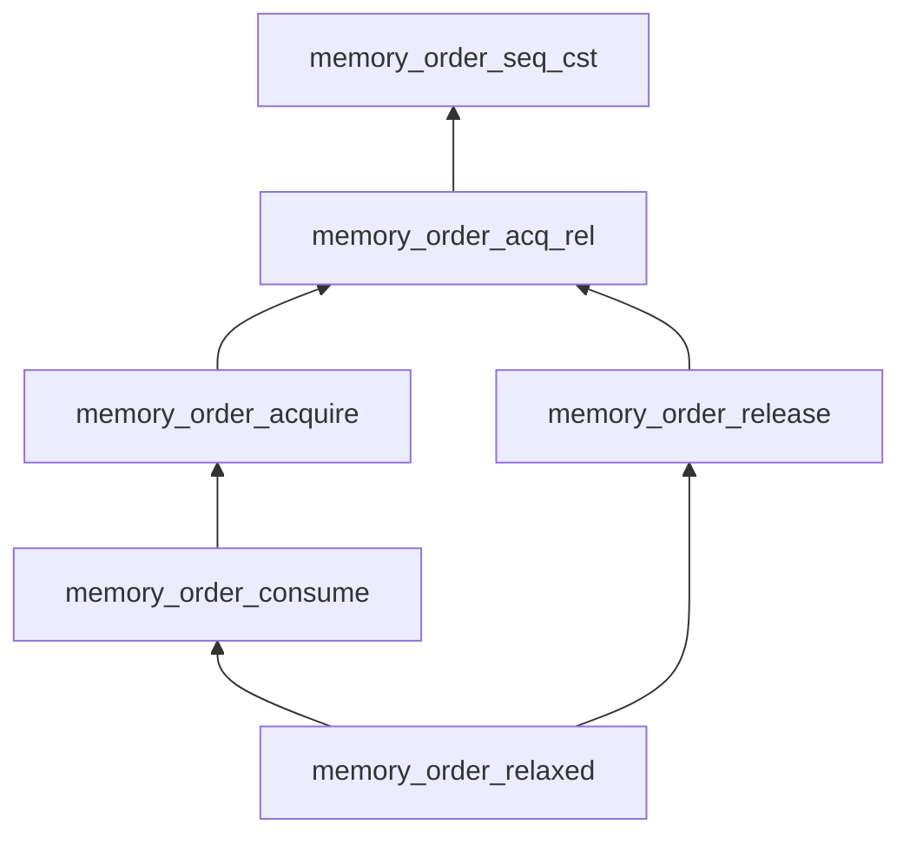

# 第 21 章：原子访问与内存一致性

本章介绍：

- 理解“先于发生”关系；
- 提供同步的 C 库调用；
- 维持顺序一致性；
- 使用其他一致性模型。

[[toc]]

本级最后介绍构成 C 体系结构模型重要部分的一组概念，它们是经验丰富的程序员必须掌握的知识。本章着重加深对事物怎样工作的理解，不一定会提高直接操作能力。虽然不会深入每一处精彩细节，[^consume-omitted] 旅途依然可能有些颠簸；请留在座位上，系好安全带。

回顾前面各章展示的控制流图，就会发现一次程序执行中不同部分的交互可能十分复杂。并发访问数据存在多个层次：

- 普通而直截了当的 C 代码只在表面上顺序执行。只有在少数特定执行位置——序列点、直接数据依赖以及函数调用完成处——才保证可以看到改动。现代平台越来越充分地利用其中留下的余地，在多个执行流水线中交错或并行完成未定序操作。
- 长跳转和信号处理程序顺序执行，但存储操作的效果可能在过程中丢失。
- 到目前为止见过的原子对象访问，保证其改动在所有位置可见且保持一致。
- 各线程并排并发运行；如果不调节对数据的共享访问，便会危及数据一致性。除了访问原子对象，还可以通过 `thrd_join` 或 `mtx_lock` 等函数调用进行同步。

内存访问并不是程序所做的唯一事情。一次程序执行的抽象状态实际上包括：

- 执行点，每个线程各有一个；
- 中间值，即计算表达式或求值对象得到的值；
- 已存储的值；
- 隐藏状态。

对这些状态的改变通常描述为：

- **跳转：** 改变执行点，包括短跳转、长跳转和函数调用；
- **值计算：** 改变中间值；
- **副作用：** 存储值或完成输入输出。

改变还可能作用于隐藏状态，例如 `mtx_t` 对象的锁定状态、`once_flag` 对象的初始化状态，以及对 `atomic_flag` 对象执行设置或清除操作。

本章用术语**作用**（effect）概括对抽象状态的一切可能改变。

::: tip 要点 21-1
每次求值都有作用。
:::

这是因为任何求值都有“下一次求值”的概念，后者会在它之后完成。即使只是：

```c
(void)0;
```

它也会丢弃中间值，并把执行点移到下一条语句，因此抽象状态仍然发生了改变。

在复杂语境中，很难讨论某一时刻一次执行的真实抽象状态。程序执行的完整抽象状态通常根本无法观察；在许多情况下，“整体抽象状态”概念本身都没有良好定义，因为我们不知道这种语境中的“时刻”究竟意味着什么。

在多个物理计算核心上完成多线程执行时，各核心之间不存在真正的参考时间概念。因此，一般而言，C 甚至不假定不同线程间存在一种细粒度的全局时间。

可以把线程 `A` 和 `B` 想象成发生在两个不同星球上的事件，这两个星球以不同速度环绕恒星。两个星球（线程）上的时间都是相对的，只有一个星球（线程）发出的信号抵达另一个时，二者才发生同步。传输信号本身需要时间；信号抵达目的地时，源头早已继续前进。因此，两个星球（线程）对彼此的认识始终只是局部的。

[^consume-omitted]: 本章不讨论 `memory_order_consume` 一致性，因而也不讨论“依赖排序先于”关系。

## 21.1 “先于发生”关系

如果要讨论程序执行——例如正确性或性能——就必须充分掌握各线程状态的**局部知识**，并知道怎样把这些局部知识缝合成一幅连贯的整体图景。

为此，本节考察 Lamport [1978] 引入的一种关系。按照 C 标准术语，它是两次求值 `E` 和 `F` 之间的**先于发生**关系，以 $F \rightarrow E$ 表示。这是事后观察到的事件间性质；若完整展开，或许称为“已知先于发生”关系更加准确。

其中一部分来自同一线程内的求值，它们通过此前介绍的“先序于”关系相连。

::: tip 要点 21.1-1
如果 `F` 先序于 `E`，那么 $F \rightarrow E$。
:::

回看输入线程的清单 20.1。对 `command[0]` 的赋值先序于 `switch` 语句，所以可以确信，`switch` 中所有分支都在赋值后执行，或者至少会被视为发生在赋值之后。例如，把 `command` 传给 `ungetc` 之下的嵌套函数调用时，可以确信它会提供修改后的值。这些结论都能从 C 的文法推出。

不同线程间的事件顺序由同步提供。同步分为两类：第一类由原子操作隐含产生，第二类由特定 C 库调用产生。先看原子操作。

如果一个线程写入原子对象，另一个线程读到了写入值，就能通过该原子对象同步两个线程。原子操作保证局部一致。

::: tip 要点 21.1-2
对原子对象 `X` 的全部修改，会按照一种与所有操作 `X` 的线程内“先序于”关系一致的顺序完成。
:::

这项顺序称为 `X` 的**修改顺序**。考虑原子对象：

```c
_Atomic(unsigned) x = 11;
```

线程 `A` 执行：

```c
++x;
x = 31;

/* ... */

unsigned y = x;
x = 0;
```

线程 `B` 同时操作 `x`：

```c
--x;
x = 5;
```

一种可能的修改顺序如下：



这里对 `x` 有六次修改：值为 `11` 的初始化、一次递增、一次递减和三次赋值。C 标准保证线程 `A` 与 `B` 都会按照与该修改顺序一致的次序感知 `x` 的全部改动。

上述示例只有两次同步。第一次发生在线程 `B` 的 `--x` 操作末尾，因为它读到并修改了 `A` 写入的值 `31`。第二次发生在 `A` 读到 `B` 写入的值 `5` 并存入 `y` 时。

再考察输入线程（清单 20.1）与计数线程（清单 20.2）的交互。二者都会在不同位置读取和修改字段 `finished`。为简化论证，假定除此之外没有其他位置修改 `finished`。

只有某一线程修改该原子对象——也就是把 `true` 写入其中——两个线程才会通过它同步。这可能发生在两种情况下：

- 输入线程遇到文件结束条件：`feof(stdin)` 返回真，或者执行遇到 `case EOF`；两种情况下 `do` 循环都会终止，并执行标签 `FINISH` 后的代码；
- 计数线程发现允许的重复次数已经超出，把 `finished` 设为真。

两项事件并不互斥，但原子对象保证其中一个线程会率先成功写入 `finished`：

- 如果输入线程先写，计数线程可能在某个 `while` 循环求值中读到 `finished` 的修改值。这次读取会形成同步：已知输入线程中的写事件先于该读取发生。输入线程在写操作前完成的任何修改，此时都对计数线程可见。
- 如果计数线程先写，输入线程可能在 `do` 循环的 `while` 中读到修改值。这次读取同样与写入同步，建立“先于发生”关系；计数线程完成的所有修改都对输入线程可见。

请注意，同步具有方向：线程间的每次同步都有“写者”端与“读者”端。原子操作及某些 C 库调用具有三种抽象性质：写者端采用**释放语义**，读者端采用**获取语义**，同时读写的一端采用**获取—释放语义**。稍后会讨论具有这类同步性质的 C 库调用。

到目前为止，所有会修改原子对象的原子操作都必须具有释放语义，所有读取原子对象的操作都必须具有获取语义。后文还会看到性质更加宽松的其他原子操作。

::: tip 要点 21.1-3
如果线程 $T_E$ 中的获取操作 `E` 读到了另一线程 $T_F$ 中释放操作 `F` 写入的值，那么 `E` 与 `F` 同步。
:::

专门构造获取与释放语义，目的在于强制相应操作之间的作用可见。如果可以把求值 `E` 一致地替换成任何适当的读取操作或函数调用，使用受到作用 `X` 影响的状态，就称作用 `X` 在 `E` 处**可见**。

例如，在前面的修改顺序中，线程 `A` 在 `x = 31` 之前产生的作用，会在线程 `B` 完成 `--x` 后对 `B` 可见。

::: tip 要点 21.1-4
如果 `F` 与 `E` 同步，那么所有先于 `F` 发生的作用 `X`，都必须在先于 `E` 之后发生的全部求值 `G` 处可见。
:::

示例还出现了可以在一个不可分割步骤中同时读取和写入的原子操作，称为**读—修改—写操作**：

- 对任意 `_Atomic` 对象调用 `atomic_exchange` 或 `atomic_compare_exchange_weak`；
- 对任意算术类型 `_Atomic` 对象使用复合赋值或其函数等价形式，以及递增、递减运算符；
- 对 `atomic_flag` 调用 `atomic_flag_test_and_set`。

这种操作可以在读取端与一个线程同步，同时在写入端与其他线程同步。到目前为止见过的所有读—修改—写操作都同时具有获取语义和释放语义。

“先于发生”关系，是“先序于”和“与……同步”两种关系组合后的传递闭包。如果存在 $n$ 以及 $E_0 = F, E_1, \ldots, E_{n-1}, E_n = E$，并且对每个 $0 \le i < n$，$E_i$ 都先序于 $E_{i+1}$ 或与其同步，就称 `F` 已知先于 `E` 发生。

::: tip 要点 21.1-5
只有存在连接两次求值、由定序关系和同步组成的链条，才能断定一次求值先于另一次发生。
:::

“先于发生”结合了极为不同的概念。许多位置上的“先序于”关系可以从语法推出，尤其当两条语句属于同一个基本块时。同步则不同：除了线程启动和结束两项例外，它通过对特定对象——例如原子对象或互斥——的数据依赖推出。

所有这些规则的目标，是让一个线程中的作用在另一个线程中变得可见。

::: tip 要点 21.1-6
如果求值 `F` 先于 `E` 发生，那么所有已知先于 `F` 发生的作用，也已知先于 `E` 发生。
:::

## 21.2 提供同步的 C 库调用

具有同步性质的 C 库函数成对出现：一端释放，另一端获取。

| 释放端 | 获取端 |
| --- | --- |
| `thrd_create(..., f, x)` | 进入 `f(x)` |
| 线程 `id` 调用 `thrd_exit` 或从 `f` 返回 | 开始执行 `id` 的 `tss_t` 析构函数 |
| `id` 的 `tss_t` 析构函数结束 | `thrd_join(id)`，或者 `atexit`／`at_quick_exit` 处理程序 |
| 首次调用 `call_once(&obj, g)` | 此后所有 `call_once(&obj, h)` 调用 |
| 释放互斥 | 获取互斥 |

前三项中，可以确定哪些事件彼此同步；同步主要限于线程 `id` 完成的作用。特别是，根据传递性，`thrd_exit` 或函数返回总会与相应线程 `id` 的 `thrd_join` 同步。

`thrd_create` 和 `thrd_join` 的同步特性，使我们能够画出图 20.1 中的连线。我们不知道各个已启动线程之间事件的时序；但在 `main` 内，可以确定创建线程和汇合线程的顺序恰如图示。还可以知道：汇合最后一个线程——计数线程——之后，所有线程对数据对象产生的全部作用都对 `main` 可见。

如果分离线程而不使用 `thrd_join`，同步只能发生在线程结束与 `atexit` 或 `at_quick_exit` 处理程序开始之间。

其他库函数稍微复杂。对于初始化工具 `call_once`，第一次 `call_once(&obj, g)` 调用的返回具有特殊地位：只有这次调用会实际进入回调函数 `g`。第一次调用是所有后续同一对象 `obj` 调用的释放操作，后续调用则都是该对象上的获取操作。这保证调用 `g()` 期间完成的全部写操作，已知先于任何其他使用 `obj` 的调用发生，并且在相应线程中实际可见。

对第 20.2 节的示例而言，这意味着函数 `errlog_fopen` 恰好执行一次，其他任何执行 `call_once` 行的线程都会与第一次调用同步。任一线程从调用返回时，都知道该调用已经完成——可能由自己完成，也可能由速度更快的另一线程完成——而计算文件名、打开流等全部作用此时都已可见。因此，所有执行过调用的线程都能使用 `errlog`，并确信它已经正确初始化。

对于互斥，释放操作可以是调用 `mtx_unlock`，也可以是进入条件对象等待函数 `cnd_wait` 或 `cnd_timedwait`。获取操作则包括通过三个互斥函数 `mtx_lock`、`mtx_trylock` 和 `mtx_timedlock` 中任意一个成功取得互斥，以及从等待函数 `cnd_wait` 或 `cnd_timedwait` 返回。

::: tip 要点 21.2-1
受同一个互斥保护的临界区顺序发生。
:::

示例中的输入线程和计数线程（清单 20.1 与 20.2）访问同一个互斥 `L->mtx`。输入线程中，如果使用者输入空格、`b` 或 `B`，互斥会保护一组新细胞的诞生；计数线程中，`while` 循环的整个次级块都受互斥保护。

以下顺序概括两个线程中由同一互斥保护的三个临界区：



解锁操作（释放）与锁定操作返回（获取）之间的同步，使两个线程同步。这保证计数线程第一次调用 `life_account` 时对 `*L` 的改动，在输入线程调用 `life_birth9` 时可见；同样，第二次 `life_account` 调用也能看到 `life_birth9` 期间对 `*L` 的全部改动。

::: tip 要点 21.2-2
在受互斥 `mut` 保护的临界区中，受 `mut` 保护的所有先前临界区作用均可见。
:::

这些已知作用始终包括执行点前移。特别是，从 `mtx_unlock` 返回时，执行点已经位于临界区外；下一个新取得锁的线程知道这项作用已经发生。

条件对象的等待函数与获取—释放语义不同，实际顺序恰好相反。

::: tip 要点 21.2-3
`cnd_wait` 和 `cnd_timedwait` 对互斥具有释放—获取语义。
:::

也就是说，它们会在挂起调用线程前完成释放操作，再在返回时完成获取操作。另一项特殊之处是，同步通过互斥而不是条件对象本身完成。

::: tip 要点 21.2-4
`cnd_signal` 和 `cnd_broadcast` 调用通过互斥同步。
:::

如果发出信号的线程没有把 `cnd_signal` 或 `cnd_broadcast` 调用放进由等待方同一互斥保护的临界区，它不一定会与等待线程同步。特别是，如果没有受互斥保护，构成**条件表达式**的对象发生非原子修改后，收到信号而唤醒的线程可能看不到这些修改。保证同步有一项简单经验规则。

::: tip 要点 21.2-5
`cnd_signal` 和 `cnd_broadcast` 应当在由等待方同一互斥保护的临界区内调用。
:::

清单 20.1 第 145 行附近正是这样做的。函数 `life_birth` 会修改共享对象 `*L` 中规模较大的非原子部分，所以必须保证所有其他操作 `*L` 的线程都能正确看到这些修改。

第 154 行则在互斥保护之外使用 `cnd_signal`。只有因为其他 `switch` 分支修改的全部数据都是原子的，这样做才成立。读取 `L->frames` 等数据的其他线程可以通过这些原子对象同步，不依赖取得互斥。以这种方式使用条件对象时务必谨慎。

## 21.3 顺序一致性

“先于发生”关系为上述原子对象保证的数据一致性，称为**获取—释放一致性**。此前见过的 C 库调用始终恰好按这种一致性同步，不多也不少；原子访问则可以指定不同的一致性模型。

请回想，所有原子对象都有一项修改顺序，它与在**同一个对象**上观察这些修改的全部“先序于”关系一致。顺序一致性对此提出了更强要求：即使操作在不同处理器上完成、原子对象位于不同内存区，平台也必须保证所有线程感知这些操作时，都与同一项全局线性顺序一致。

::: tip 要点 21.3-1
具有顺序一致性的所有原子操作，都处于同一项全局修改顺序中，与它们作用于哪个原子对象无关。
:::

因此，顺序一致性是一项极强要求。它不仅强制获取—释放语义，也就是事件间的因果偏序，还把偏序扩展成全序。如果希望并行化程序执行，顺序一致性可能并非正确选择，因为它可能迫使原子访问顺序执行。

标准为原子类型提供以下函数接口。它们应当完成名称所描述的操作，并提供同步：

```c
void atomic_store(A volatile* obj, C des);
C atomic_load(A volatile* obj);
C atomic_exchange(A volatile* obj, C des);
bool atomic_compare_exchange_strong(A volatile* obj, C* expe, C des);
bool atomic_compare_exchange_weak(A volatile* obj, C* expe, C des);
C atomic_fetch_add(A volatile* obj, M operand);
C atomic_fetch_sub(A volatile* obj, M operand);
C atomic_fetch_and(A volatile* obj, M operand);
C atomic_fetch_or(A volatile* obj, M operand);
C atomic_fetch_xor(A volatile* obj, M operand);
bool atomic_flag_test_and_set(atomic_flag volatile* obj);
void atomic_flag_clear(atomic_flag volatile* obj);
```

其中 `C` 是任意适当的数据类型，`A` 是相应原子类型，`M` 是与 C 算术兼容的类型。顾名思义，`fetch` 与运算符接口返回 `*obj` 在对象修改**之前**的值。因此，这些接口不等价于相应复合赋值运算符（例如 `+=`），后者返回修改**之后**的结果。

所有这些函数接口都提供顺序一致性。

::: tip 要点 21.3-2
除非另有说明，所有原子运算符及函数接口都具有顺序一致性。
:::

还要注意，函数接口与运算符形式不同，其实参受 `volatile` 限定。

原子对象另有一项函数调用，与此前见过的函数不同，它不隐含同步：

```c
void atomic_init(A volatile* obj, C des);
```

其作用与调用 `atomic_store` 或赋值相同，但不同线程的并发调用可能产生竞争。可以把 `atomic_init` 看作一种廉价赋值。

## 21.4 其他一致性模型

另一组配套函数接口可以请求不同的一致性模型。例如，若要实现只有获取—释放一致性的后缀 `++` 等价操作，可以写成：

```c
_Atomic(unsigned) at = 67;

/* ... */

if (atomic_fetch_add_explicit(&at, 1, memory_order_acq_rel)) {
    /* ... */
}
```

::: tip 要点 21.4-1
名称附加 `_explicit` 的原子对象同步函数接口，允许指定一致性模型。
:::

这些接口接受 `memory_order` 类型符号常量作为附加实参，指定操作的内存语义：

- `memory_order_seq_cst` 请求顺序一致性；使用它等价于不带 `_explicit` 的形式。
- `memory_order_acq_rel` 请求获取—释放一致性。对一般原子类型，通常用于 `atomic_fetch_add`、`atomic_compare_exchange_weak` 等读—修改—写操作；对 `atomic_flag`，通常用于 `atomic_flag_test_and_set`。
- `memory_order_release` 请求只有释放语义的操作，通常用于 `atomic_store` 或 `atomic_flag_clear`。
- `memory_order_acquire` 请求只有获取语义的操作，通常用于 `atomic_load`。
- `memory_order_consume` 请求比获取一致性更弱的因果依赖形式，通常也用于 `atomic_load`。
- `memory_order_relaxed` 不增加任何同步要求，唯一保证是操作不可分割。典型用途是由不同线程更新、只关心最终累计数值的性能计数器。

可以按照一致性模型对平台施加的限制比较它们：



`memory_order_seq_cst` 与 `memory_order_relaxed` 可用于所有操作，其他 `memory_order` 则受到一些限制。只能出现在同步一端的操作，只能指定相应一端的顺序：

- 只完成存储的两个操作 `atomic_store` 和 `atomic_flag_clear`，不得指定获取语义；
- 只完成加载的三类操作，不得指定释放或消费语义：采用单个 `memory_order` 实参的 `atomic_load`，以及比较—交换操作的强、弱版本在失败情况下的加载。

因此，比较—交换的 `_explicit` 形式需要两个 `memory_order` 实参，以区分成功与失败情况的要求：

```c
bool atomic_compare_exchange_strong_explicit(
    A volatile* obj,
    C* expe,
    C des,
    memory_order success,
    memory_order failure);

bool atomic_compare_exchange_weak_explicit(
    A volatile* obj,
    C* expe,
    C des,
    memory_order success,
    memory_order failure);
```

其中，`success` 一致性必须至少与 `failure` 一致性同样严格。

此前一直隐含假定同步的获取端与释放端对称，但它们并不对称。一次修改始终只有一个写者，却可能有多个读者。把新数据传到多个处理器或核心十分昂贵，所以某些平台允许避免把原子操作前发生的所有可见作用，传播到读取新值的每个线程。C 的**消费一致性**就是为映射这类行为而设计的。本书不深入该模型；只有确信原子读取前的某些作用不会影响读取线程时，才应使用它。

## 本章小结

- “先于发生”关系是推理不同线程间时序的唯一方式。只有通过原子对象或极少数特定 C 库函数进行同步，才能建立这种关系。
- 顺序一致性是原子操作的默认一致性模型，但不是其他 C 库函数的默认模型。它还假定所有相应同步事件具有全序，这项假定可能代价高昂。
- 显式采用获取—释放一致性可能生成更高效的代码，但必须谨慎设计，为名称带 `_explicit` 后缀的原子函数提供正确实参。
