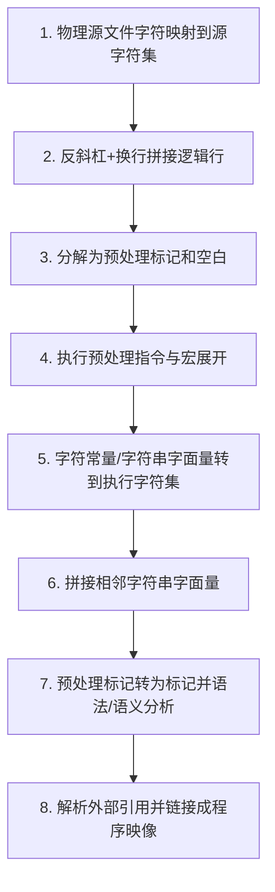

# 5.1.1 翻译环境

> [!NOTE]
> 这一页对应标准里的“翻译环境”模型。它描述的是标准如何理解源文件、翻译单元、翻译阶段和诊断，而不是要求编译器必须内部逐步照着做。

[[toc]]

## 5.1.1 翻译环境

### 5.1.1.1 程序结构

1. C 程序不要求必须一次性整体翻译。程序文本以若干单元保存；本文档把这些单元称为**源文件**（或**预处理文件**）。

2. 一个源文件连同通过 `#include` 预处理指令所包含的全部头文件和源文件，一起构成一个**预处理翻译单元**。经过预处理之后，预处理翻译单元称为**翻译单元**。

3. 先前已经翻译过的翻译单元，可以单独保存，也可以保存在库中。

4. 程序的各个独立翻译单元可以通过多种方式相互通信，例如：

   - 调用具有外部链接的标识符所命名的函数；
   - 操作具有外部链接的标识符所命名的对象；
   - 操作数据文件。

5. 各个翻译单元可以分别翻译，随后再链接，以生成可执行程序。

前向引用：标识符的链接（6.2.2）、外部定义（6.9）、预处理指令（6.10）。

### 5.1.1.2 翻译阶段

1. 翻译时各种语法规则的先后关系，由以下阶段规定。3）



2. 第 1 阶段：如果有必要，以实现定义的方式把物理源文件中的多字节字符映射到源字符集，并把行结束标记转换为换行符。

3. 第 2 阶段：删除每个紧跟换行符的反斜杠字符（`\`），把物理源代码行拼接成逻辑源代码行。每个物理源代码行中，只有最后一个反斜杠才有资格参与这种拼接。非空源文件必须以换行符结束，并且在进行这种拼接之前，该换行符前面不得紧邻反斜杠。

4. 第 3 阶段：把源文件分解成预处理标记4）以及空白字符序列（包括注释）。源文件不得以不完整的预处理标记或不完整的注释结束。每个注释都会被替换为一个空格字符。换行符会被保留。除换行符外，每个非空白字符序列究竟是保留原样还是替换为一个空格字符，由实现定义。

5. 第 4 阶段：执行预处理指令，展开宏调用，执行一元运算符表达式 `_Pragma`。如果通过标记粘连（6.10.5.3）产生了一个符合通用字符名语法的字符序列，则行为未定义。`#include` 预处理指令会导致被命名的头文件或源文件从第 1 阶段到第 4 阶段被递归处理。随后，所有预处理指令都会被删除。

6. 第 5 阶段：把字符常量和字符串字面量中的每个源字符集成员和转义序列，转换成执行字符集中的对应成员。对于没有对应成员的源字符或转义序列，则以实现定义的方式把它转换成执行字符集中某个非空字符（或非空宽字符）成员。5）

7. 第 6 阶段：把相邻的字符串字面量标记拼接起来。

8. 第 7 阶段：分隔标记的空白字符不再具有意义。每个预处理标记都被转换成一个标记。所得标记序列随后会作为翻译单元进行语法分析、语义分析和翻译。

9. 第 8 阶段：解析全部外部对象和函数引用。把库组件链接进来，以满足对当前翻译中未定义的函数和对象的外部引用。所有这类翻译器输出都会被收集成一个程序映像，其中包含在执行环境中运行所需的信息。

::: details 脚注说明
3）这要求实现的行为必须**如同**这些独立阶段确实发生过一样，尽管在实践中许多阶段通常会被折叠到一起。源文件、翻译单元和已翻译的翻译单元，既可以保存为文件，也可以保存在任何其他实现定义的介质中；这些实体与任何外部表示之间并不要求一一对应。这里给出的只是概念性描述，并不规定具体实现方式。  
4）如 6.4 所述，把源文件字符划分成预处理标记这一过程是与上下文相关的。例如，可参见 `#include` 预处理指令中对 `<` 的处理。  
5）实现可以把同一个“无对应成员的源字符”在不同位置转换成执行字符集中的不同成员。
:::

前向引用：通用字符名（6.4.3）、词法元素（6.4）、预处理指令（6.10）、外部定义（6.9）。

### 5.1.1.3 诊断

1. 如果某个预处理翻译单元或翻译单元违反了任何语法规则或约束，那么符合标准的实现至少应产生一条诊断消息（其标识方式由实现定义），即使该行为同时也被明确规定为未定义行为或实现定义行为。除此之外的情形，不要求一定产生诊断消息。

2. 示例：对于下列翻译单元，实现必须发出诊断消息：

```c
char i;
int i;
```

因为在本文档中，某些构造既被描述为违反约束，又被描述为导致未定义行为；在这种情况下，违反约束这一点仍然必须被诊断出来。

#### 推荐实践

3. 建议实现指出每次违规的性质，并在可能时给出其位置。当然，实现也可以自由地产生任意数量的诊断消息，这些消息通常被称为“警告”；只要一个有效程序仍然能够被正确翻译即可。实现也可以成功翻译一个无效程序。附录 I 列出了一些更常见的警告。
