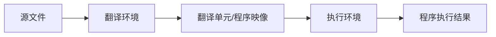

# 5.1 概念模型

> [!TIP]
> 这里的“概念模型”不是实现必须逐步照做的内部流程，而是标准为了描述语义而建立的抽象模型。实现可以优化，但优化后的结果不能违背这个模型要求的可观察行为。

[[toc]]

## 5. 环境

1. 一个实现会在两个数据处理系统环境中翻译 C 源文件并执行 C 程序；本文档分别把它们称为**翻译环境**和**执行环境**。它们的特性定义并约束了符合标准的 C 程序在执行时可能产生的结果，而这些程序必须是依照符合标准的实现所规定的语法和语义规则构造出来的。

前向引用：在本章中，只列出众多可能的前向引用中的少数几项。

## 5.1 概念模型

1. 本节把标准后续会用到的两个核心环境模型先建立起来：

   - [5.1.1 翻译环境](/教程/标准文档翻译/5_环境/5_1_1_翻译环境)
   - [5.1.2 执行环境](/教程/标准文档翻译/5_环境/5_1_2_执行环境)

