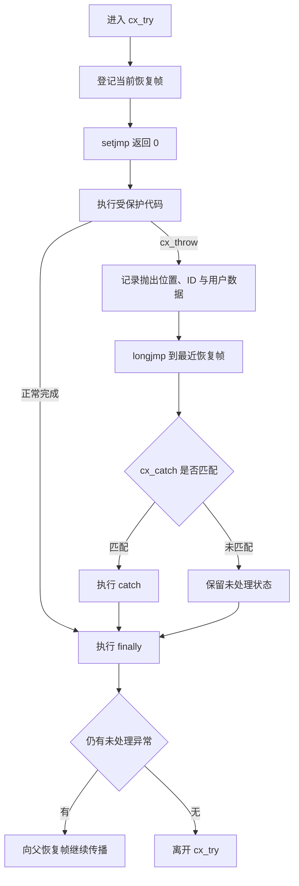

# 10. 库与第三方依赖

把第三方库加入工程，相当于同时接受它的接口契约、构建方式、失败路径、版本策略和授权条件。只看调用示例，很难判断它能否长期成为工程的一部分。

本章用 [`paul-j-lucas/c_exception`](https://github.com/paul-j-lucas/c_exception) 做一次完整评估。它把标准 C 的 `setjmp`、`longjmp` 与宏组合成 `cx_try`、`cx_catch`、`cx_throw` 和 `cx_finally`，很适合观察“简洁接口背后包含哪些工程约束”。第一部分已经讲过 [`setjmp` 与 `longjmp`](/教程/正文/语法和标准库/22_非局部控制与信号/22_2_非局部跳转) 的语言规则；本章把注意力放在多文件组成、依赖接入、资源所有权和采用决策上。

## 1. 先把依赖评估写成问题

评估开始前，先说明项目希望第三方库解决什么问题。`c_exception` 面向的场景是：错误可能发生在很深的调用路径中，作者希望把错误传播到较高层的统一处理点，并使用接近异常处理的表面语法。

已有的返回值、错误码和 [`goto` 统一清理](/教程/正文/语法和标准库/14_文本转换_错误与程序生命周期/14_5_goto清理模式) 是本次比较基线。评估过程至少回答下列问题：

| 维度 | 需要回答的问题 |
| --- | --- |
| 功能 | 它解决的错误传播问题是否真实存在？ |
| 接口 | 调用方需要遵守哪些命名、控制流和生存期约束？ |
| 实现 | 表面语法最终展开成什么 C 控制流？ |
| 资源 | 跳过多层函数返回时，谁释放文件、堆内存和锁？ |
| 构建 | 需要哪些工具、生成文件、编译选项和链接产物？ |
| 可移植性 | 目标编译器、操作系统和线程模型是否覆盖？ |
| 验证 | 上游测试覆盖了什么，下游还需要验证什么？ |
| 维护 | 应固定发布版本、标签，还是某个提交？ |
| 授权 | 仓库元数据、许可证正文与源码声明是否一致？ |

::: concept dependency-evaluation-contract title="第三方依赖是一组持续生效的契约"

第三方依赖的成本贯穿获取、构建、调用、测试、升级和分发。可靠的采用结论应记录上游快照、适用范围、退出方案以及重新评估的触发条件。

:::

::: generate dependency-evaluation-intro kind=explanation concepts=dependency-evaluation-contract

面向第一次引入 C 第三方库的读者，解释为什么依赖评估需要同时检查接口、实现、构建、测试、版本和授权。结合本章表格给出一个小型工程场景，说明只验证“示例能运行”会遗漏哪些长期成本。

:::

## 2. 固定可复查的上游快照

第三方仓库的默认分支会继续变化。教程、缺陷报告和工程决策都应指向一个可重复读取的快照。

::: info 本案例的核对边界

本案例在 2026 年 8 月 8 日核对上游 `master`，固定到提交 [`ec8b37a2e27500db09ec4a0ef5b79320de167e4c`](https://github.com/paul-j-lucas/c_exception/tree/ec8b37a2e27500db09ec4a0ef5b79320de167e4c)。后文对源码、构建文件和测试的描述均以这个提交为准。

:::

可以用下面的命令取得同一份源码：

```sh
git clone https://github.com/paul-j-lucas/c_exception.git
cd c_exception
git checkout --detach ec8b37a2e27500db09ec4a0ef5b79320de167e4c
git rev-parse HEAD
```

`--detach` 表示当前工作目录直接停在指定提交上。学习和审计时，这能避免默认分支前进后悄悄改变观察对象。真正集成到项目时，还应把提交、来源 URL、校验值和更新方式写入依赖清单或锁定文件。

::: concept dependency-snapshot title="先固定快照，再形成结论"

版本名称提供人类可读的发布标识，提交哈希提供精确的源码身份。评估记录应同时保留二者；当两者无法对应时，以已经核对的源码提交限定结论范围。

:::

::: generate dependency-snapshot-explanation kind=explanation concepts=dependency-snapshot

解释分支、标签、发布版本和提交哈希在依赖管理中的区别。围绕 `c_exception` 的固定提交示例，说明教程为什么应提供可复查快照，以及升级时应重新检查哪些证据。

:::

## 3. 从目录读出构建边界

先查看仓库的顶层目录和 `src/`，可以得到一张初步构建图：

```text
c_exception/
├── bootstrap
├── configure.ac
├── Makefile.am
├── lib/
├── m4/
└── src/
    ├── c_exception.h
    ├── c_exception.c
    ├── c_exception_test.c
    └── Makefile.am
```

这些文件承担不同职责：

| 路径 | 职责 | 对接入方的含义 |
| --- | --- | --- |
| [`src/c_exception.h`](https://github.com/paul-j-lucas/c_exception/blob/ec8b37a2e27500db09ec4a0ef5b79320de167e4c/src/c_exception.h) | 公开类型、宏和函数声明 | 每个调用方都要按它的控制流契约编写代码 |
| [`src/c_exception.c`](https://github.com/paul-j-lucas/c_exception/blob/ec8b37a2e27500db09ec4a0ef5b79320de167e4c/src/c_exception.c) | 异常记录、恢复点链和状态迁移 | 需要单独编译并链接到最终程序 |
| [`src/c_exception_test.c`](https://github.com/paul-j-lucas/c_exception/blob/ec8b37a2e27500db09ec4a0ef5b79320de167e4c/src/c_exception_test.c) | 上游单元测试 | 可用于理解受支持行为并建立回归基线 |
| [`configure.ac`](https://github.com/paul-j-lucas/c_exception/blob/ec8b37a2e27500db09ec4a0ef5b79320de167e4c/configure.ac) | 编译器、功能与检测选项 | 上游构建要求 C11，并提供若干 Sanitizer 开关 |
| `lib/`、`m4/` | Gnulib 文件与 Autoconf 宏 | 直接抽取两个核心源码文件时仍需处理生成配置和辅助头文件 |

[`src/Makefile.am`](https://github.com/paul-j-lucas/c_exception/blob/ec8b37a2e27500db09ec4a0ef5b79320de167e4c/src/Makefile.am) 会构建 `libc_exception`，再把测试程序链接到该库。由此可以确认，它是一个需要编译和链接的多翻译单元库。上游构建入口采用 Autotools；接入 CMake、XMake 或其他构建系统时，需要建立明确的适配层并重新验证生成配置、辅助头文件和编译选项。

::: concept dependency-build-boundary title="完整构建契约覆盖公开头文件之外的文件"

公开头文件只描述调用接口。实现源文件、生成配置、辅助库、编译定义和链接选项共同决定最终行为。依赖接入应从上游构建图出发，逐项映射到本项目的构建图。

:::

::: generate dependency-build-map kind=explanation concepts=dependency-build-boundary

根据本节目录树，带读者画出 `c_exception` 的最小构建图：调用方包含公开头文件，核心实现编译为库，测试程序链接该库，Autotools 与 Gnulib 提供生成配置和辅助能力。说明直接复制头文件、直接复制两个核心文件、使用上游构建三种做法各自需要补齐什么。

:::

## 4. 先从公开接口理解承诺

库默认暴露带 `cx_` 前缀的名字：

- `cx_try`
- `cx_catch(...)`
- `cx_throw(...)`
- `cx_finally`
- `cx_cancel_try()`
- `cx_current_exception()`

在包含头文件前把 `CX_USE_TRADITIONAL_KEYWORDS` 定义为 `1`，还可以使用 `try`、`catch`、`throw` 和 `finally`。上游默认关闭这些短名字，以减少与调用方标识符发生冲突的机会。对 C 库而言，稳定前缀本身就是接口设计的一部分。

`cx_exception_t` 记录抛出位置、整数异常 ID 和可选的 `void *` 用户数据。异常 ID 可以精确匹配，也可以通过 `cx_catch()` 捕获任意 ID；库还允许调用方安装自定义匹配函数。

下面是一个只展示公开接口的最小调用示例：

```c
#include "c_exception.h"

#include <stdio.h>

enum {
    EX_PARSE = 1
};

static void parse_record(void) {
    cx_throw(EX_PARSE);
}

int main(void) {
    cx_try {
        parse_record();
    }
    cx_catch(EX_PARSE) {
        puts("parse failed");
    }
    cx_finally {
        puts("cleanup");
    }

    return 0;
}
```

输出：

::: terminal

parse failed
cleanup

:::

这段代码只能说明接口形状和一条成功捕获路径。形成采用结论前，还需要继续追踪宏展开、未捕获传播、提前离开代码块、资源释放和线程状态。

::: concept exception-style-api-contract title="异常风格语法仍然受 C 控制流约束"

`cx_try` 等名字由预处理宏提供。编译器最终看到的是 `for`、`if`、`setjmp`、函数调用和普通代码块，因此每个宏都可能改变周围语句的结合方式和跳转含义。

:::

::: generate exception-style-api-reading kind=explanation concepts=exception-style-api-contract

借助本节最小示例解释 `cx_try`、`cx_catch`、`cx_throw` 和 `cx_finally` 的表面含义，同时提醒读者把它们当成宏接口阅读。说明为什么公开 API 文档必须包含控制流、生存期和资源所有权规则。

:::

## 5. 从表面语法追到实现

阅读 [`c_exception.h`](https://github.com/paul-j-lucas/c_exception/blob/ec8b37a2e27500db09ec4a0ef5b79320de167e4c/src/c_exception.h#L243-L365) 可以看到，`cx_try` 的骨架由一个 `for`、两层 `if` 和 `setjmp` 组成；`cx_catch` 与 `cx_finally` 继续拼接在这条语句链上。阅读 [`c_exception.c`](https://github.com/paul-j-lucas/c_exception/blob/ec8b37a2e27500db09ec4a0ef5b79320de167e4c/src/c_exception.c#L143-L151) 可以看到，抛出动作最终调用 `longjmp` 回到最近的恢复点。

各层职责可以概括为：

| 层 | 主要工作 |
| --- | --- |
| 宏层 | 组合出接近异常处理的表面语法 |
| 恢复帧 | 保存 `jmp_buf`、父恢复帧、当前状态和异常 ID |
| 状态机 | 在 `INIT`、`TRY`、`THROWN`、`CAUGHT`、`FINALLY` 之间迁移 |
| 抛出实现 | 写入异常记录，并向最近恢复帧执行 `longjmp` |
| 捕获实现 | 按异常 ID 或自定义规则判断是否匹配 |
| 收尾实现 | 执行 `finally`，并继续传播未捕获异常 |



为了支持嵌套，恢复帧通过 `parent` 形成链。当前异常记录与恢复帧链使用线程局部存储，因此每个线程拥有独立的传播路径。终止处理函数和异常 ID 匹配函数则存放在进程内共享的静态状态中；工程上适合在启动阶段完成配置，运行阶段保持只读，并为任何并发修改建立同步规则。

::: concept exception-macro-state-machine title="宏负责语法，状态机负责传播"

`setjmp` 保存返回点，`longjmp` 完成非局部跳转，恢复帧链确定传播方向，状态机决定捕获、收尾和继续传播。四者合在一起，才构成库对外呈现的异常风格控制流。

:::

::: generate exception-implementation-walkthrough kind=explanation concepts=exception-macro-state-machine

结合流程图分步解释一次正常完成、一次成功捕获和一次向外层继续传播。说明 `for` 与嵌套 `if` 如何支撑宏语法，恢复帧链和线程局部状态分别解决什么问题，并引导读者从公开宏追到 `cx_impl_try_condition()` 与 `cx_impl_do_throw()`。

:::

## 6. 把限制视为接口的一部分

上游 [`README.md`](https://github.com/paul-j-lucas/c_exception/blob/ec8b37a2e27500db09ec4a0ef5b79320de167e4c/README.md#L3-L15) 明确提醒该库具有严格要求和多项限制。[头文件中的 API 注释](https://github.com/paul-j-lucas/c_exception/blob/ec8b37a2e27500db09ec4a0ef5b79320de167e4c/src/c_exception.h#L184-L408) 给出了更具体的契约：

| 约束 | 原因 | 工程影响 |
| --- | --- | --- |
| 在 `cx_try` 外声明、在块内修改、离开块后继续读取的自动存储期局部对象需要 `volatile` 限定 | `longjmp` 会影响这类对象的可用值 | 代码评审必须识别跨恢复点状态 |
| 使用 `cx_try` 的函数避开 VLA | 这是上游明确规定的使用条件 | 栈上动态尺寸对象需要改用固定尺寸或显式分配 |
| `break` 只适用于调用方自己写出的循环或 `switch` | `cx_try` 自身展开为循环 | 外层控制流可能与代码表面形状不同 |
| 从 `try`、`catch`、`finally` 中执行 `goto` 或 `return` 前先调用 `cx_cancel_try()` | 库需要先弹出当前恢复帧 | 提前返回必须经过专门协议 |
| `continue` 会推进宏内部状态机 | 它可能直接进入 `finally` | 代码评审要按宏展开理解目标位置 |
| 用户数据指针指向的对象需要活到处理完成 | `cx_throw` 只保存指针值 | 所有权与生存期必须写进异常类型约定 |
| 未捕获异常会调用终止处理函数 | 已经没有可用恢复帧 | 顶层需要明确终止、记录和测试策略 |

`cx_cancel_try()` 还会改变收尾语义：从 `try` 或 `catch` 中调用它后，当前 `finally` 不会执行，未捕获异常也不会继续传播。这个接口适合处理确实需要提前离开的分支，同时要求调用点显式承担清理责任。

这类限制说明，宏提供的是建立在现有 C 语句之上的新写法；自动栈展开、析构与跳转语义仍由 C 本身决定。团队若采用这类库，应把限制转写成代码评审清单和自动化测试。

::: concept macro-control-flow-contract title="宏接口的展开结果属于公开契约"

当宏引入循环、分支或非局部跳转时，它与 `break`、`continue`、`goto`、`return` 的交互会直接影响程序行为。接口文档、示例和测试都应覆盖这些交互。

:::

::: generate exception-restrictions-review kind=explanation concepts=macro-control-flow-contract

面向已经掌握普通 C 跳转语句的读者，逐项解释本节限制与宏展开之间的联系。设计一次代码评审场景，让读者判断提前返回、VLA、用户数据指针和未捕获传播分别需要什么处理。

:::

## 7. 资源所有权决定方案是否可靠

`longjmp` 会越过普通函数返回路径，并且只负责改变控制流。关闭文件、释放堆内存、解锁互斥量和调用清理函数都需要显式安排。每项资源都需要明确的所有者和覆盖成功、失败、继续传播三条路径的释放策略。

下面的结构让取得文件的函数同时负责关闭文件。内层 `finally` 在正常完成和异常传播前都会执行；缺少匹配的 `catch` 时，库会在 `finally` 之后把异常继续传给外层恢复帧。

```c
#include "c_exception.h"

#include <stdio.h>

enum {
    EX_OPEN = 1
};

static void parse_stream(FILE *fp);

static void parse_file(const char *path) {
    FILE *fp = fopen(path, "rb");
    if (fp == NULL) {
        cx_throw(EX_OPEN);
    }

    cx_try {
        parse_stream(fp);
    }
    cx_finally {
        fclose(fp);
    }
}
```

这个模式仍然要求每个资源所有者建立自己的清理边界。若 `parse_stream` 内部还取得堆内存或锁，相应资源也应在各自所有者所在层完成释放。另一种常见方案是使用区域分配器或集中资源栈，让较高层能够一次回收整组资源；这需要成为整个子系统的一致设计。

对多数边界清晰的 C API，返回状态、输出参数和统一清理标签能提供显式、局部且容易组合的失败路径。异常风格控制流在深层解释器、解析器等场景中可能减少逐层转发代码，同时会增加隐藏控制流和资源纪律要求。采用决策应由真实调用深度、资源模型和团队约定共同决定。

::: concept nonlocal-resource-ownership title="资源所有权保持在取得资源的代码层"

控制流可以直接越过若干调用层，资源责任仍留在取得资源的代码层。可靠设计需要让每个所有者在传播发生前完成清理，或把资源统一登记到可整体回收的区域中。

:::

::: generate exception-resource-strategy kind=explanation concepts=nonlocal-resource-ownership

围绕文件、堆内存和互斥量各给出一个资源所有权例子，说明异常传播为什么不会自动释放它们。比较局部 `finally`、`goto` 统一清理和区域式资源管理的适用条件，帮助读者建立可执行的清理检查表。

:::

## 8. 按上游方式构建，再补下游验证

上游要求 C11，并以 Autoconf、Automake、Libtool 和 M4 生成构建文件。仓库中的 `bootstrap` 会运行 `autoreconf -fi`。在具备这些工具的 POSIX shell 环境中，基本验证流程为：

```sh
./bootstrap
./configure
make
make check
```

`configure.ac` 还提供 AddressSanitizer、MemorySanitizer 和 UndefinedBehaviorSanitizer 开关。具体选择应与编译器能力匹配，并在干净构建目录中执行。例如：

```sh
./configure --enable-asan --enable-ubsan
make
make check
```

上游 [`README.md`](https://github.com/paul-j-lucas/c_exception/blob/ec8b37a2e27500db09ec4a0ef5b79320de167e4c/README.md#L45-L54) 建议调用方使用 `-Wno-dangling-else` 和 `-Wno-shadow`。工程若接受这些选项，应把它们限制在第三方库目标或必要调用点，项目自身源码继续保留完整诊断。诊断抑制属于依赖成本，也应进入采用记录。

当前测试文件覆盖正常完成、精确捕获、任意捕获、深层函数抛出、自定义 ID 匹配、嵌套传播、重新抛出和用户数据。下游集成测试还应补充：

1. `cx_cancel_try()` 与提前离开代码块；
2. 未捕获异常和自定义终止处理函数；
3. 每条传播路径上的文件、堆内存和锁释放；
4. 多线程分别嵌套恢复帧；
5. 运行期间修改共享处理函数时的同步策略；
6. 目标编译器的优化构建与 Sanitizer 构建。

在 Windows 工程中，可以选择提供 Autotools 的兼容环境运行上游流程，也可以为现有构建系统编写适配目标。后一条路径需要显式处理 `config.h`、Gnulib 辅助文件、线程局部存储写法和平台编译选项，并在 CI 中持续验证。

::: concept upstream-downstream-verification title="上游测试是基线，下游测试负责真实接入环境"

上游测试证明维护者声明的若干行为，下游测试证明固定快照在本项目的编译器、构建选项、线程模型和资源路径中满足要求。两层证据共同支撑采用结论。

:::

::: generate dependency-verification-plan kind=explanation concepts=upstream-downstream-verification

根据本节内容，为 `c_exception` 设计一份从构建到运行的验证矩阵。区分上游已有测试和下游需要补充的集成测试，并说明为什么警告抑制、优化构建、Sanitizer、资源泄漏与线程场景都需要独立证据。

:::

## 9. 版本和授权也要进入技术审查

固定提交中的 [`configure.ac`](https://github.com/paul-j-lucas/c_exception/blob/ec8b37a2e27500db09ec4a0ef5b79320de167e4c/configure.ac#L23-L38) 把项目版本写为 `1.2`，[`NEWS`](https://github.com/paul-j-lucas/c_exception/blob/ec8b37a2e27500db09ec4a0ef5b79320de167e4c/NEWS#L8-L17) 也记录了 1.2；在本案例核对日期，[公开标签列表](https://github.com/paul-j-lucas/c_exception/tags) 只列出 `c_exception-1.1`。因此，采用方需要在“较旧的已标记版本”和“较新的精确提交”之间做出明确选择，并记录选择依据。

授权信息还存在需要澄清的差异：

- GitHub 仓库元数据与 [`COPYING`](https://github.com/paul-j-lucas/c_exception/blob/ec8b37a2e27500db09ec4a0ef5b79320de167e4c/COPYING) 指向 LGPL 3.0；
- [`NEWS`](https://github.com/paul-j-lucas/c_exception/blob/ec8b37a2e27500db09ec4a0ef5b79320de167e4c/NEWS#L37-L50) 写明 LGPL 第 3 版或更新版本；
- [`src/c_exception.h`](https://github.com/paul-j-lucas/c_exception/blob/ec8b37a2e27500db09ec4a0ef5b79320de167e4c/src/c_exception.h#L1-L19) 与核心源码头部写明 GPL 第 3 版或更新版本。

::: warning 授权口径需要上游确认

同一快照中的授权声明并不一致。实际复制、修改、链接或分发前，应向上游维护者确认适用许可证，并保留书面结论。本节只记录工程审查事实，不提供法律判断。

:::

这也是第三方依赖审查的重要价值：许可证徽章只能作为线索，最终仍要检查许可证正文、源码头部、发布说明和项目实际分发方式。

::: concept dependency-version-license title="版本身份与授权身份都要能够追溯"

工程需要知道“采用了哪份源码”以及“依据什么条件使用和分发”。版本记录解决前一个问题，一致且明确的授权材料解决后一个问题。

:::

::: generate dependency-release-license-review kind=explanation concepts=dependency-version-license

以本节的版本与授权差异为例，讲解如何核对标签、项目版本、发布说明、许可证正文和源码头部。强调记录事实、限定结论范围、向上游澄清和保存证据的工程流程。

:::

## 10. 写出可执行的采用记录

完成调查后，用一份短记录收束结论：

```text
依赖：paul-j-lucas/c_exception
用途：
固定快照：
目标平台与编译器：
接入方式：
公开接口：
失败传播规则：
资源清理规则：
线程配置规则：
上游验证：
下游验证：
版本依据：
授权依据：
替代方案：
采用结论：
重新评估触发条件：
```

对本案例，可以形成这样的阶段性结论：`c_exception` 适合作为宏、状态机、非局部跳转和依赖评估的源码阅读材料。生产工程准备采用时，应先确认授权口径，固定精确快照，验证目标构建环境，为资源所有权与提前离开代码块制定统一规则，并补齐下游集成测试。在这些条件完成前，返回值、错误码和统一清理标签能继续提供清晰且可局部验证的错误处理边界。

采用记录还应写明退出方案，例如保留一层项目自有适配接口，让业务代码依赖本项目的错误模型。未来更换实现时，变更可以收敛在适配层与少量集成测试中。

::: concept dependency-decision-record title="采用结论必须能够指导下一步行动"

有效记录会给出固定快照、接入方式、验证要求、未决事项、退出方案和重评条件。它既能支持当前决策，也能让未来升级或替换依赖时复用已有证据。

:::

::: generate dependency-decision-example kind=explanation concepts=dependency-decision-record

根据本章调查结果，示范填写一份简洁的 `c_exception` 采用记录。分别给出“仅用于源码学习”和“准备进入生产工程”两种目标下的结论，并说明哪些未决事项会阻止生产接入继续推进。

:::

## 11. 习题

<Exercise id="21001" :d="3" :w="3">

阅读固定快照中的 `cx_try`、`cx_catch`、`cx_finally` 与 `cx_impl_try_condition()`，画出以下三条路径的状态迁移：正常完成、成功捕获、内层未捕获后向外层传播。每条路径都要标出 `setjmp`、`longjmp` 和 `finally` 的执行位置。

</Exercise>

<Exercise id="21002" :d="4" :w="4">

为最小调用示例增加一个文件资源和一块堆内存，分别在取得每项资源后注入 `cx_throw`。设计测试证明正常完成、当前层捕获和向外层传播三种情况下都只释放一次，并说明每项资源的所有者。

</Exercise>

<Exercise id="21003" :d="3" :w="3">

按照本章模板写一份 `c_exception` 采用记录。目标环境由你选择，但必须包含编译器、构建系统、线程模型、固定快照、警告处理、上游与下游测试、授权未决事项、替代方案和重新评估触发条件。

</Exercise>
