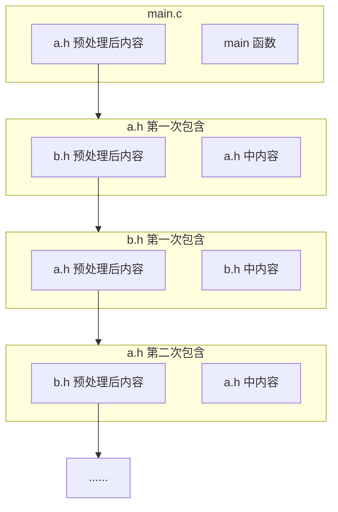
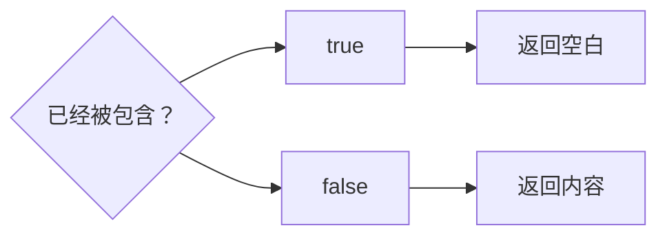
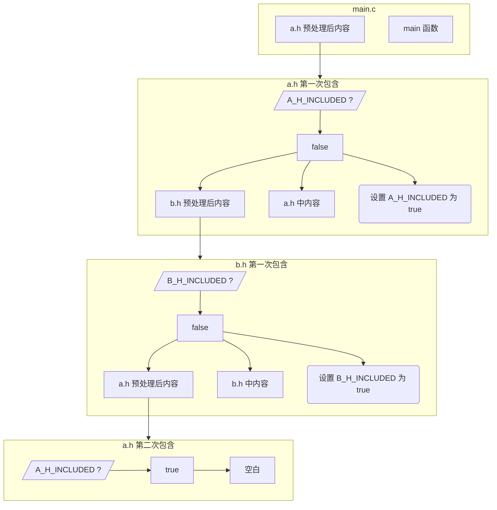

# 包含文件

## `#include` 预处理指令

1. `include "文件名"`：搜索非实现控制下的文件
2. `include <文件名>`：搜索实现控制下的文件

这个指令会把指定的文件内容“原封不动”地插入到当前文件中，就好像文件内容直接写在当前文件中一样。看下面的例子：

::: code-group

```c [main.c]
#include <stdio.h>

int main() {
#include "arr.c"
    for(int i = 0; i < 10; i++){
        printf("%d ",arr[i]);
    }
    return 0;
}
```

```c [arr.c]
int arr[10] = {
    1, 2, 3, 4, 5, 6, 7, 8, 9, 10
};
```

:::

经过翻译阶段 4 的处理（代码中没有表现出翻译阶段 1~3 的处理）之后，`main.c` 文件会变成：

```c
// stdio.h 内容

int main() {
    int arr[10] = {
1, 2, 3, 4, 5, 6, 7, 8, 9, 10
    };
    for(int i = 0; i < 10; i++){
        printf("%d ",arr[i]);
    }
    return 0;
}
```

::: info 原封不动

预处理器执行时，会直接将被包含的文件内容插入到当前文件中，不做任何检查。

也就是说，下面的代码可以通过编译：

::: code-group

```c [main.c]
#include <stdio.h>

int main() {
    int arr[10] = {
#include "arr.txt"
    }
    for(int i = 0; i < 10; i++){
        printf("%d ",arr[i]);
    }
    return 0;
}
```

```txt [arr.txt]
1, 2, 3, 4, 5, 6, 7, 8, 9, 10
```

但不要这样做。阅读代码的人可能弄不明白 `arr.txt` 文件的内容；如果其中内容出现错误，编译时的报错会指向 `arr.c` 文件，加大了调试难度；如果 `arr.txt` 文件进行改动，比如增加了一个数，那么 `main.c` 文件中的 `arr` 数组声明就需要相应修改，增大了耦合性。

（_）如果数据确实保存在 `_.txt`当中，可以编写脚本程序，在编译时读取`txt`文件，生成含有`arr`数组定义的代码，再将该代码包含到`main.c` 文件中。

:::

:::

根据翻译阶段的规则，被包含的文件会被重新执行翻译阶段 1~4。当被包含的文件里面仍然有 `#include` 指令时，会嵌套包含。我们有时会遇到这种情况：A 文件包含 B 文件，B 文件包含 A 文件。这时就会出现循环包含的问题，如下：

::: code-group

```c [a.h]
#include "b.h"

void a(void) { /* ... */ }
```

```c [b.h]
#include "a.h"

void b(void) { /* ... */ }
```

```c [main.c]
#include "a.h"

int main(void) { /* ... */ }
```

:::

::: details 为什么会循环包含

从 `main.c` 开始看，它包含了 `a.h`，处理之后本该变成这样：

```c
// a.h 内容（记作代码①）

int main(void) { /* ... */ }
```

但是，包含的 `a.h` 文件要经过预处理，才能将其内容插入上述代码块中 `// a.h 内容` 所在之处。它又包含了 `b.h`，处理之后的 `a.h`（代码①）变成了这样：

```c
// b.h 内容（记作代码②）

void a(void) { /* ... */ }
```

包含的 `b.h` 文件也要经过预处理，才能将其内容插入上述代码块中 `// b.h 内容` 所在之处：

```c
// a.h 内容

void b(void) { /* ... */ }
```

这样，预处理的过程就会无限递归下去，如下面的流程图：



:::

为避免这个问题，我们通常采取**头文件防护**的措施。典型的做法是在每个头文件的开头加上：

```c
#ifndef TOKEN
#define TOKEN
// some code
#endif
```

其中，`TOKEN` 是用来这个文件的独一无二的名字。

这样，第一次包含该头文件时，`TOKEN` 没有被定义，`#ifndef` 后面的代码会被执行。当第二次包含该头文件时，`TOKEN` 已经被定义，`#ifndef` 后面的代码不会被执行。流程图如下：



用上面的代码做例子：

::: code-group

```c [a.h]
#ifndef A_H_INCLUDED
#define A_H_INCLUDED
#include "b.h"

void a(void) { /* ... */ }
#endif // A_H_INCLUDED
```

```c [b.h]
#ifndef B_H_INCLUDED
#define B_H_INCLUDED
#include "a.h"

void b(void) { /* ... */ }
#endif // B_H_INCLUDED
```

```c [main.c]
#include "a.h"

int main(void) { /* ... */ }
```

:::

这样，`main.c` 经过预处理的步骤如下：

```c
// a.h 内容

int main(void) { /* ... */ }
```

上述代码中的 `a.h` 经过预处理后如下：

```c
// b.h 内容

void a(void) { /* ... */ }
```

此时定义了 `A_H_INCLUDED`。

上述代码中的 `b.h` 经过预处理后如下：

```c
// a.h 内容

void b(void) { /* ... */ }
```

此时定义了 `B_H_INCLUDED`。

上述代码中的 `a.h` 再次经过预处理。因为已经定义了 `A_H_INCLUDED`，`a.h` 内容为空，`b.h` 只剩以下内容：

```c
void b(void) { /* ... */ }
```

`a.h` 经过预处理之后的内容：

```c
void b(void) { /* ... */ }

void a(void) { /* ... */ }
```

`main.c` 经过预处理之后的内容：

```c
void b(void) { /* ... */ }

void a(void) { /* ... */ }

int main(void) { /*... */ }
```

也可以将上面的过程画成流程图：



这样就防止了头文件的循环包含。

很多编译器实现了 `#pragma once` 指令，可以与上面的方法实现相同效果。
