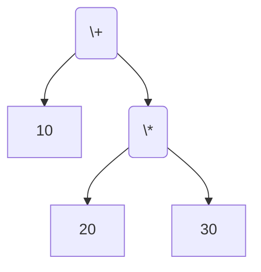
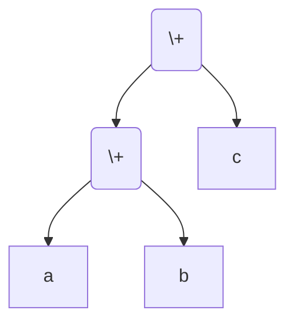
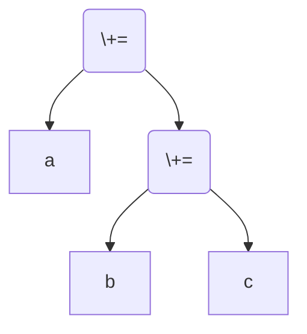

# 优先级和结合性

**优先级**和**结合性**解决在表达式中“如何加括号”的问题。

## 1. 优先级

优先级决定了当表达式中存在不同运算符时，运算符与操作数绑定的顺序。

比如加法和乘法：

```c
int a = 10 + 20 * 30;
```

运行结果：该代码块主要用于语法或结构说明，单独运行通常无终端输出。


因为乘法的优先级高于加法，所以乘法运算符会**优先把他两侧的操作数和它绑定**，形成 `10 + (20 * 30)`：



运行结果：该代码块主要用于语法或结构说明，单独运行通常无终端输出。


显然最后 a 的值为 610。

## 2. 结合性

举例：`a + b + c` 中，由于加法具有左结合性，所以操作数 `b` 属于左边的 `+`，形成 `(a + b) + c`。把这个表达式用树形表示就是：



运行结果：该代码块主要用于语法或结构说明，单独运行通常无终端输出。


赋值运算是**右结合**的，所以在 `a += b += c` 会变成 `a += (b += c)`：



运行结果：该代码块主要用于语法或结构说明，单独运行通常无终端输出。


## 3. 优先级和结合性表

下表列举了 C 语言中所有运算符的优先级和结合性。

::: details 如何得知优先级？

标准中没有单独规定运算符的优先级，优先级由词法推出。

比如下面的 BNF：

```bnf
expr ::= term | expr '+' term | expr '-' term
term ::= factor | term '*' factor | term '/' factor
```

运行结果：该代码块主要用于语法或结构说明，单独运行通常无终端输出。


注：本教程中 BNF 均使用 `::=` 表示定义，使用 `|` 表示 alternatives。

这时，我们就说，`+` 与 `-` 具有相同的优先级，`*` 与 `/` 也具有相同的优先级，`+` 和 `-` 的优先级低于 `*` 与 `/`。

:::

| 优先级 |   运算符   | 描述                           | 用法                             |  结合性  |
| :----: | :--------: | :----------------------------- | :------------------------------- | :------: |
|   1    |    `++`    | 后缀自增                       | `左值++`                         | 从左到右 |
|        |    `--`    | 后缀自减                       | `左值--`                         | 从左到右 |
|        |    `()`    | 函数调用                       | `函数指示符(表达式列表)`         | 从左到右 |
|        |    `[]`    | 数组下标                       | `指针表达式[表达式]`             | 从左到右 |
|        |    `.`     | 结构体与联合体成员访问         | `结构体或联合体表达式.成员`      | 从左到右 |
|        |    `->`    | 结构体与联合体成员通过指针访问 | `指向结构体或联合体的指针->成员` | 从左到右 |
|   2    |    `++`    | 前缀自增                       | `++左值`                         | 从右到左 |
|        |    `--`    | 前缀自减                       | `--左值`                         | 从右到左 |
|        |    `+`     | 一元加                         | `+表达式`                        | 从右到左 |
|        |    `-`     | 一元减                         | `-表达式`                        | 从右到左 |
|        |    `!`     | 逻辑非                         | `!表达式`                        | 从右到左 |
|        |    `~`     | 逐位非                         | `~表达式`                        | 从右到左 |
|        |  `(type)`  | 转型                           | `(类型)表达式`                   | 从右到左 |
|        |    `*`     | 解引用                         | `*指针表达式`                    | 从右到左 |
|        |    `&`     | 取址                           | `&左值`                          | 从右到左 |
|        |  `sizeof`  | 取大小                         | `sizeof(类型)`                   | 从右到左 |
|        | `_Alignof` | 对齐要求                       | `_Alignof(类型)`                 | 从右到左 |
|   3    |    `*`     | 乘法                           | `表达式 * 表达式`                | 从左到右 |
|        |    `/`     | 除法                           | `表达式 / 表达式`                | 从左到右 |
|        |    `%`     | 余数                           | `整型表达式 % 整型表达式`        | 从左到右 |
|   4    |    `+`     | 加法                           | `表达式 + 表达式`                | 从左到右 |
|        |    `-`     | 减法                           | `表达式 - 表达式`                | 从左到右 |
|   5    |    `<<`    | 逐位左移                       | `整型表达式 << 表达式`           | 从左到右 |
|        |    `>>`    | 逐位右移                       | `整型表达式 >> 表达式`           | 从左到右 |
|   6    |    `<`     | 小于                           | `表达式 < 表达式`                | 从左到右 |
|        |    `<=`    | 小于等于                       | `表达式 <= 表达式`               | 从左到右 |
|        |    `>`     | 大于                           | `表达式 > 表达式`                | 从左到右 |
|        |    `>=`    | 大于等于                       | `表达式 >= 表达式`               | 从左到右 |
|   7    |    `==`    | 等于                           | `表达式 == 表达式`               | 从左到右 |
|        |    `!=`    | 不等于                         | `表达式 != 表达式`               | 从左到右 |
|   8    |    `&`     | 逐位与                         | `表达式 & 表达式`                | 从左到右 |
|   9    |    `^`     | 逐位异或                       | `表达式 ^ 表达式`                | 从左到右 |
|   10   |    `\|`    | 逐位或                         | `表达式 \| 表达式`               | 从左到右 |
|   11   |    `&&`    | 逻辑与                         | `表达式 && 表达式`               | 从左到右 |
|   12   |   `\|\|`   | 逻辑或                         | `表达式 \|\| 表达式`             | 从左到右 |
|   13   |    `?:`    | 三元条件                       | `表达式1 ? 表达式2 : 表达式3`    | 从右到左 |
|   14   |    `=`     | 简单赋值                       | `左值 = 表达式`                  | 从右到左 |
|        |    `+=`    | 以和赋值                       | `左值 += 表达式`                 | 从右到左 |
|        |    `-=`    | 以差赋值                       | `左值 -= 表达式`                 | 从右到左 |
|        |    `*=`    | 以积赋值                       | `左值 *= 表达式`                 | 从右到左 |
|        |    `/=`    | 以商赋值                       | `左值 /= 表达式`                 | 从右到左 |
|        |    `%=`    | 以余数赋值                     | `左值 %= 表达式`                 | 从右到左 |
|        |   `<<=`    | 以逐位左移赋值                 | `左值 <<= 表达式`                | 从右到左 |
|        |   `>>=`    | 以逐位右移赋值                 | `左值 >>= 表达式`                | 从右到左 |
|        |    `&=`    | 以逐位与赋值                   | `左值 &= 表达式`                 | 从右到左 |
|        |    `^=`    | 以逐位异或赋值                 | `左值 ^= 表达式`                 | 从右到左 |
|        |   `\|=`    | 以逐位或赋值                   | `左值 \|= 表达式`                | 从右到左 |
|   15   |    `,`     | 逗号                           | `表达式, 表达式`                 | 从左到右 |

不用背这个表。多打几个括号，让自己的代码变得更易于理解，这很重要。
