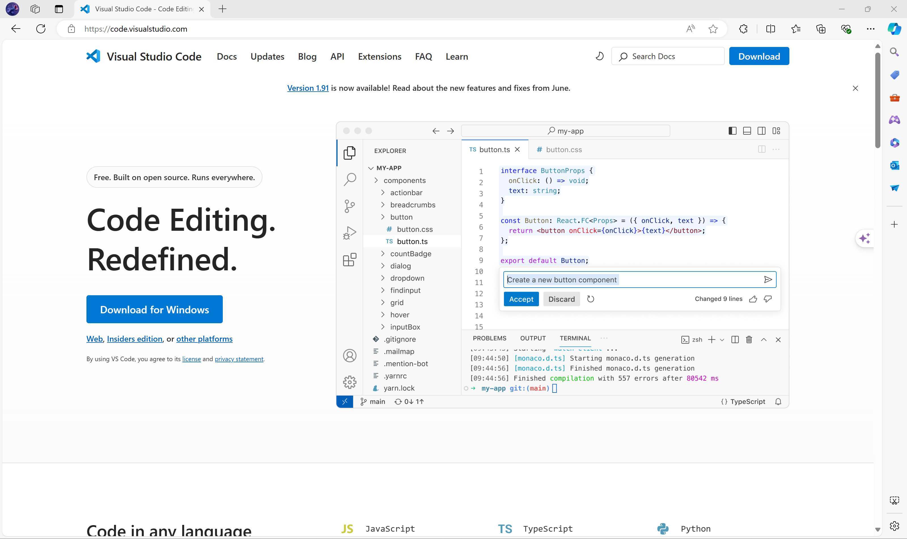

# 编程工具

## 文本编辑器和代码编辑器

1. **NotePad**
   微软自带那个，没啥好说的（其实有让他好用的方法，但没必要）
2. **Visual Studio Code**
   简称 **VSCode** 或 **vsc**,强大的编辑器，基于 **Chromium** 引擎，优化做的非常好
   1. 下载：[code.visualstudio.com](https://code.visualstudio.com)
      如果是 Windows 用户，直接点击 **Download for Windows** 即可，如图：
      

## 集成开发环境

1. **Microsoft Visual Studio**
2. **JetBrains CLion**
