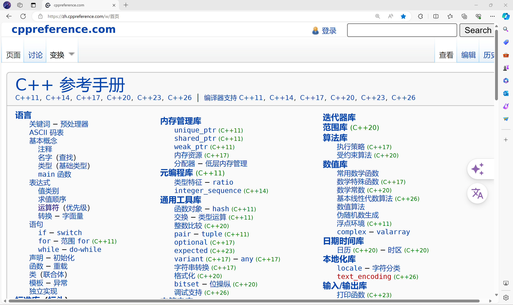
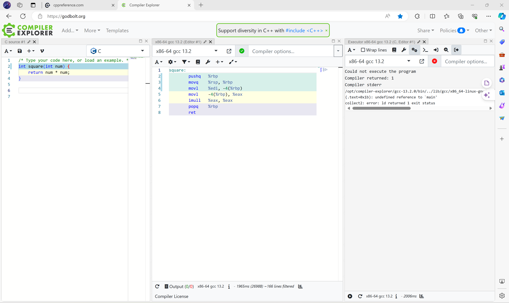
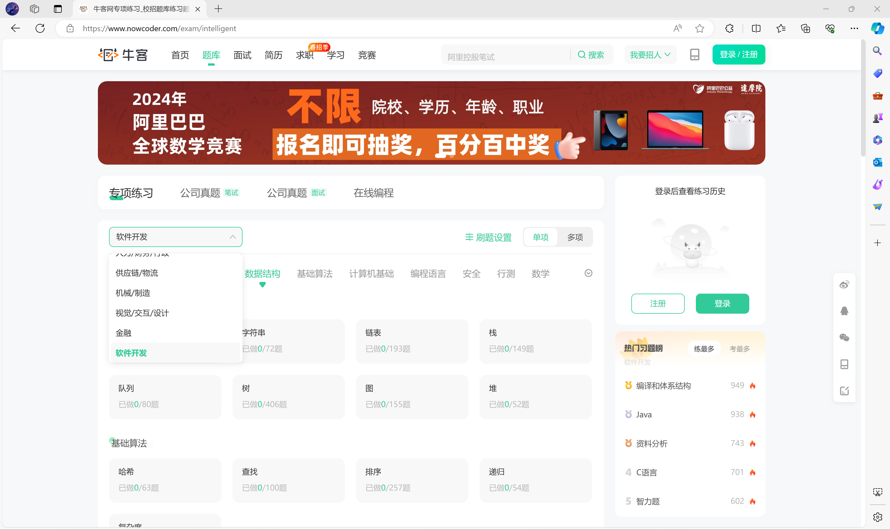
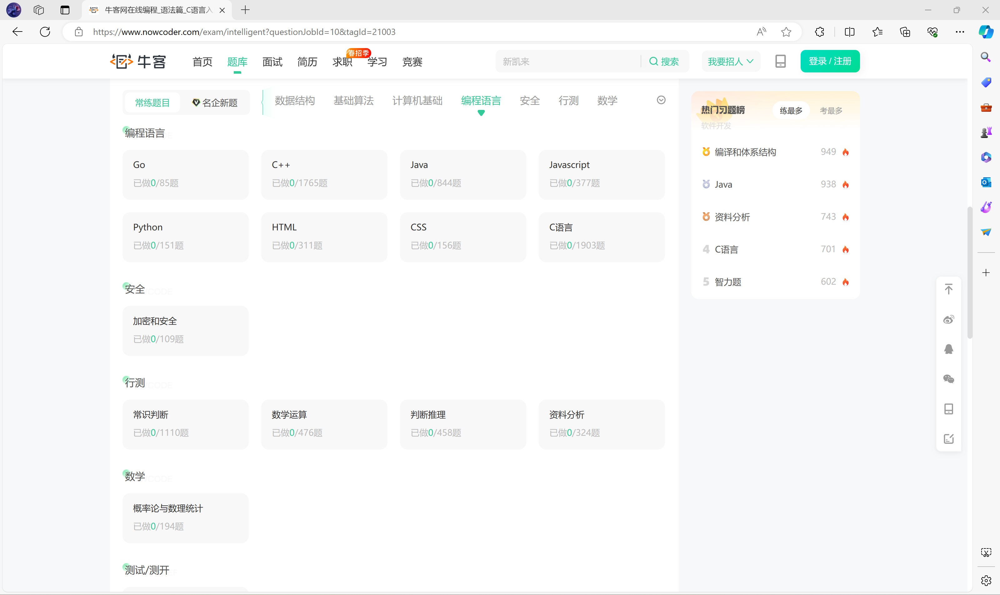
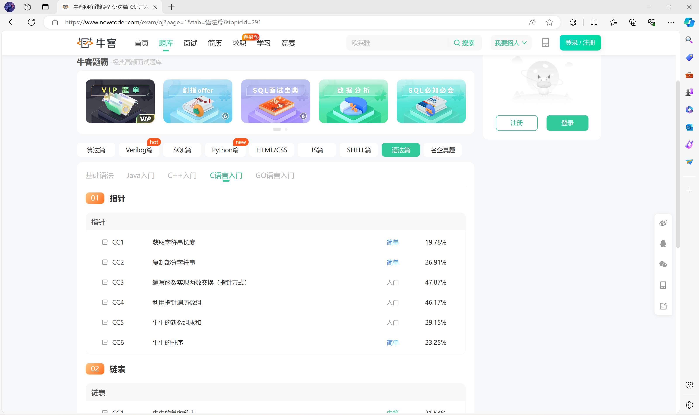
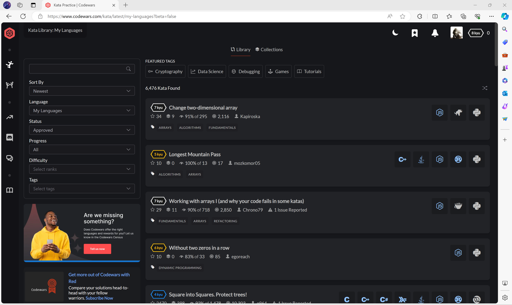

# 正文 1 - 在开始编程之前

## 1. 什么是编程

### 1.1 定义

### 1.2 编程的两个起源

1. 两个计算模型 **图灵机** **lambda演算**
2. **命令式编程**和**函数式编程**

### 1.3 编程语言

1. 编译型语言和解释型语言
2. 主流编程语言

## 2. 学习编程的方法和建议

### 2.1 多敲代码

1. 实践是检验真理的唯一标准
2. 个人认为计算机专业的大学生，如果未来走开发的话，四年之内高质量代码量应该达到**10w**行以上

### 2.2 学会看报错，看日志

### 2.3 使用搜索引擎查找资料

[**google**](https://google.com/)，[**bing**](https://cn.bing.com/)，[**you**](https://you.com/)

### 2.4 博客

可以发博客分享自己的心得或提出自己的疑问

### 2.5 学会使用**github**

[**github**](https://github.com)是世界上最大的代码托管网站，上面有大量优秀的开源项目

### 2.6 关于

#### 2.6.1 关于AI

了解一下[**prompt engineering**](https://github.com/dair-ai/Prompt-Engineering-Guide)

#### 2.6.2 关于编程交流群

详见[**编程交流群生存指南**](../../技术无关/1_编程交流群生存指南.md)

#### 2.6.3 关于手机编程

不要用手机编程，平板也不行

#### 2.6.4 关于RTFM

自然语言是**注释**，**代码**更重要

#### 2.6.5 关于黑子

C有**很多**值得黑的地方，不过黑的话要拿出证据来（当然这些证据也**俯拾即是**）

#### 2.6.6 关于更高级的东西

```txt
Talk is cheap, show me the code.
Code is cheap, show me the proof.
```

```txt
Talk is not cheap.
```

## 3. 学习编程必需的能力

1. **搜索引擎**的使用 主流搜索引擎见 **2.3 使用搜索引擎查找资料**
2. 寻找**官方网站**，**注册账号**，与下载**正版软件**的能力
3. 基本的**英语**水平，要理解**报错信息**的内容
4. 合理**提出问题**的能力，详见[**编程交流群生存指南**](../../技术无关/1_编程交流群生存指南.md)

## 4. 关于C

### 4.1 发展历史

1. 机器码
2. 汇编
3. ALGOL CPL BCPL
4. C

### 4.2 标准

1. ANSI C（被ISO采纳）
2. 从c89到c23（建议大家有空了看看标准）

### 4.3 编译过程

1. 8个翻译阶段
2. **预处理器**（在翻译阶段4）
3. **编译器**（在翻译阶段7）
4. **汇编器**
5. **链接器**（在翻译阶段8）

### 4.4 应用领域

1. 系统编程：操作系统，编译器，数据库等
2. 嵌入式开发，IoT
3. 网络编程
4. 图形图像处理

### 4.5 推荐网站

1. [**cppreference**](https://zh.cppreference.com/)
   学习 C 和 C++ 必备网站
   
2. [**compiler explorer**](https://godbolt.org/)
   在线编译器，支持**生成汇编**等多项功能，支持非常多的语言和多种编译器
   
3. [**newcoder**](https://www.nowcoder.com/)
   大量练习题，需要登录后使用
   
   点击 **在线编程-语法篇-C语言入门**
   
   点击 **专项练习-编程语言**，选择**C语言**
   
4. [**codewars**](https://www.codewars.com/)
   偏实际应用的题目，注重语言特性和实践，需要登录后使用
   
   登录后初始化账号，鼠标移动到左边打开侧边栏，点击**practice**
   

### 4.6 推荐的C书籍

***C Primer Plus第六版（中文版）***
本视频即参考此书内容录制

==**任何书籍都不是万能的，都有错误或遗漏的地方**==

## 5. 开发C的工具

### 5.1 编译器

1. gcc
2. clang
3. msvc（充话费送的）

### 5.2 编辑器/IDE

1. 别弄混代码编辑器和编译器！！！（否则就等着群友骂你吧）
2. 轻量编辑器 [**VSCode**](https://code.visualstudio.com/)（Visual Studio Code，简称*vsc*）但是需要自己配环境(如[**MSYS2**](https://msys2.org))；如果官网下载特别慢的话，复制下载链接，把链接中的 `az764295.vo.msecnd.net` 换成 `vscode.cdn.azure.cn`
3. 普遍应用于 Linux 的最佳开源编辑器 **vim**
4. 什么是 **IDE**（Integrated Development Environment）
5. **dev-cpp** 和 **code::blocks**
6. [**VS**](https://visualstudio.microsoft.com/zh-hans/vs/)（Microsoft Visual Studio）（十分庞大）
   由于MSVC对C的支持是充话费送的，**不推荐**使用VS写C语言程序
7. JetBrains [**CLion**](https://www.jetbrains.com/clion/)（推荐）
   还有使用 **Resharper** 语言引擎的 **CLion Nova**，目前（2024.2.21）只能在 [**JetBrains Toolbox App**](https://www.jetbrains.com/toolbox-app/) 下载
   目前（2024.4.20）**Resharper**似乎被集成进了**CLion**
8. 在线 IDE [**Lightly**](https://lightly.teamcode.com/)（强力推荐）
9. IDE **!=** 开发效率高

### 5.3 CMake

### 5.4 debugger

IDE一般会自带debugger

## 6. 推荐阅读或学习

1. **SICP** (Structure and Interpretation of Computer Programs)
2. **UML**
3. [**FrankHB 的 GitHub 上的文章**](https://github.com/FrankHB/pl-docs/blob/master/zh-CN)
4. [**垠学**](https://www.yinwang.org)
